本章包括：

* 了解Hugo命令行

* 在Hugo建立一个主题和内容的新网站。

* 概述基于Hugo的网站的结构

* 使用Hugo设置自动部署管道

* 衡量网站的性能并分析其可维护性。

Hugo非常容易上手。它没有任何主要的依赖项，也不需要强大的硬件来运行。它速度快，可以在旧硬件和基于云的虚拟机的基本版本上使用。

在本章中，我们将为一家名为Acme Corporation的公司创建一个基本网站。Acme公司是全球领先的数字形状制造商，如直线、圆、正方形和三角形。我们将使用现有的Hugo主题，并从了解如何向Hugo网站添加内容开始。

我们将在本章开始介绍的网站将在全书中得到加强。在本章中，我们将创建网站的基本结构，为其选择主题，添加一些页面，并使用我们自己的HTML/CSS自定义主页。

附录中提供了与Hugo一起启动和运行的信息。您也可以使用官方网站<https://gohugo.io/>获取Hugo以及参考文档。您无需安装Go即可获得Hugo。它适用于所有主要平台 这本书需要Hugo的版本大于等于v0.75.1。

## 2.1您的第一个Hugo网站

如果您需要，请联系我们。

## 2.1.1 Hugo命令行

Hugo是一个设计良好的命令行工具，提供了Hugo的所有功能。它通过迁移数据、创建占位符、分析性能以及构建网站的核心任务来提供帮助。Hugo命令行有两个不同的部分：

* 命令确定您希望Hugo执行的任务。您可以通过在命令行上使用Hugo[command]来提供命令和子命令。Hugo的命令是分级的。简单的hugo调用,运行默认命令来构建站点。运行`hugo new`创造新的对象。`hugo new`的默认值创建新的内容页面。您可以使用`hugo new site`来构建站点骨架，使用`hugo new theme`来生成主题。

* Flags（也称为命令行参数）-指定通过提供不同配置来修改命令结果的选项。Flags特定于命令，每个命令都可以有独立的标志。例如，`new site`命令中的–format yaml将元数据格式从默认的TOML更改为yaml。学习Hugo命令行的直观方法是使用--help标志。对Hugo的帮助是分层的：Hugo --Help为Hugo命令提供帮助，并将Hugo new列为子命令；并将`hugo new`列为子命令；`hugo new --help`提供了新命令的文档，并将site作为子命令提及。Hugo的帮助还显示了每个命令可用的所有标志。您还可以生成手册页格式的Hugo命令行文档（在基于UNIX的操作系统中由man命令使用）。为此，使用`hugo gen man`或使用`hugo gen doc`创建Markdown文件。让我们通过创建我们的第一个网站来了解这一切是如何结合在一起的。要在Hugo中创建新网站，我们将使用以下列表中的命令。

## 清单2.1创建新网站的Hugo命令

```bash
hugo new site acme-corporation --format yaml
```
该命令在当前文件夹中名为acme corporation的子文件夹中创建Hugo骨架文件夹结构，YAML作为元数据语言。该命令的各个部分如图2.2所示。注意，我们将使用YAML(<https://yaml.org/>)而不是默认的TOML(<https://toml.io>)本书的元数据语言。YAML在一般编程社区中更流行，比TOML更不冗长，GitHub对它有更好的支持。它是一种更容易上手的语言，也是整个Hugo生态系统新用户的更好选择。我们将在第3章中讨论YAML作为Hugo的元数据语言。附录B讨论了TOML作为元数据语言选项。请注意，Hugo官方文档提供了所有支持语言的元数据。

图2.1 Hugo命令行用于访问Hugo,Hugo中的所有功能都通过此命令行公开,您不仅可以使用它来编译Hugo网站，还可以创建页面、运行开发服务器、测量构建性能和访问模块。
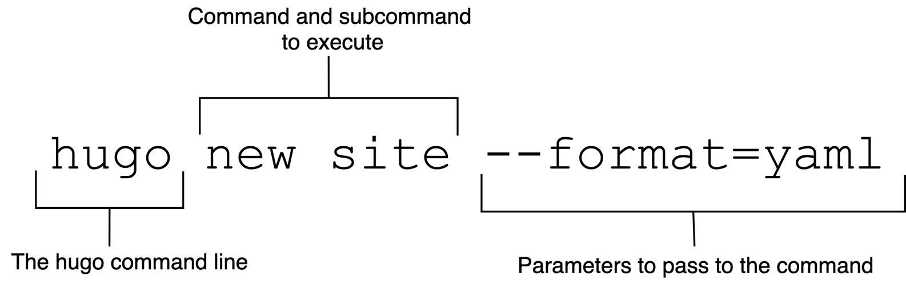

## 2.1.2添加到源代码管理

任何项目的第一步都是将更改提交到版本控制存储库。命令行界面不支持本机撤消/重做。如果不小心删除了文件，它不会进入回收站或垃圾文件夹。任何正在运行的脚本都有可能导致数据丢失，包括hugo命令。除非您对源代码进行了版本控制，否则无法回头。版本控制系统允许恢复已删除的文件并恢复到旧版本。本书中使用的版本控制系统是Git。Git是最流行的系统，GitHub与之紧密集成。这也包括GitHubPages，它是互联网上最流行的静态网站主机。将每个检查点提交给版本控制是一个好主意。您可以使用git命令或类似SourceTree或Fork的GUI客户端来执行这些任务。在命令行上，可以使用多个Git命令执行此操作，如下所示。为了帮助进行版本控制，请注意代码检查点，您可以暂停检查代码。

清单2.2用于创建新存储库的Git命令
```bash
cd acme-corporation
# Create an empty GitHub repository.
git init .
# Add files that were just created using the Hugo command line.
git add *
# Check-in those files to version control with a commit message.
git commit -m "Create website skeleton"
```

尽管我们创建了一个网站框架，但这并不意味着我们有一个有效的网站。hugo命令创建的大多数骨架文件夹都是空的。最起码，我们需要提供一些内容和主题，以便在我们的网站上呈现。

> CODE CHECKPOINT <https://github.com/hugoinaction/hugoinaction/tree/chapter-02-01>
> 注意：为了更好地支持GitHub，服务器上的存储库中添加了额外的文件（Readme.md、License.md和.gitignore）。

## 2.1.3 Hugo网站的结构

在添加主题或内容之前，让我们看看Hugo网站的构成。Hugo的骨架文件夹结构包括以下文件夹：

图2.2,Hugo new命令生成的Hugo骨架（acme公司文件夹的内容）。Hugo网站的各个部分包括内容模板的原型文件夹、设置和元数据的配置文件、文本内容的内容、结构化内容的数据（键值对）、，布局和主题，以及需要托管但不属于任何其他类别的其他内容的静态文件夹。

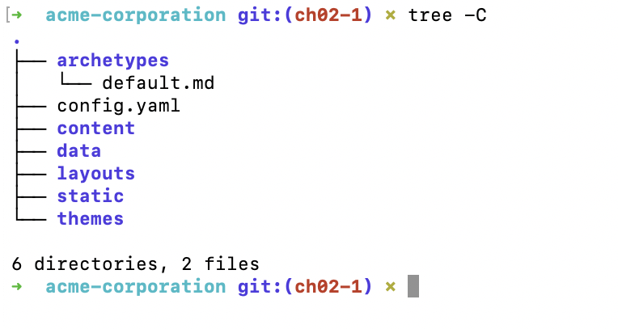

archetypes 原型包含内容文件的模板。Hugo试图减少创建内容所需的复制和粘贴工作,我们可以为原型中的内容Markdown文件或文件夹创建模板，Hugo使用这些模板创建框架内容文件。由于没有涉及数据库，因此需要提供的任何元数据都必须手动填写。原型有助于自动填充帖子中常见的元数据。我们将在第5章中了解原型。

config.yaml  这是网站的配置文件，包含整个网站共享的元数据，包括主题名称和需要传递给Hugo或主题以呈现内容的任何参数。Hugo支持将配置拆分为多个文件，并支持测试和生产等不同环境。在第5章中，我们将详细介绍配置。它是用一种叫做yaml的元数据语言编写的，我们将在第3章中讨论。

content  这是传统上进入数据库的所有内容所在的文件夹。我们可以根据需要将内容组织到文件和文件夹中。默认情况下，Hugo将直接基于该文件夹中的文件夹结构生成网站输出，尽管可以覆盖该结构。我们将在整本书中使用内容文件夹。

data  数据文件夹可用于存储YAML、TOML或JSON文件形式的结构化数据，这些文件将作为全局变量在整个网站中提供。在创建文档网站时，作者必须在源代码中处理来自生成器的结构化文档。此功能对于读取该信息非常有效。代码生成的文档可以存储在文件夹中，并从数据目录中读取。我们将在第5章中阅读数据文件夹。
layouts Layouts文件夹用于覆盖主题的部分。Hugo为用户提供了混合和匹配主题页面的灵活性，并编写自己的自定义页面，这些页面可能使用或不使用部分主题。layouts目录可用于存储这些覆盖的主题布局。主题和布局之间的界限是模糊的，Hugo为用户提供了充分的灵活性，通过逐个覆盖页面来缓慢创建主题。在本章中，我们将使用layouts文件夹更新主页，并将在第6章中详细介绍布局。

static 静态文件夹用于存储静态内容，如字体或pdf文件，或需要按原样复制到输出目录的要下载的内容。该文件夹在某种程度上相当于apache/nginx web服务器根文件夹，您可以在其中放置任何HTML文件进行渲染。建议在content/data/theme/layout文件夹中放置尽可能多的内容，以便对其进行编程访问，并从渲染管道中获益。二进制文件（如.pdf文件，.woff表示web字体，.zip表示可下载内容）存储在该文件夹中，这些二进制文件不属于其他任何地方，但仍需要在网站中。从本章开始，静态文件夹中会有一些数据。

themes 主题文件夹包含可用于设置数据样式的主题。主题是用Go模板语言编写的，主题的部分可以通过布局覆盖。我们将在本章中添加主题，并在第7章中创建自己的主题

在所有这些文件夹中，内容文件夹是在向网站添加内容的日常生活中花费最多时间的文件夹。主题文件夹包含可以在网站外部管理的主题，而其他文件夹在需要添加主要内容时很少更改（数据驱动网站的数据文件夹除外）。

在构建基于Hugo的网站时，以下是您将遇到的其他文件和文件夹（在本书中）：

* **assets**  Hugo网站中的assets文件夹用于放置图像、javascript和css文件，这些文件在网站的所有页面中都是全局可用的。在Hugo的旧版本中，我们使用了静态文件夹。assets文件夹允许我们在编译期间对这些文件进行预处理。Hugo可以在其资产管道（称为Hugo管道）中调整图像大小、缩小JavaScript并将SCSS转换为CSS。我们将在第6章中了解图像操纵和资产绑定。

* **resources** 处理数据时，Hugo会将繁重操作的结果缓存在resources文件夹中。我们应该将此文件夹放入版本控制中，并在各个版本中重用其数据。这个文件夹是Hugo获得出色表现的关键要素之一。处理图像是一项CPU密集型操作，需要时间。大多数图像在不同版本之间不会发生变化，只要处理后的图像不发生变化，就可以对其进行缓存，这为Hugo带来了巨大的性能提升。

* **public**   这是Hugo的默认输出目录。hugo命令将在此处生成要部署的输出HTML。

* **go.mod** and **go.sum** 列出项目依赖项并用于管理Hugo模块的文件。我们很少每天查看这些文件，但我们确实需要将这些文件置于版本控制中。

* **_vendor** 此文件夹存储通过Hugo模块包含的第三方依赖项。在第8章中，我们将在使用hugo模块时创建此文件夹。

> 迁移到HUGO
Hugo支持从Jekyll导入内容，并自动将内容从Jekyl格式转换为Hugo理解的格式。您可以使用`hugo import jekyll＜source jekyll folder＞＜target hugo folder＞`命令将jekyll中的内容导入hugo网站。此命令不提供同步，用于一次性导入。

2.2添加主题

回到我们在本章中构建的Acme Corporation示例网站的项目。在Acme公司的网站能够看到之前，它需要一个主题和一些内容。创建Hugo主题很耗时，对于初学者来说，尝试一些公共主题是个好主意。如果您计划使用其他人创建的主题，则可能无需学习Go模板语言即可使用Hugo。您可以通过学习Markdown这样的标记语言和YAML这样的元数据语言来创建网站。你总是可以选择修改主题来定制UI，但是如果你想要建立一个网站并专注于内容，那么只需要知道内容标记和元数据语言。对于Acme Corporation，我们将从已经构建并准备好使用的主题开始。有多种方法可以获得主题：

1. 使用Hugo模块整合主题
Hugo模块允许主题有自己的依赖关系，如果由其他技术使用，基于Hugo模块的主题可能无法工作。Hugo可以在尝试构建时自动获取主题及其依赖项中所需的模块，从而简化集成。Hugo模块作为一个功能确实有额外的依赖性和设置要求，我们将在第7章介绍Hugo模块时讨论这些要求。Hugo模块在Hugo中得到了积极的开发和维护，并形成了许多Hugo相对较新特性的基础。

2. 使用git子模块引用主题文件夹中的主题
Git子模块是Git版本管理系统的一个功能，它允许一个Git存储库包含另一个存储库作为其中的模块。这些依赖关系可以链接到另一个服务器位置并独立构建。虽然子模块特性是git二进制文件的一部分，不需要单独安装，但它确实有安装步骤。该功能不如Hugo模块强大，子模块用于在引入Hugo模块之前开发的主题中。随着时间的推移，在Hugo世界中，git子模块的使用率正在下降，不建议在更新的主题和网站中使用。

3. 下载主题并将其复制到`themes`文件夹
下载和复制是最简单的方法，最不容易出错。由于主题代码在本地可用，我们可以很容易地阅读它以了解主题正在做什么或修改它，并在我们的网站上看到更新。当开发一个新主题时，这种方法允许轻松地进行更改，并节省了管理不同存储库的开销

为了简化入门，我们将在本书的前6章使用下载和复制方法。

## 2.2.1向网站添加主题

我们可以在Hugo网站上找到主题<https://themes.gohugo.io/>.虽然大多数主题都使用下载和复制方法，但有些主题可能有依赖关系，因此hugo模块是必要的。我们将使用没有这种要求的Eclectic主题。Eclectic主题的副本保存在<https://github.com/hugoinaction/Eclectic>.本书附带的代码示例（ <https://github.com/hugoinaction/hugoinaction/tree/chapter-02-resources/01>). 您可以将Eclectic文件夹粘贴到网站内的主题文件夹中。一旦完成，就可以使用Eclectic。

要加载Eclectic作为网站主题，需要在网站配置中指定：

```yaml
# In `config.yaml`
theme: Eclectic
```

这告诉Hugo在主题文件夹中查找一个名为Eclectic的文件夹，并从该文件夹中加载主题。注意，在本书的捆绑资源中，主题Eclectic在一个公共位置共享，以防止重复。

> Source code at <https://github.com/hugoinaction/hugoinaction/tree/chapter-02-02>

2.2.2运行开发服务器

您可以使用命令行上的命令hugo server以开发模式运行我们的Acme网站（我们也可以使用hugo服务）。这将创建一个开发服务器，它将在本地提供内容。开发过程中使用开发服务器模式来实时编译代码，并对本地托管版本（通常称为实时重新加载）的网站内容进行近实时更新。Hugo的默认端口（网站所在机器内的位置）是1313，除非该端口上运行了其他东西（在这种情况下，可以通过--port<number>标志来更改），否则开发模式网站应该在那里可用。你可以打开<http://localhost:1313>在您的浏览器中查找没有内容的默认网站。默认主页在大多数主题中都很特殊，但如果没有提供任何内容，许多主题都会提供空视图。

图2.3 Hugo Development Server可以使用Hugo server运行。这在本地托管了基于hugo的网站（位于<http://localhost:1313/>在这种情况下），并随着内容的变化和我们在主题中以及在浏览器中的内容更新中所做的变化而自动重建它。

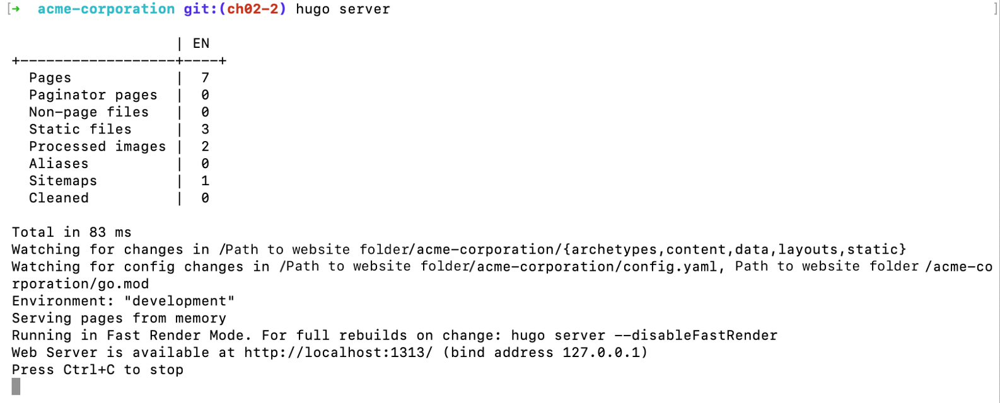

[Hugo server](https://gohugo.io/commands/hugo_server)模式也称为开发模式或实时重新加载模式。它会监听文件系统中的更改，并使用更新重新构建网站。在开发模式中，Hugo还支持快速渲染，即只构建按需请求的页面。由于Hugo的速度惊人，我们没有注意到网页重建的延迟。如果通过命令行标志--disableFastRender和--disableLiveReload干扰JavaScript中的状态，我们可以禁用快速渲染或实时重载。注意，您可以使用--environment命令行标志以开发模式运行网站的生产版本。

无需通过本书的大部分内容退出Hugo开发服务器，因为它支持实时重新加载，我们可以轻松切换内容。但您可以随时通过Ctrl-C退出它并再次运行`hugo server`命令。

> TIP:
> Hugo dev服务器经过优化，可以通过内容更改和影响多个文件的主题更改进行刷新。如果您正在更改主题，则浏览器缓存或开发服务器中的增量构建可能会妨碍查看更新。在这些情况下，重新启动开发服务器、清除浏览器缓存和/或使用`hugo server --noHTTPCache --disableFastRender`可能很有用。

当您第一次在开发模式下运行网站时，主题提供的图像及其JavaScript和CSS文件由Hugo优化，并缓存在本章前面讨论的资源文件夹中。提交资源是一个好主意，它是源代码控制，以防止Hugo再次生成它们。

图2.4 主题为Eclectic的默认网站。当选择Eclectic主题作为基于Hugo的网站的主题时，将基于主题创建索引页面，即使没有提供该页面的内容，该页面也可以呈现（我们仍需要配置更新）。这可以作为开发网站其余部分的起点。

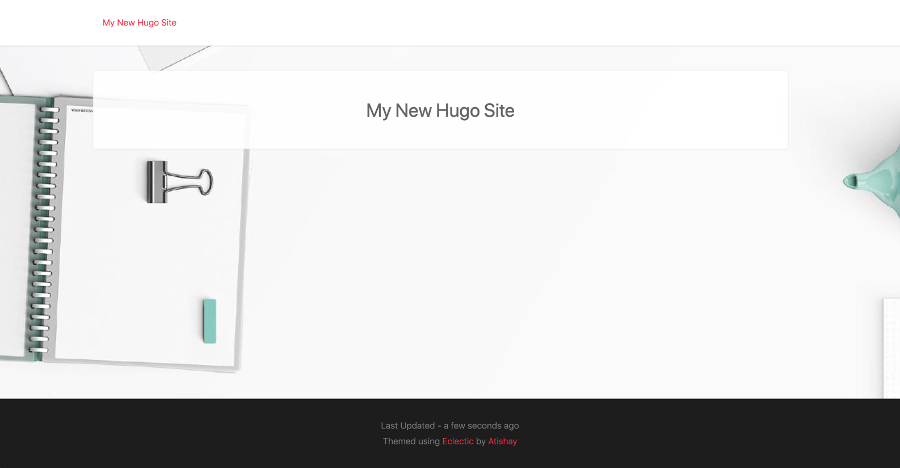

2.3添加内容

我们将把主题生成的空页面转换为功能齐全的网站。这包括通过为主题提供一些设置和元数据来配置主题，添加隐私策略和使用条款等页面，并使用自定义版本覆盖主题提供的登录页面。

Hugo的模板语言非常灵活，每个Hugo主题都是一个完整的软件程序。它可能有不同主题的独特作品。主题提供了自己的文档，说明如何向特定页面添加数据，这些数据可能超出了基于Hugo的一般网站的需要。主题可以采用主题特有的自定义参数，以及特殊页面的自定义结构化数据。此自定义数据不可跨主题移植，如果您在开发网站时仍在判断主题，请首先关注基于标准模板的内容页面，而不是登录页面等特殊页面，然后联系我们。

3.1配置

事实上，该网站用两行代码运行得很好，这就是Hugo精心设计的默认值的神奇之处。通过为我们的网站传递正确的选项，我们可以做得更好。除了设置，`config` 文件还用于存储标记Hugo网站元素的结构化数据。让我们在`config.yaml`中添加一些数据，这些数据是使用Hugo中的eclectic模板成功所需的。根据Acme Corporation主题eclectic的要求，这些更改提供了填充菜单、页脚、版权声明以及标题和作者信息等。在配置文件中，添加以下数据以向主题提供配置，从而正确设置网站。更新的配置文件出现在本书附带的第2章资源中（ <https://github.com/hugoinaction/hugoinaction/tree/chapter-02-resources/02> ). 记住，在托管之前，使用所需的URL更新所提供示例中的baseURL。

图2.5 用于Acme Corporation网站的配置文件。一个典型的Hugo配置文件包含：1）所有主题中常见的配置选项，如网站的URL、名称和语言。2） 某些Hugo功能的选项，如菜单 3）主题特定参数。

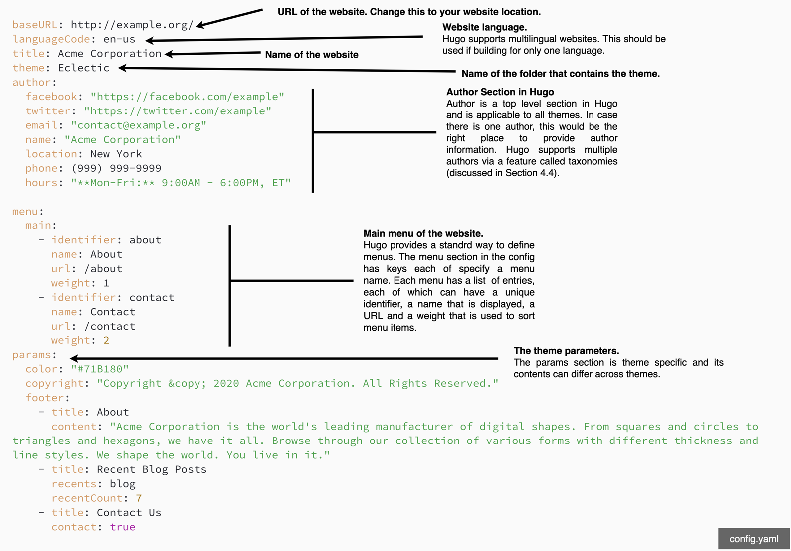

清单2.1中的配置文件以YAML元数据语言提供，我们将在第3章中详细介绍。它使用由冒号分隔的键和值提供结构化信息。YAML是为人类可读而构建的，通过查看上述代码示例，应该不难理解配置文件是否提供了网站标题、主题名称、作者信息、菜单详细信息、版权声明以及主题页脚的一些文本。注意，YAML区分大小写，间距的变化可能会导致YAML解析器出现问题。Hugo还支持更加友好的TOML格式。本书的资源还包含该文件的toml版本，该版本可以作为替代版本。如果首选toml格式，则应删除config.yaml。

eclectic主题允许我们提供自己的徽标，甚至通过将其放置在assets/image文件夹中来控制网站背景图像。我们将在这个文件夹中放置logo.svg和background.svg，以个性化网站。（如果该文件夹不存在，则必须创建该文件夹）这些文件位于本书第2章的代码包中（ <https://github.com/hugoinaction/hugoinaction/tree/chapter-02-resources/03>)

上述配置的某些部分（如菜单和标题）由Hugo标准化，将在第4章中介绍。其他部分（如参数）因主题而异，取决于主题。甚至像logo.svg这样的图像位置也是特定于主题的。

您可以立即看到在Acme网站中提供元数据的影响。使用此配置，它应该与图2.6类似
图2.6 Acme Corporation网站在配置主题后看起来更加完整。配置中添加的主菜单和页脚部分在所有页面中都可用，一旦放置图像，徽标和背景图像就会立即更新。
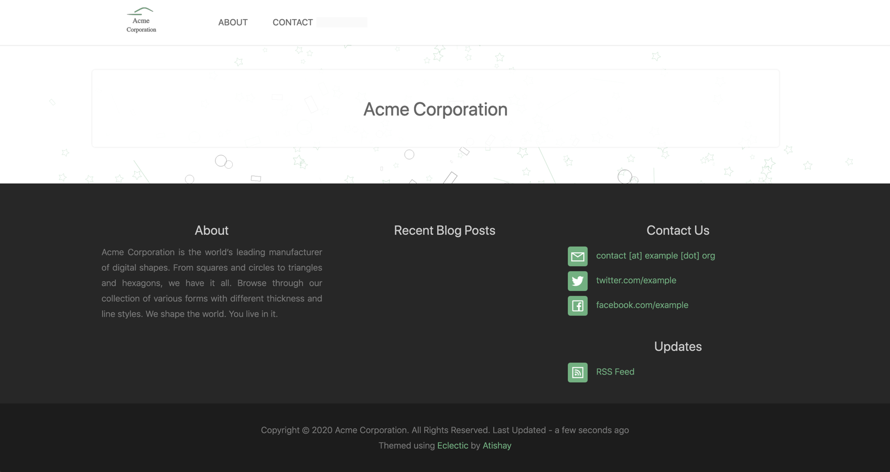

## 2.3.2内容页

网站的目标是提供内容，而我们的美丽网站迄今为止还没有。网站顶部菜单中添加的条目链接到不存在的页面。我们需要在网站中创建页面以使其发挥作用。我们将首先向本章菜单中链接的页面添加内容，并在第3章中对其进行格式化。

内容页可以创建为内容文件夹中的文本/标记文件。您可以将`privacy.md`文件放在包含基于Markdown的内容的`content`文件夹中,得到<https://localhost:1313/privacy>网址。类似地，我们可以添加关于(`about`)、条款(`terms`)和联系(`contact`)页面（ <https://github.com/hugoinaction/hugoinaction/tree/chapter-02-resources/04> ). 主题将自动应用，添加文档后应立即呈现。内容页面可以使用Markdown格式设置文本格式。通过这种方式，我们可以添加任意数量的页面，以生成网站的核心结构。标记提供了多种格式选项，我们将在第3章中讨论这些选项。

## 2.3.3索引页

索引页面，也称为主页或登录页面，是大多数网站中的一个特殊页面，其内容是独特的，与所有其他页面不同。基于文本的内容适用于其他页面，但对于索引页面，许多网站都实现了自定义内容。网站有自定义的旋转木马和包含大量图像的部分，需要为该页面定制实现。Hugo认识到了这一点，并为索引页提供了一个特殊的模板，称为`index`模板。如果你有一个一次性的索引页面，你不想被内容驱动，你可以重写`index.html`布局并将自定义的硬编码html文件放在那里。它仍然是一个Hugo模板，可以访问所有变量，但它们是可选的。我们可以重用其他模板的一部分，如页眉和页脚，并将自己的内容以HTML或Go模板语言添加到页面中。

对于Acme Corporation的索引页面，我们将使用自己的HTML/CSS手工编码的自定义页面覆盖主题的索引页面。在layouts文件夹中，我们可以放置一个名为index.html的带有自定义html内容的新文件，该文件的内容用于呈现索引页面（ <https://github.com/hugoinaction/hugoinaction/tree/chapter-02-resources/05> ).

图2.7 我们可以通过在layouts文件夹中放置一个html模板文件来覆盖Hugo主题中的模板。这样做为理解HTML的人提供了一种快速定制网站的方法，而无需学习Hugo。自定义HTML可能非常特定于特定的网站，但在我们使用Hugo的模板语言之前，我们必须非常小心我们正在编写的HTML，因为自定义HTML页面在链接到的内容发生更改时不会自动更改。
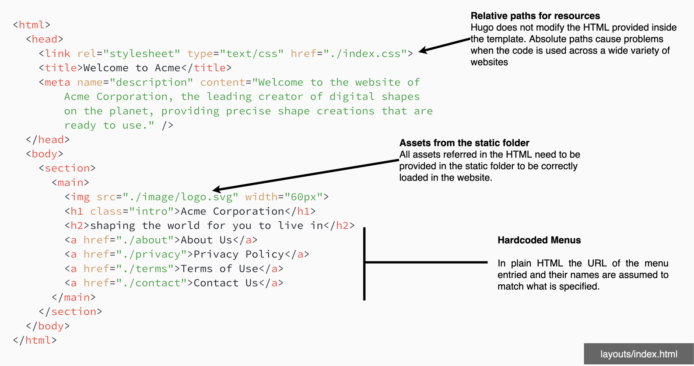

我们可以使用Hugo管道参考assets文件夹中的图像，这将在第6章中讨论。在此之前，我们将资产放在静态文件夹（static/index.css、static/image/background.svg、static/iimage/logo.svg）中，以便从上面链接的基于html的普通位置加载它们（ <https://github.com/hugoinaction/hugoinaction/tree/chapter-02-resources/06>).

图2.8。Hugo网站中的自定义登录页面可以通过在layouts文件夹中放置名为index.html的文件来创建。主题提供的主页被此页面覆盖。对于Acme Corporation，我们使用带有硬编码HTML/CSS的登录页面，并避免使用eclectic基于结构化数据创建页面的主题特定功能。
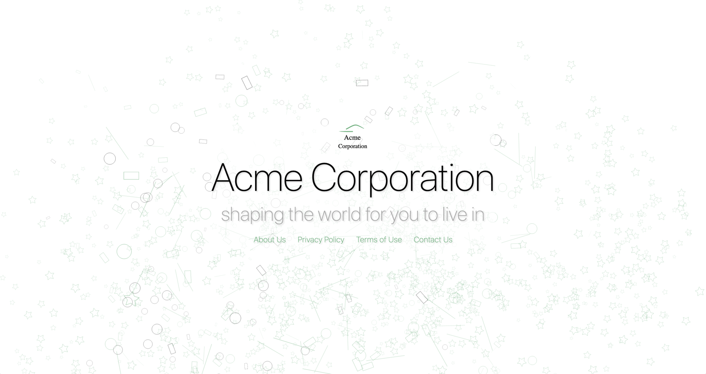

## 2.4持续交付

Hugo和Jamstack最大的优势是能够提供低维护、廉价和高效的主机。所有这些都可以在不付出大量努力的情况下实现，因为所有这些都与代码库集成在一起。虽然有很多方法可以通过Hugo实现持续交付，比如将代码推送给Amazon S3这样的存储提供商，或者像其他任何web堆栈一样将其与Apache/Nginx放在web服务器层，但我们将重点关注Hugo社区最流行的方法。您可以在Hugo网站上找到更多的托管信息，该网站维护各种流行的托管提供商和脚本的运行列表，以在其上设置基于Hugo的托管。尽管在公共云上部署基于Hugo的网站提供了对各种其他服务的访问，但Netlify和GitHub Pages的简单性是开始学习Hugo的最佳方法。

## 2.4.1 Netlify托管
Netlify的创始人创造了“Jamstack”一词，是一家领先的静态网站托管服务。Netlify提供内置支持Hugo的部署服务。Netlify负责持续集成，并为网站提供大量API供其使用。您可以将包含源代码的压缩zip或未压缩文件夹上载到Netlify以进行部署。您可以连接GitHub存储库并在Netlify上免费获得静态托管，即使是私有存储库，直到达到带宽限制。当使用GitHub注册Netlify时，它提供了一个自动集成，您可以在其中搜索存储库。您可以授权Netlify访问特定的存储库，并提供构建步骤和输出文件夹。Netlify提供了一个方便的命令行工具，可以在不离开终端的情况下执行这些任务。您还可以通过名为`netlify.yaml`的配置文件提供构建说明。它还提供域名购买、DNS以及使用自定义标头等管理CDN。

> TIP
> 如果使用Netlify，请确保签出分支域功能。Netlify将每个拉取请求构建并托管到一个单独的网站中，并可以通过分支机构维护不同的版本。该功能用于托管我们在本书中演示的各种版本的网站。您可以导航到<https://ch02-4.hugoinaction.com>到目前为止，您可以看到一个包含本章内容的实时网站。

一旦您注册了Netlify，它将提供一个分步向导来托管您的网站。如果您已经在GitHub上推送了网站的源代码，则可以在登录Netlify后单击“从git新建站点”开始部署。这会带你去<https://app.netlify.com/start>您可以直接导航到。图2.9显示了在Netlify上运行所需的三步流程。如果需要指定Hugo的确切版本，可以在步骤3中单击show advanced选项，并添加一个环境变量`Hugo_version`，其值为您希望使用的Hugo版本，如0.75.1。如果未指定版本号，Netlify不保证使用最新版本的Hugo。最好通过手动指定生成版本来控制它。注意，我们通过命令行参数`hugo --minify --baseURL $DEPLOY_PRIME_URL`向hugo提供网站URL。此覆盖<https://example.org>我们在配置中指定了正确的URL。您还可以在名为`netlify.yaml`或`netlify.toml`的文件中指定构建参数。

图2.9 Netlify托管步骤。按逆时针顺序-1）注册Netlify后创建新网站。2） 连接到GitHub以获取链接的源代码存储库。3） 指定要部署的输出文件夹的build命令。
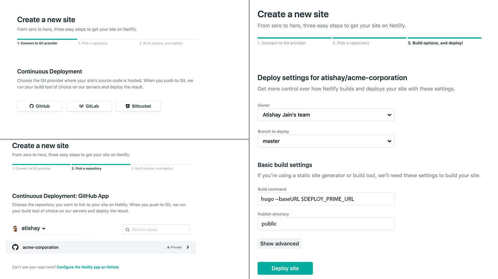

## 2.4.2 GitHub Pages

GitHub是瑞士军刀。GitHub在开发者社区非常受欢迎，并且能够为开源代码提供无限的免费托管，因此是开始静态托管的最佳场所。GitHub有一个名为GitHubPages的服务，它可以从源代码存储库中的分支或文件夹中呈现静态HTML。虽然GitHub可以在推送后在服务器上编译Jekyll网站，但对于Hugo，我们需要通过GitHub Actions提供构建步骤，GitHub是内置在GitHub中的持续集成系统。Hugo的GitHub软件商痁中有多个操作可用。我们将使用Hugo安装<https://github.com/marketplace/actions/hugo-setup>在本节中

以下是在GitHubPages上托管我们基于Hugo的Acme Corporation网站的步骤（假设源代码已经在GitHub上推送）：

1. 添加GitHub action文件，告诉GitHub需要采取哪些操作。（<https://github.com/hugoinaction/hugoinaction/tree/chapter-02-resources/07>）按下这些更改以创建gh-pages分支。
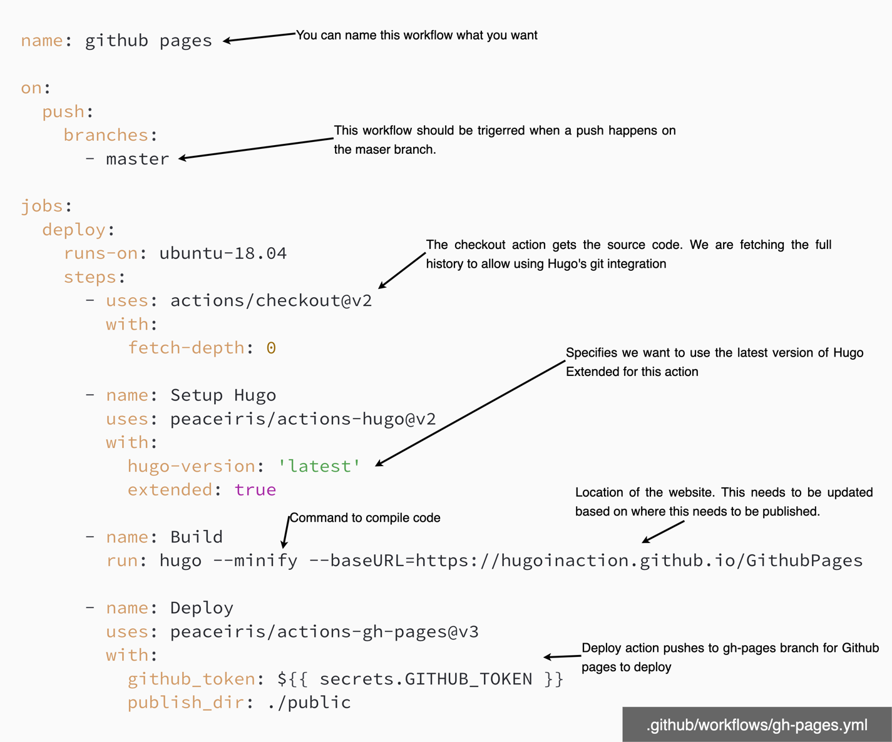

2. 在存储库的github设置中，从gh page分支存储库启用GitHub页面一旦启用，网站的统一资源定位地址将在界面中可见。（见图2.11）

3. 修复GitHub操作文件中的基本URL，然后再次推送。

图2.11。为静态网站托管GitHubPages的选项。对Hugo使用选项1-gh-page分支。
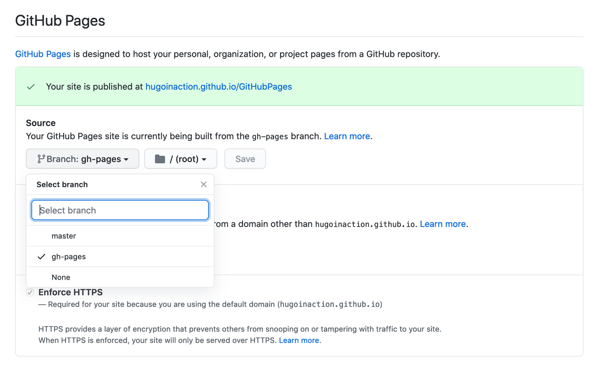

使用GitHub Pages的示例网站位于<https://hugoinaction.GitHub.io/GitHubPages/>源代码位于<https://github.com/hugoinaction/GitHubPages/>.您可以导航到GitHub UI中的Actions选项卡，以查看部署网站的运行GitHub Actions的结果。

该网站应在网络上可用，一旦启用，您应该能够导航到GitHub在页面部分提供的链接。GitHub提供了一个CDN，可以在全球范围内分发网站，并在免费配额限制下为网站免费（低于1 GB，每月带宽为100 GB，截至撰写本书时每小时约10次构建）。这是一个很好的地方，用于个人网站或在开发中测试Jamstack网站。许多GitHub页面用于GitHub上已有源代码的文档网站，Hugo是生成这些代码的一个流行工具

> 随时随地编辑
> 这是一个普遍的误解，即使用Jamstack构建的网站很难编辑，除非您设置了开发环境。大多数现代Jamstack网站都有一个连续的环境设置，我们只需简单的签入即可进入生产环境。这使得Jamstack比传统的基于数据库的网站堆栈更灵活。您不仅可以更改内容，还可以更改设计、配置甚至业务逻辑，而无需设置开发环境，所以在Jamstack上编辑比在传统web堆栈上编辑更容易。
> 在进行小编辑的情况下，GitHub的web界面是一个有价值的工具，可以从任何地方编辑网站。手机和平板电脑上都有CodeHub、PocketHub或Working Copy等应用程序，可以帮助从git存储库创建或修改Markdown文档。您可以在任何地方进行更改，持续集成系统可确保更改在提交后几秒内生效。与传统堆栈不同，为Jamstack设置本地开发环境要容易得多，即使我们必须这样做，也不需要几天。

## 2.4.3 AWS、Azure和谷歌云

如果您将公共云的功能用于Jamstack的其他部分，或者希望比标准化托管中提供的控制更细粒度，那么也可以从Hugo部署到云。Hugo自带内置命令`Hugo deploy`，将网站部署到AWS S3存储桶、Google云存储和Azure存储。一旦在计算机上设置了身份验证凭据，就可以在配置文件中指定`deployment.targets.URL`部分以及指向特定服务的链接，如`s3://<Bucket Name>？region=<AWS region>`用于AWS S3部署。当您运行`Hugo deploy＜target name＞`时，Hugo将自动识别云和当前构建之间的更改，并同步构建。我们可以在同一节中指定云向网站用户公开的缓存策略。

## 2.5 达到性能和可维护性目标

Hugo和Jamstack的一大承诺是高性能和低持续维护。这两个术语本身都不是绝对的，并且存在梯度。我们需要在功能、易开发性、易使用性、维护和性能之间选择适当的平衡，以获得最佳效益。一个没有图片的网站可能会比一个有数百个图片的网站更快，但这并不意味着这将是所有用例的最佳网站。因此，在分析性能和可维护性时，我们需要考虑用例。

## 2.5.1性能

性能是Hugo团队对构建进行基准测试的一个主要指标，我们应该能够毫无困难地获得常规用例的良好性能。Acme Industries的所有网页都托管在CDN上，预先呈现，客户端不需要进行太多处理即可显示。虽然你会在视觉上发现网站很容易加载，但获取数字很重要，这样可以比较构建和更改，并解决问题。衡量性能的标准工具是内置在谷歌Chrome浏览器中的名为Lighthouse的审计工具。对于Acme Industries，about页面代表我们将要测量的网站的典型页面。

> 注意
Chrome中的审计工具不断更新新的测试，因此结果可能与显示的截图不完全匹配。
图2.12。使用Google Chrome灯塔性能测试对Acme Corporation的关于页面进行性能审核。
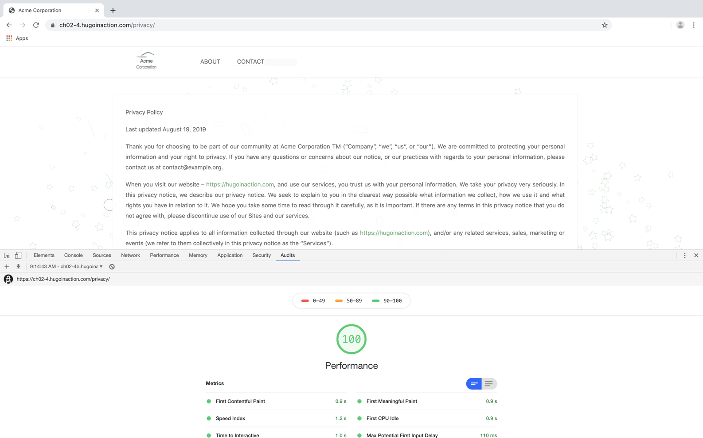

衡量部署在CDN上的托管站点的性能非常重要，因为Hugo的开发服务器不是用户在生产中获得的。它是为开发而构建的，不会产生正确的结果。

* 转到Google Chrome中的“查看”>“开发人员”>“开发者工具”菜单，打开web检查器。
* 转到“审核”选项卡并运行审核。您应该能够在大多数Hugo网站上获得不错的绩效审核分数。

审计可能会提出一些问题，这些问题可以在主题中修复，因此可以选择克隆主题或创建一个问题供主题开发人员修复。

## 2.5.2可维护性

网络设置的可维护性很难直接衡量。没有工具来判断堆栈是否可维护。检查维护系统所需的工作量的一种方法是列出每个依赖项，并找出哪些依赖项需要持续的安全更新，哪些依赖项可能被开发人员放弃，或者由于其自身的依赖项而难以更新。我们还应该衡量在没有积极维护依赖关系的情况下消除依赖关系的努力。幸运的是，对于我们刚刚讨论的基于Hugo的设置，我们几乎没有依赖关系。在我们的测量系统中，我们认为重写是非常高的风险，主要更新或部分重写是高风险，不涉及大量更改的调整是中等风险，而低风险是指没有最小的手动干预。

1. 本章中创建的Acme公司网站取决于Hugo。Hugo在过去的版本中进行了一些突破性的改动，但大多数改动都很小。我们不需要为安全修复进行更新，因为它是一个仅限开发的依赖项。如果我们对网站升级到中等水平感到满意，则可以将其评为持续努力的低水平。

2. GitHub页面上的托管不需要持续维护，考虑到它是互联网上开发人员最重要的服务之一，无论是持续维护还是升级，它都可以评为低级别。Netlify为我们管理日常维护，工作量很小。由于它远不如GitHub受欢迎，Netlify转向新的商业模式或关闭门户的风险是固有的。迁移到GitHub对于这里构建的网站类型来说很容易，因此总体风险仍然很低。

3. 为Acme Corporation选择的Eclectic主题依赖于一些基于JavaScript的插件，但它们是稳定的，多年来没有重大变化。尽管如此，使用Eclectic的用户数量并不是很大，如果开发者决定在未来不维护主题，Acme Corporation的团队将不得不在他们想要更新时添加修复程序以支持更新的Hugo版本。除非他们想要新功能，否则这将是一个中等努力的承诺。

总的来说，保持我们在本章中构建的网站的活力的持续努力非常低，而如果我们需要升级它，则根据Hugo的突破性变化以及主题开发人员能够适应这些变化的能力，努力将从低到中。

## 2.6明智地选择主题

网站的性能和维护风险很大程度上取决于所选主题。如果主题构建不当，hugo团队为保持其性能所付出的努力将不会反映在网站的构建时间中。基于Hugo的网站的主要维护风险是依赖于与Hugo的新版本不兼容的主题的风险。我们可以继续无限期地使用Hugo的旧版本和主题，而不必太担心安全问题，因为内容是静态的。JavaScript的使用并不频繁，跨站点脚本编写的风险很小。但如果我们想更新Hugo，而主题不再受支持，我们将独自维护主题。这是一个好主意，不知道主题，至少在一个网站的早期，这样如果我们发现我们使用的主题有问题，我们可以很快转到另一个主题。

主题也可以成为学习如何最好地使用Hugo的一个很好的来源。许多使用Hugo的开发人员选择主题作为起点，而不是绝对解决方案。选择Hugo的一个重要原因是能够定制所有内容，而分叉主题是执行这项任务的有力方式。在本书中，我们将在第7章结束时从eclectic主题转向我们自己的定制主题。

如果我们想继续用其他人维护的主题来构建我们的网站，那么研究可移植性是一个好主意。Hugo提供了许多跨主题的标准化，切换Hugo主题并不困难。我们将在Acme公司的网站上添加另一个主题，以确保我们的代码到目前为止是可移植的。我们还为Hugo提供了环球主题的副本，该主题也在github.com/hugoinaction/Universal（ <https://github.com/hugoinaction/hugoinaction/tree/chapter-02-resources/08> ). 它可以复制到主题文件夹，并通过网站配置启用。

```yaml
# In config.yaml
theme: Universal
```

虽然上面的代码可以工作并渲染网站，但我们还需要进行一些配置，以最大限度地利用Universal主题。将logo.png放置到static/image/logo.png，更新配置以包含以下参数，以便universal理解（<https://github.com/hugoinaction/hugoinaction/tree/chapter-02-resources/09>)

```yaml
# In config.yaml add in the params section
params:
  style: green
  logo: /image/logo.png
  logo_small: /image/logo.png
  about_us: Acme Corporation is world's leading manufacturer of digital shapes. 
  From squares and circles to triangles and hexagons, we have it all. 
  Browse through our collection of various forms with different thickness and line styles. 
  We shape the world. You live in it.
  recent_posts:
    enable: true
```

 Universal配置文件在本书的代码资源中以TOML和YAML格式提供
 (<https://github.com/hugoinaction/hugoinaction/tree/ch02-resources/10>)

由于每个主题都有自己独特的主页，通过选择我们自己定制的基于HTML的主页，切换主题变得非常容易。如果我们现在渲染或实时重新加载，主页将保持不变。关于页面与Universal主题保持通用。

图2.13。Acme Corporation的使用条款页面，主题兼收并蓄。当主题在Hugo中切换时，Markdown提供的大部分内容都会被保留下来。只有像config这样的地方提供的参数才需要重做。
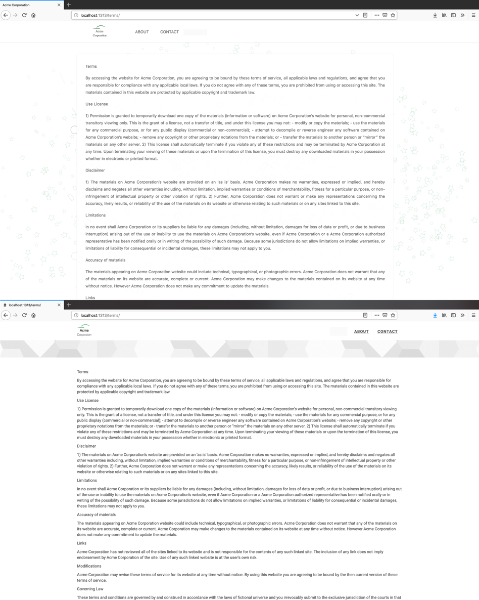

在本书的其余部分，我们将回到eclectic主题。

2.7概述

* Hugo可在Linux、MacOS和Windows上的大多数主要软件包管理器中安装。

* Hugo具有广泛的命令行功能，目的是最大限度地减少用户需要做的工作。它有方便的选项，可以帮助创建网站的所有部分，从添加模块依赖项到创建新的基于Markdown的文档。
* Hugo项目由`content`文件夹和`theme`文件夹之外的文件夹组成。它包括post模板的`archetypes`、`static`、结构化数据的`data`、`theme`覆盖的布局、Hugo内部缓存的资源、图像、js和css文件的资产以及生成的输出的公共部分。还有一个配置文件，可以是configs的文件夹。
* Hugo主题可以通过多种方式添加，最简单的方式是直接复制到主题文件夹。它们需要在使用前配置通用的和主题特定的参数。
* Content可以添加为Markdown、特定于主题的结构化数据或重写的HTML模板。
* Hugo网站可以通过GitHub Pages和Netlify在全球范围内轻松托管，它们提供持续的交付支持，而不需要开发人员做大量工作。
* 我们可以切换主题，但如果我们使用大量特定于主题的数据，比如params，那么这项工作将需要重做。我们应该尽早研究主题转换，这样如果主题被放弃，我们就可以很容易地转换。
* Google Chrome的审计功能可用于衡量性能。应对可维护性进行全面的依赖性审计。
* 在开发过程中，需要定期监控每个网站的可维护性和性能，以确保质量。Hugo提供了出色的性能，并有一小部分依赖关系，但很大程度上仍取决于所选主题。

