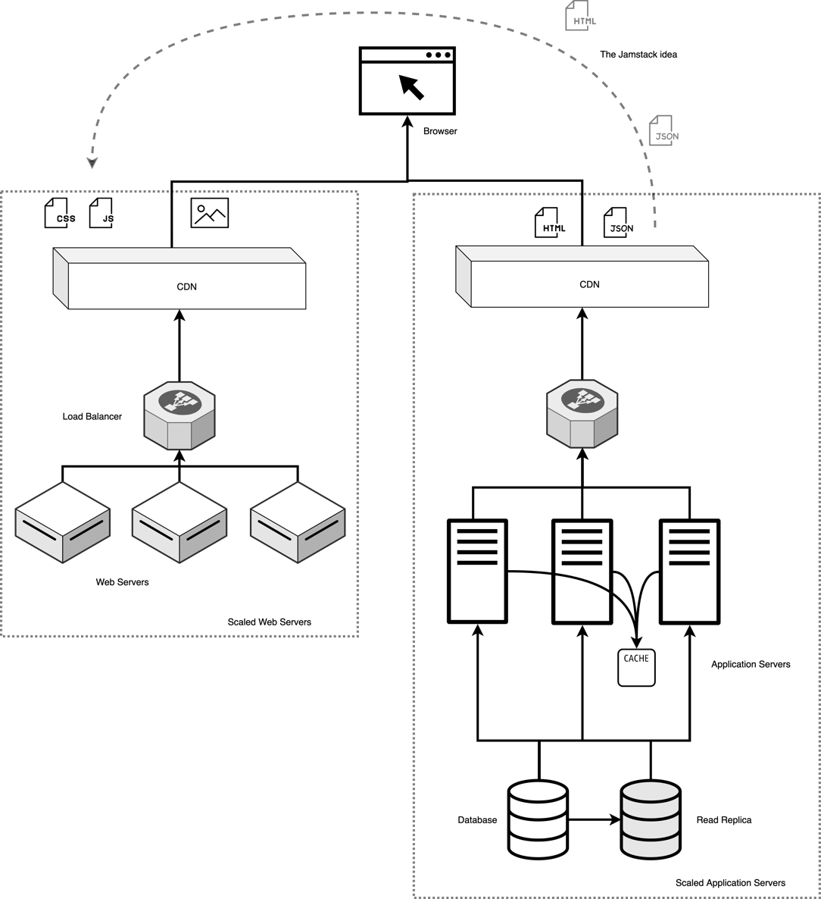
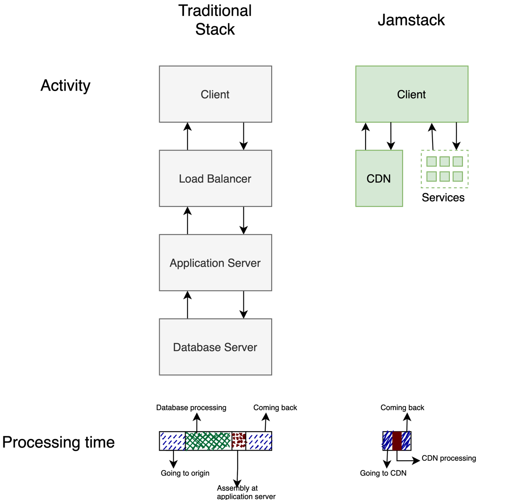
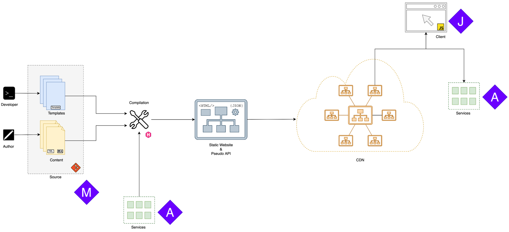

本章包括

* 构建网站的Jamstack基础知识

* 静态站点生成的原理

* 了解Hugo静态站点生成器

* Hugo静态站点生成器的优点

* 最适合Jamstack和Hugo的用例
<!--more-->

如果你最近与网站有过联系，或者有类似职位的朋友，你一定知道维护网站需要做多少工作。它需要DevOps工程师、系统管理员和数据库架构师来保持网站在互联网上运行。这是整个团队的全职工作，而不仅仅是个人。内容的维护是如此困难，以至于创作者以前所未有的速度转向WordPress.com等托管服务，甚至将内容分发给Medium或Facebook等平台。

**Jamstack提供了一种进行web开发的方式，可以最大限度地减少维护网站的日常开销。**这个词是由Netlify的联合创始人兼首席执行官Matt Biilmann于2016年创造的。它通过将所有内容存储到部署期间编译的文件中，然后通过内容交付网络（CDN）分发，从而放弃了数据库。动态、基于服务器的内容由第三方维护的应用程序编程接口（API）提供，或由云服务提供商托管，网站所有者的日常参与最少。通过这种方式，开发人员无需处理安全更新、拒绝服务（DoS）攻击，也无需持续监控以阻止黑客。

Jamstack严重依赖于HTML、CSS和JavaScript等核心web技术。它提供了在现代网络上快速启动和运行的能力。我们可以构建性能卓越、成本低、维护量小的网站。它可以为各种用例构建网站，如个人博客、商业网站和电子商务解决方案。Jamstack可以通过提供对静态内容的完全支持与基于服务器的框架协调工作，而用户生成的基于服务器的内容仍然可以由传统框架提供。

Hugo是Jamstack中最受欢迎的框架之一，提供了最佳的构建速度。它满足了该工具的承诺，它帮助我们享受web开发，而无需与设置、维护或日常维护相关的烦恼。**Hugo是一个难得的工具，开发人员可以选择何时喝咖啡，因为无需等待编译、更新或部署。**Hugo以标记格式获取模板和网站，并将其转换为可供托管的HTML。

我祝贺您拿起这本书，开始了从根本上简化web开发方法的旅程。

## 1.1 Jamstack的技术栈
为了充分理解Jamstack，我们首先需要理解web堆栈的概念。web堆栈是用于web应用程序开发的软件集合。它是一个堆栈，因为软件是按层排列的。其他一些流行的web堆栈包括LAMP（Linux Apache MySQL PHP）、MEAN（MongoDB Express Angular Node.js）和MERN（MongoDB Express React Node.js）。图1.1显示了非基于Jamstack的网站的典型web堆栈。

网页由静态资产和动态资产组成。这些资产由堆栈中不同类型的服务器提供服务。静态资产（如图像、JavaScript和CSS文件）由传统web堆栈中的web服务器（如Apache）托管。这些文件不会在多个用户之间更改。第二组内容是可以是不同的动态内容。它基于提供的请求参数，包括URL、请求头、cookie和相关的HTTP POST数据。PHP或Express等应用程序服务器接受这些参数并创建响应。它可能需要向保存网站内容的数据库服务器（如MySQL或MongoDB）发出一系列请求。应用程序服务器接收此请求，并使用应用程序逻辑将其生成为JSON响应（在MEAN/MERN中）或将HTML模板生成为HTML内容（在LAMP中），然后提供给web浏览器。在浏览器中，通过执行JavaScript并使用CSS对提供的内容和图像进行样式化来组装网页。

自从互联网出现以来，这种网络架构基本上是相同的。随着互联网的发展和流量的增加，这种架构受到了重视。增加服务器内的CPU和RAM（称为垂直扩展）无法处理现代互联网的流量。这需要我们添加多台机器来提供堆栈的水平扩展。

web服务器易于扩展,由于内容不变，因此可以跨多台共享负载的机器进行复制。内容交付网络（CDN）执行跨地理位置上更接近最终用户的节点复制这些资产的任务，并为最终用户以非常快的速度提供所有网络流量的互联网成规模的处理。图1.2显示了左侧Web服务器的扩展策略。

应用程序层（应用程序和数据库服务器）很难扩展。如果我们通过管理客户端中的用户状态（通过JavaScript或cookie）来保持请求无状态，那么应用程序服务器可以水平扩展。因为这些是在服务器中执行的逻辑，很难在CDN中移动这些内容。

数据库层是最难扩展的。CAP定理告诉我们，在互联网规模下，扩展常规数据库是不可能的。它指出，在分布式数据库中，我们最多可以同时拥有三个CAP资产中的两个属性：一致性（每次读取都会收到最近的写入或错误）、可用性（每次请求都会收到一个（非错误）响应）和分区容错性（尽管节点之间的网络丢弃（或延迟）了任意数量的消息，但系统仍会继续运行）。诸如最终一致性之类的解决方案存在于应用程序堆栈中，其中数据库不一致，但经过一段时间后会变得一致。这些变通方法会导致应用程序逻辑的困难，并对我们使用该技术可以实现的某些事情施加限制。

尽管存在这些问题，传统的网络堆栈仍然能够在互联网规模下生存。尽管存在数据库可伸缩性问题，堆栈仍能工作的最大原因之一是负载类型。在大多数情况下，对数据库的更改要比检索数据少一个数量级。我们可以通过添加缓存层来减轻数据库的检索负载。数据库的读取副本、应用程序服务器的缓存服务器都是这方面的解决方案。我们甚至发现，许多网页在多个请求之间不会发生变化。许多网站可以在应用程序层上添加CDN以减轻负载。右侧的图1.2显示了此解决方案。

如果仔细看图1.2，应用程序层与Web服务器层非常相似。管理为动态计算而构建的应用程序服务器中的缓存层要困难得多。Jamstack颠覆了传统的web堆栈，建议将大部分逻辑从应用程序层转移到web服务器层。

> 注意
> Jamstack没有规定用于开发网站的任何特定技术。它提供了一种web开发方法，其中大多数网站都是预先构建的，并且可以通过客户端脚本添加动态特性。

明确尝试缓存所有内容使缓存管理更加简单。我们可以预先计算和缓存大量需要动态计算的工作。这种预计算（在Jamstack中也称为编译和预渲染）提供了增强性能的额外好处，因为当用户请求数据时，服务器中不需要计算。Jamstack不禁止服务器端或客户端处理。它建议仅在需要时使用这些工具。部署期间的预计算效率更高，web服务器的安全问题和维护需求更少。

图1.3提供了第一个请求运行时Jamstack与传统web堆栈的比较。对于经典方法中的初始HTML，请求需要通过互联网到达服务的源服务器。然后，负载平衡器选择应用程序服务器。应用服务器可以向数据库发送多个请求以获取所需的数据。它基于应用程序逻辑和作为应用程序代码一部分的HTML模板来组装响应，以创建传递给客户端以呈现的最终HTML。在Jamstack中，数据库处理和将数据与模板合并的应用程序逻辑已经在编译时完成。这不需要对每个请求都发生。请求不需要通过互联网到达源服务器。HTML已经缓存在地理位置接近客户端的CDN位置。

注意，图1.3只显示了对数据的初始请求。之后通常会调用图像、JS和CSS文件。这些可能会要求源服务器或第三方服务提供其他数据。

## 1.2 Jamstack如何工作？

Jamstack提供的简化堆栈有很多幕后处理。这个编译过程在Jamstack中是新的。图1.4解释了Jamstack的各个部分。

在基于Jamstack的网站中，内容存储在标记文档中，而不是数据库中。与数据库表中的单元格不同，标记文档提供了使用基于文本的常规编辑器查看和编辑页面内容的灵活性。内容作者可以直接编辑这些文件或使用图形CMS（如果需要）。开发人员维护模板和业务逻辑，以组合数据并创建网站。这些文件在Git等版本控制系统中管理，并托管在GitHub等基于云的存储库系统中，以管理更改。这些构成了网站的标记（M）层。

老派的做法

在磁盘上的文件夹中写入内容并将其上载到管理内容的共享托管提供商上的方法看起来很像早期的web，我们曾经通过FTP连接上载HTML和PHP文件。相似之处很容易看出。这就提出了一个问题: 这次有什么不同？

自从我们开始手动控制服务器以来，网络已经成熟了很多。许多需要服务器代码的功能现在可以使用前端技术实现。共享主机已经升级到云，您可以将主机和计算扩展到互联网规模。即使是传统的基于web堆栈的服务也托管在云中。

那个时代的另一个重要变化是工具。像FrontPage这样的工具是为设计者和最终用户而构建的，这使得网站成为了一个网站作者不理解的复制粘贴脚本的网格。现代工具以开发人员为目标，帮助优化、维护和性能。网站是用这些工具设计的，而不是拼凑在一起

我们从网络的早期就学到了。我们有一个更好的系统，具有足够的功能和灵活性，可以毫无妥协地构建任何所需的应用程序。

像Hugo这样的网站建设工具,使用这些数据将网站编译成一组HTML文件以及CSS、JavaScript和基于图像的资产。构建器可以通过API与外部和内部服务进行通信，以获取要编译到网站中的数据。构建器还可以将网站内容构建成机器友好的格式，如JSON。JSON文件充当API（称为伪API），用于通过JavaScript或本地移动应用程序使用标记中的数据。

编译后的网站由内容交付网络（CDN）不同地理位置,的分布式机器托管。从最接近最终用户的CDN节点向最终用户提供此内容。所有与用户有关的静态内容都会立即提供。对于动态数据，JavaScript代码可以接管。JavaScript是Jamstack的J层。JavaScript为网站提供交互性和个性化。

JavaScript层可以与各种服务通信以提供动态内容。这些服务公开了构成Jamstack A层的API。这些API封装了传统堆栈中剩余的应用服务器。建议使用第三方拥有的托管服务或FaaS（功能即服务）云解决方案托管的托管服务，以最大限度地减少维护负担。

## 练习1.1

在Jamstack中，大部分逻辑应该驻留在哪里？
1. Server
2. Microservices
3. Compiled Templates
4. Client
5. JavaScript

## 1.3 Jamstack的“JAM”

Jamstack的三个不同部分构成了JAM，分别代表JavaScript、API和标记。

## 1.3.1 JavaScript

Jamstack中的JavaScript指的是客户端脚本的所有方法，这些方法提供用户个性化的交互性和动态功能，并且不能预先编译。它使开发人员能够在运行时对用户操作做出反应并修改用户界面。Jamstack将JavaScript框架及其管理的细节留给web开发人员。

在传统堆栈中，服务器在处理用户交互方面扮演着重要角色。即使只需要修改页面的一部分，也需要生成新页面。这是不必要的，也是次优的。现代JavaScript完全能够在浏览器中存储用户状态。它可以与服务器通信并更新界面，而用户无需执行重新加载。Jamstack规定在使用JavaScript的情况下，最好使用JavaScript——为最终用户提供交互界面，并从客户端到服务器进行通信。

## 1.3.2应用程序编程接口（API）

应用程序编程接口（API）为与web服务通信提供了一个定义良好的契约。API抽象了整个服务器功能，客户机不需要了解服务器内部来使用服务。在Jamstack中，预编译和客户端JavaScript接管了许多最初在服务器上完成的工作。服务器仍然有它的用处。这包括跨机器存储应用程序状态、需要比单个机器更高处理能力的计算，以及需要从网站查看从服务器发回来的数据。

许多传统系统公开API以与底层功能进行通信。虽然根据定义，这些方法符合Jamstack定义，但Jamstack建议尽量减少API的构建，以减少维护开销。Jamstack对其他堆栈中需要API的许多操作进行了不同的处理。您可以在磁盘上放置/更新/删除文件，而不是内容创建/更新/移除API。只有基于网站内用户行为的动态更新（如购买和评论）才需要专用API。

有第三方API提供程序提供高级API，开发人员可以利用这些API，而无需自行构建所有内容。从表单处理到全文搜索，无需编写自定义代码即可实现大规模搜索。

当我们需要编写自定义后端时，云服务提供商会使这项任务比从头开始构建更容易。通过功能即服务（FaaS），云服务提供商接管了正常运行时间、持续安全更新以及随用户负载扩展的所有权。服务提供商在全球范围内保持性能和可用性。开发人员编写代码并将其交给服务提供商进行部署。正在进行的工作很少。开发人员致力于增强功能或更新功能级别的任何依赖项。

## 1.3.3标记(Markup)

传统的标记定义包括文本文档中包含的一组注释（如HTML文档中的XML标记、Markdown中文本周围的星号），这些注释提供了有关如何理解/呈现文本的更多信息。在Jamstack中，整个标记文档都被视为标记。这包括文本数据、注释标记和结构化元数据。

标记形成Jamstack的数据层。与传统数据库不同的是，标记存储在文本文件中，人类可以以原始形式阅读和编辑标记，而无需使用工具将数据转换为可读格式。标记语言提供了一种以简洁易读的方式编写格式化文档的方法。Markdown是用于在Jamstack中编写内容的最流行的标记语言。我们将在第3章中详细了解Markdown。它可以伴随各种元数据语言（这些语言不用于标记，而是用于与文档相关的附加信息），其中之一是Yaml,它不是标记语言（Yaml），我们也将在第3章中讨论。

注意
HTML（超文本标记语言）也是一种标记语言，您可以自由选择将数据写入Jamstack。Markdown等人类可读语言使其更易于阅读和维护。它们在呈现过程中被转换为HTML，并强制保持布局（模板）和呈现（CSS）不包含内容。

使用基于标记的文档存储数据有许多优点。大多数网页是非结构化的,它最终存储在常规数据库的单个单元格中。这不是对数据库技术的良好利用。如果作为文件进行管理，我们可以使用Git这样的版本控制系统来对数据更改进行版本控制。将数据与代码一起使用可以简化跨服务和构建环境的迁移。我们可以将所有配置文件存储在一起。通过按需启动构建环境，优化和测试更容易。对于非结构化内容，数据库的大多数组织和查询功能都没有用。基于数据库托管博客或通用网页并不是对其资源的最佳利用。

随着Git和GitHub的普及，许多开发人员已经熟悉标记语言，尤其是Markdown。代码库中的大多数自述文件都是用标记语言编写的。这些语言稳定、标准化、易于学习和理解。有很多工具可以用这些语言编写或跨这些语言迁移数据。它们还可以很好地与diff和merge工具（用于跨更改的版本比较）配合使用，并且主要的编程语言都有解析它们的库。这为程序员提供了极大的灵活性，以他们喜欢的方式处理数据。

## 练习1.2

Jamstack的M代表什么？

1. markup (正确)
2. markdown
3. MySQL
4. MongoDB

## 1.4 为什么使用Jamstack？

向用户展示的HTML内容的预构建具有独特的优势，从最小的操作到极大的性能和成本降低。

## 1.4.1 最小操作

由于内容在发布之前就已经构建好了，并且其输出以纯HTML形式提供，网站中移动部分的数量大幅减少。服务提供商负责安全更新、硬件故障和网络问题。云主机提供几乎100%的正常运行时间，而无需网站所有者的任何积极参与。无需随叫随到，无需考虑服务器、扩展、负载平衡、跨大陆的正常运行时间或任何其他操作开销。开发商可以专注于构建的乐趣。企业可以专注于其核心能力，而不是建立DevOps团队。

## 1.4.2 出色的性能

作为静态网站提供的预先构建的HTML完全托管在CDN上。这样，每个文件都被缓存并从地理位置非常接近最终用户的服务器提供服务。不存在到应用程序服务器的往返，也不存在可能成为瓶颈的数据库查询。大多数以Jamstack为目标的站点生成器在编译时生成HTML。这意味着HTML已经可以在用户请求时呈现。即使只有一个HTTP请求，该网站也非常实用。具有Jamstack的基本网站可以在大多数审计中提供90%以上的绩效分数。如果开发人员在构建主题时对性能敏感，基于Jamstack的网站可以满足这些审核中100%得分的所有标准。

## 1.4.3 降低成本

随着数据库和应用服务器从托管堆栈中移除，硬件成本降低。随着操作变得自动化，大多数DevOps需求都不存在。所有这些都意味着显著的成本节约。您可以使用GitHubPages和Netlify等静态站点主机免费创建网站。AWS S3、谷歌云存储和Azure存储等所有主要云提供商都提供低成本的静态托管。不需要IT或DevOps团队来管理服务器组。

## 1.4.4 提高开发人员生产力

类似Git的版本控制系统用于管理基于Jamstack的网站。不需要有复杂的开发环境。在开发人员机器上运行代码只需一个命令。大多数网站都可以通过一天多次简单地推送到服务器来部署。这些特性为开发人员提供了关注网站内容的时间和灵活性。

## 1.4.5 生命周期

HTML/CSS是构建的最稳定的技术。浏览器向后兼容，继续支持自90年代以来支持的所有功能。如果你托管了一个基于Jamstack的网站，并在互联网上消失了十年，它仍将以你回来时离开的状态存在。互联网不允许任何在静态服务器上托管的纯HTML/CSS/JS之外的技术堆栈。您甚至可以继续在虚拟机中使用静态站点生成器，而无需永远更新版本。由于生成器是本地的，因此生成器中的安全漏洞不会影响网站。您可以离线使用它，这使得这些漏洞不会暴露在互联网上。

## 1.4.6 工具

Jamstack的工具,具有更少的活动部件和明确的结构，比其他堆栈更先进和强大。通过Netlify、GitHub Pages等轻松实现一键部署，并支持扩展。将整个网站作为代码呈现也意味着没有什么可隐藏的。没有复杂的安全或性能配置，堆栈中不同层没有额外的管理开销，也不需要IDE（集成开发环境）。

> 动态更新

> 如果是Jamstack的新手，那么无法动态更新网站似乎是一个限制。大多数传统系统都提供一种管理模式来更新网站。Jamstack对这方面没有作任何硬性规定。

> 这不是一个限制，因为不需要任何特殊工具来更新基于Jamstack的网站。内容是用标记语言编写的，它非常友好，易于使用，我们可以在任何文本编辑器中提供更新。大多数版本控制提供商，如GitHub、GitLab和Bitbucket，都能够从浏览器提交新的更改。这些可以自动构建并部署到生产环境中。

> 我们从内容的完整版本控制系统中获得了好处。我们还可以自由选择文本编辑器。作为奖励，我们可以随时随地更新主题。文本内容、自动部署和持续集成等确保我们不会错过WordPress实例中的管理模式。

> 如果需要，也可以使用管理工具。我们在附录C中讨论了Netlify CMS。

## 1.5 何时不使用Jamstack

Jamstack的构建基于这样一个假设：对于任何内容，读请求比写请求多出一个数量级。它还假设内容在编译时可用，并且不会动态更改。不能满足这些条件，Jamstack无法很好的工作。

## 1.5.1 当存在无历史意义的动态数据时

如果我们正在用不断变化的数据构建一个仪表板类型的应用程序，那么预编译作为一个概念并不能提供很大的价值。基于传感器的数据可以在几毫秒内改变。在许多情况下，这些数据永远不会被读取。Jamstack作为一个概念在这种类型的应用程序中并不适用。这里需要对报告的用例发出警告，其中一些数据需要长期存在，并且经常被读取，一旦写入就不会被编辑。此报告非常适合预生成和保存。

## 1.5.2 基于用户生成的内容和瞬时数据构建

像Twitter和Facebook这样的网站是由很少在单个页面上阅读的非常小的帖子构建而成的。这些被编译为提要，每个用户的提要都不同，并且随着时间的推移而变化。任何给定时间的提要都可能无法读取。大多数帖子几乎没有历史意义，而且大多数单独的帖子页面从未被阅读过。这些用例不适合Jamstack的一次写入多次读取用例。虽然理论上我们可以编译经常使用的页面，但这也可以通过传统的web堆栈实现。这里需要记住的一点是，如果数据具有永久性价值，故事就会发生很大变化。如果我们有用户生成的博客文章、产品页面或文章，这些文章只写一次并多次阅读，那么这又回到了Jamstack所针对的“写一次读多次”用例。

## 1.5.3 具有用户特征的网页

有些网站的每个页面都是为用户个性化的。根据用户id，此数据不同。因此，预编译可能没有意义。大多数用户可能无法登录。无法公开访问可能会增加负载的机器人。对数据进行多次读取和一次写入的整个概念是错误的。这方面的一个例子是日历应用程序。每个用户的日历都不同。如果每个人的日历都不一样，那么预先生成他们的日历是没有意义的。

## 1.5.4 无数据可编译时

当Web应用程序,是用户,又是创作者还是消费者的网站。例如,对于一个文档编辑器（比如谷歌文档）来说，没有数据可以显示。在这些情况下，Jamstack方法没有帮助。

## 练习1.3

以下哪个网站最适合转换为Jamstack？

1. google.com
2. amazon.com   (正确)
3. facebook.com
4. twitter.com

## 1.6 选择静态站点生成器

Jamstack没有规定特定的技术。开发者可以自由选择自己喜欢的技术来构建网站。有一个庞大的静态站点建设者列表，可以从中选择各种权衡。它们以不同的编程语言构建，并为不同的插件提供集成和支持。

Jekyll是最古老的现代静态网站建设者。虽然由于无缝的GitHub集成，Jekyll非常受欢迎，但其性能缓慢，插件侵入，内核移动缓慢。许多用户从Jekyll开始他们的静态站点之旅，但由于性能原因而离开，特别是当他们最终使用插件时。

Hugo是具有深度功能集的静态站点生成器中速度最快的。开发团队以构建一个系统而自豪，该系统可以在不到一秒钟的时间内呈现出数百页的复杂网站。hugo是用Go（Golang）写成的，以一个二进制的形式分发。由于缺乏对插件的依赖，核心团队承担了标准化大部分功能的责任。这使得我们可以通过大量的思考来构建特性，并将重点放在可维护性和性能上。它的模板语言是一种完整的编程语言，可以用来构建任何东西。文档维护得很好，社区在论坛中非常活跃。它被许多每月有数百万用户的热门网站使用。hugo的核心是稳定的，虽然它确实快速发展，但它与旧版本兼容。

有一批基于JavaScript框架的静态站点生成器，如Gatsby、Nuxt和Next.js，它们也非常流行。这些迫使您遵循他们对如何编写和使用JavaScript的选择。Next.js等框架包含构建API后端的功能。如果您希望构建一个JavaScript繁重的应用程序，并同意这些框架所做的决定，这些可能是很好的选择。由于JavaScript生态系统的性质以及这些框架存在的时间相对较短，因此，随着更多想法的发展，确实会出现混乱。

还有另一组静态站点生成器，如Python中的Pelican和Rust中的mdBook。这些功能集和受欢迎程度要小得多。如果您与一种语言绑定，并希望在其中编写自己的功能，则可以使用这些功能。

## 1.7为什么选择Hugo?

Hugo是最古老的静态站点框架之一，多年来一直在流行。其创建者Steve Francia拥有Drupal内容管理系统的丰富经验，他带来了一些最佳实践，并与Hugo一起纠正了Drupal的设计缺陷。

Hugo处于WordPress这样的工具和Rails或Express.js之间的最佳位置，后者主要为非技术受众而构建，后者提供生成通用软件的能力，但需要持续的维护工作。使用Hugo，您可以获得比Rails/Express.js低一级的灵活性，维护工作类似于选择第三方托管的WordPress实例，从一开始就具有出色性能的额外优势。Hugo是为那些不介意自己动手编写代码，但需要保持理智并在他们正在构建的项目之外生活的用户而设计的。选择Hugo的开发人员很少转向其他网站建设方法。这有多种原因：

你并不孤单
Hugo在业界极受欢迎，并已大规模用于Bootstrap等网站(<https://getbootstrap.com>)，Lets Encrypt(<https://letsencrypt.org>)，Smashing Magazine(<https://www.smashingmagazine.com>)，Netlify(<https://www.netlify.com/>)1Password Support(<https://support.1password.com/>).

Smashing Magazine将其数千页的网站从WordPress迁移到Hugo，以提高其性能和易用性。

## 1.7.1 Hugo  非常快

Hugo是目前最快的功能丰富的静态站点生成器。虽然我们在开始一个项目时可能无法理解这一点，但这在我们的日常生活中非常重要。等待编译或刷新是开发人员沮丧的主要原因，这可能意味着好项目的消亡。当技术变化迫使我们对网站模板进行重大更改时，这一点变得更加重要。移动设备的出现给大量的WordPress主题带来了死亡，更新每个方面都非常痛苦，以至于开发者放弃了。即使有十年的内容，基于Hugo的网站仍将继续为开发提供令人尊敬的性能。与任何较慢的框架相比，重写或翻新基于Hugo的网站更容易，也更令人愉快。

## HUGO 与 GO 语言

开发者在选择Hugo时的犹豫不定,是对Go语言的恐惧。go不是一种主流语言，与其他选项相比，它的社区非常小。但这不会影响你使用hugo的决定。**没有必要学习Go，也没有必要了解Go是如何与hugo一起取得成功的**。这本书没有一行Go代码。我们不需要学习我们的大多数工具是如何在内部工作的，就可以使用它们。Go是Hugo用户的内部细节。

Go编程语言内置了对并发的支持。用并行执行编写代码在Go中比其他许多用于构建网站生成器的编程语言更容易。hugo从Go的速度中获益匪浅，而不必强迫用户承担所有的复杂性。Hugo的用户只需使用Go模板语言，尽管名称不同，但它与Go本身是不同的语言。它是图灵完备（即，它可以用来编写涉及逻辑的程序，逻辑是所有现代计算的基础），允许我们编写任何我们想要的东西，包括模块和函数，而无需处理多线程代码的大量复杂性。**如果你不打算写自己的主题或shortcodes，甚至Go模板语言也可能不需要**。您可以用标记语言编写内容，并从书架上选择一个主题来构建网站。

大多数其他基于Jamstack的网站生成器都是在单线程顺序流中编写的。这允许他们拥有插件，但以性能的形式支付巨额费用。由于Hugo中的大多数主要功能都可用，因此不需要折衷缓慢的框架。

虽然Go不是主流，但它被用于开发Docker和Kubernetes等重要的基础技术。因此，它没有被放弃的重大风险。由于Go不是主流，Hugo开发人员有一些独特的优势来影响编程语言并获得改进Hugo的功能。hugo的创始人史蒂夫·弗朗西亚（Steve Francia）领导了Go编程语言的项目管理和策略，其最佳特性也影响了hugo。

## 1.7.2 hugo是稳定的

hugo的核心功能已经得到了很长一段时间的支持，不太可能被打破。新增加的功能可确保这些功能不受干扰，并继续正常工作。在Hugo的早期，它进展缓慢，因为开发团队专注于正确的架构。这是有回报的。Hugo是灵活的，可扩展到新功能，大多数版本不会破坏数千个使用它构建的网站。虽然Hugo没有被标记为大于1.0的版本，但这不应被视为不稳定的迹象。这意味着Hugo开发团队相信Hugo的持续发展，不希望将支持分成多个主要版本。Hugo试图在各个版本之间保持向后兼容，并在需要更改时提供如何升级的指导。如果你选择了一个旧的主题并获得了hugo的最新版本，你可能会得到一些警告，但大多数应该会继续工作。编译速度也比构建时的版本快。

## 1.7.3 Hugo为性能而生

Hugo社区开始寻找并与最快的静态站点生成器合作。它有一种自然的倾向，即在他们所做的每件事中都寻求性能。在社区论坛中，有很多关于如何通过简单易行的步骤来提高网站性能的建议。如果你从互联网上找到一个随机脚本来与Hugo一起做一些事情，那么很可能会对其进行性能优化。

Hugo的核心表现也影响其产量,开发人员可以从Hugo用于优化自己工作流程的方法中学习。一般来说，基于Hugo的网站的质量要比一般网站好得多。

## 1.7.4 Hugo是独立的

一个插件密集的系统似乎提供了很多灵活性和功能，直到维护的概念出现。即使一个插件被放弃，即使框架被积极维护，您的网站也可能会变得糟糕。对于Rails这样的框架来说，这是一个典型的问题，每个主要版本都成为迁移所有插件的巨大痛苦。在过去流行的生态系统（如jQuery、Backbone和Angular）中也可以看到同样的情况，其中插件没有更新。即使是极受欢迎并积极维护的Jekyll，也存在插件腐烂的巨大问题。

自给自足让Hugo能够绕过困扰其他项目的问题。核心团队已经能够将最佳方法标准化，以执行本机提供的任务。Hugo团队优化了Hugo，而不需要较低级别的API兼容性。他们继续为标准化工作流程编写复杂的多线程逻辑，以减少用户在其他地方花费的几毫秒时间。用户从插件作者那里得到了更多的支持，并且对放弃其核心工作流程的担忧更小。

自包含并不意味着Hugo不可扩展。Go模板语言非常强大，用户可以将代码片段作为可重用的模块共享，并可以使用该语言执行复杂的逻辑。

## 1.7.5 Hugo作为单个文件分发

Hugo将其所有核心依赖项和资源打包在一个可执行文件中。这使得下载Hugo、将其转移到另一台机器或备份变得极其简单。在系统中，由于安全问题，每个文件都有大量的检查，一个没有其他依赖关系的二进制文件真的很有用。如果开发人员需要在受限环境中使用Hugo二进制文件，可以将其与源代码一起签入。只有一个文件可以处理所有事务，因此不需要更新依赖项，也不需要管理构建系统。这与基于JavaScript的静态站点构建器形成鲜明对比，后者有数百个依赖项，每个依赖项可能需要经过安全团队的审查才能在企业环境中使用。

## 1.7.6 Hugo的维护成本极低

由于移动部件（插件和操作系统依赖性）较少，安装步骤很小，没有数据库或复杂的托管步骤，Hugo的维护工作量可以比其他web开发方法少得多。每个依赖项都是维护。你可以得到一个非常强大的网站，只需Hugo和一个托管提供商就可以获得非常低的维护费用。虽然Hugo已经更新了向后兼容性，但您可以在有时间的时候进行更新，而不必去修复晦涩难懂的插件。网络开发世界中的大多数其他生态系统都不能这样。

## 1.7.7 Hugo可以让你免于分析瘫痪

Hugo拥有大量工具和技术，能够快速启动和运行。虽然强大的模板系统允许您将自己的解决方案应用于某个问题，但大多数常见的问题都已解决。Hugo有一个通用的分页方法实现，将内容分类为无限类型的类别，并获得菜单等核心网站元素。对于Hugo来说，起床和跑步很容易，因为有一种很好的记录和流行的方法来解决大多数问题。

## 1.7.8 Hugo很强大

尽管雨果固执己见，但他多才多艺。Hugo扩展的Go模板语言是一种强大而灵活的语言。这为开发人员提供了在Hugo中编写适当程序的能力。Hugo提供的标准库规模庞大，而且还在不断增长。它从一开始就表现出色。即使你写了非常糟糕的代码，内置函数的核心性能也能在很长一段时间内保持优雅。通过在网站生成期间访问API，Hugo在不损失生成输出性能的情况下提供了大量功能。

使用Hugo，您可以在网站的任何地方编写函数，包括开发内容（作为嵌入标记中的自定义快捷方式）以进行某些特殊处理。您可以将其封装为可重用的内容，或者在特定页面上留下一次性代码片段。

Hugo有很多web开发原语。尽管如此，不使用它们似乎不像是在对抗框架。如果您不想使用Hugo提供的功能并使用模板语言构建自己的功能，那么使用Hugo其他功能的体验不会恶化。

## 1.7.9 Hugo可扩展

Hugo已经迎合了具有数千页和数百万月活跃用户的多语言内容的网站。Hugo在处理互联网上一些规模最大、使用量最大的网站方面有着良好的记录。已经有足够的原语和功能将基于Hugo的网站从开发人员扩展到团队。Hugo支持多种输入和输出格式，并具有多种功能，可实现团队中非技术成员日常工作的自动化。

## 1.7.10 Hugo是一个社区项目

Hugo由一个志愿者社区维护，该社区对该项目没有任何商业利益。这使得项目的方向符合社区的最佳利益。Hugo不能因公司的一时兴起而转向、被收购或关闭。

## 1.8速度真的很重要吗？

构建性能的重要性再强调也不为过。Hugo采用了许多技术来加快构建时间，比如拥有一个支持所有层缓存的多线程内核，以防止尽可能多的返工。这将使开发人员从注意构建时间的负担中解放出来。

当你以watch mode（一种特殊的开发模式）启动Hugo时，网站会在不到一秒钟的时间内出现。它以打字的速度重新加载，而无需完成为实时重新加载设置花式热模块替换件的整个步骤。该功能不仅适用于带有虚拟内容的主题，还适用于可以推送至生产的整个网站。这提供了编辑网站的灵活性，您可以在五分钟内完成其他工作。在其他框架中，做好准备本身就是一项任务。进入开发模式需要很长时间，因此对于浏览时发现的小错误，我们往往会忽略它们。

随着整个数据随您的网站传输并在运行中重新编译，开发人员可以自由地进行实验并立即查看结果，也可以在不付出额外脑力的情况下投入生产。数据输入也是如此。构建时间缓慢的静态站点构建者的一个巨大负担是，提交数据是内容编写者需要计划的事情，因为启动和运行自己可能需要5分钟，这样你就可能失去思路。WordPress的内容灵活性和Jamstack的运行时性能并不像Hugo那样是一个非此即彼的框架。

在框架级别完成了这项工作，并且暴露了所有原语，作为一名开发人员，您开始重新思考您的网站建设策略。这段代码是否需要进入JavaScript，必须在访问此页面的十亿客户机器中的每一台上运行，或者我们是否可以编写这样的代码，使其运行一次，并将结果保存为SVG或预先计算的HTML，这样客户就不必重新执行？在构建过程中，这些细微的调整对提高网站性能有很大帮助。

练习1.4

Hugo使用____Go___（编程语言）构建。

## 1.9 我们可以用Hugo做什么？

Jamstack是一个非常通用的概念，可以应用于各种各样的问题。Hugo适用于大多数人，并凭借其处理规模的能力成为Jamstack成功的典范。当信息需要从服务器流到客户端时，Hugo会发光，而客户端主要用于消费所述信息而不是创建。这符合传统的出版定义，即内容创作者通过媒体（如网络）向消费者提供内容。以下是Hugo的专长：

## 1.9.1个人网站和博客

远离互联网的日子一去不复返了。通过某种方式或其他方式，现代世界中的每一个有网络用户作为朋友或亲戚的人都已经出现在网络上。正确的方法是拥抱互联网，控制你的在线印象，而不是让它依赖于他人，而不是试图隐藏它。

Hugo非常适合建立和运行个人网站。个人网站的大目标是低维护、低成本和展示自己品味的灵活性。在本书中，我们将看到如何构建低维护、几乎免费的托管以及足够的灵活性来定制您想要的内容。除此之外，您还可以获得出色的性能、随时随地更新的能力、全面的SEO支持和快速启动。

你可以选择任何一个公开可用的Hugo主题，在几分钟内开始并运行一个像样的网站。你会惊讶于有多少功能没有任何定制。一旦你到了那里，就很容易找到主题并开始定制它，从而在互联网上留下你独特的印象。

## 1.9.2非技术业务网站

Hugo可以毫无问题地扩展到并行更新内容的团队。那些核心能力不是建立网站的企业需要一些易于维护、成本低、性能好的东西。他们还需要灵活性和控制力。Hugo在需求列表中勾选了所有这些框。这是经过深思熟虑的，对于任何可能通过短期合同加入网站开发的供应商团队来说都很容易理解。Hugo提供了很少的地方让开发人员编写会减慢网站速度的坏代码。整个机制足够灵活，可以立即添加业务所需的一个自定义页面，而无需通过并拆分整个网站。

通过Jamstack的JavaScript和API层，Hugo网站可以扩展为提供为服务器上动态网站更新保留的功能。您将在本书中看到，我们如何构建低成本、低维护的功能，如购物车，同时保持网站的其余部分静态管理。

## 1.9.3文档网站

Hugo非常支持从CSV或JSON等文件中读取结构化数据，然后用它创建网站。您仍然可以应用自己的自定义主题。它内置了对语法高亮显示的支持，可以轻松扩展到大量页面。这使得它非常适合编写自定义网站，可以从API文档中读取并准备一个格式整洁的规范版本。

## 1.9.4基于Jamstack的混合网站

所有网站都有显示内容的页面。这些页面包括隐私政策、关于我们的通用页面、博客、产品列表页面，以及公司发布新闻声明的新闻编辑室。对于所有这些旨在消费而非操作的内容，Hugo和Jamstack可以帮助保持内容以低成本、高可用性和良好性能运行。基于服务器技术的页面可以单独交付，也可以使用服务器公开的API与服务器进行内置JavaScript通信。

## 练习1.5

基于Hugo的网站不能有管理员页面，需要在本地进行完整设置才能编写内容。（对/错）
答案是 对

## 1.10与Hugo不符的案例

与所有工具一样，Hugo有自己的用例。除了适用于任何Jamstack框架的所有Jamstack限制之外，我们需要了解Hugo的关注点仅限于Jamstack的标记部分。虽然Hugo提供了最快的JavaScript bundler，并且对npm生态系统有很好的支持，但它对Jamstack的JavaScript和API层采取了不干涉的方式。如果希望构建一个需要大量JavaScript的工具，这些JavaScript需要与静态页面混合，或者需要一个与网站模板共享代码的API，那么Hugo将这些部分独立的方法是不够的。

另一种Hugo可能不是最佳的情况是，当我们需要Hugo不具备的一些功能，并且无法通过API实现这些功能时。Hugo保持其核心无法访问模板和模块，以保持其灵活性和性能不变。对于想要构建一个定制的静态站点构建器的开发人员来说，Hugo可能不是正确的选择。

## 1.11如何与Hugo和本书一起取得成功

在本书中，我们将为Acme Corporation建立网站，这是一家领先的数字形状制造商。该网站将有常规的公司页面、支持动态评论和搜索的博客、基于JavaScript的形状编辑器以及通过电子邮件发送的购买形状的店面。

我们将从Hugo擅长的Jamstack标记层开始，在那里我们将讨论如何在Hugo网站中创建和组织基于标记的文档，如何使用这些文档来呈现网页，创建主题，这些主题可以共享web模板，并使用模块来创建可重用的内容和模板代码。在第二部分中，我们将深入研究Hugo对Jamstack的JavaScript和API部分的支持，包括如何在编译时和运行时调用API，构建基于Jamstack简单的API，使用JavaScript增强用户体验，编译复杂的JavaScript应用程序并将其与基于Hugo的网站绑定。

为了成功阅读本书，您需要一台具有现代操作系统、访问互联网、网络浏览器以及对网络开发人员熟悉的工具和编程语言的理解的机器。其中包括HTML、CSS、JavaScript、Git、GitHub和可选的npm，以及任何模板引擎（例如Mustache、Jade或Embedded Ruby（ERB））。代码示例都在GitHub上提供，并托管在https://hugoinaction.com.建议查看这些不同样本之间的差异，以将本地所做的更改与样本中的更改进行比较。

## 练习1.6
Hugo在Jamstack的___M____层工作。

## 1.12总结

* Jamstack是web开发的一种方法，它不是将内容存储在数据库中并在运行时进行查询，而是将大多数内容与主题一起存储为文件，并在部署期间编译到网站中。

* Jamstack中的静态内容是用可编译为HTML的标记语言编写的。动态内容以API的形式提供。这是通过JavaScript访问的。

* Jamstack在成本、操作和维护方面提供了巨大的节约。我们还有一个快速的网站。

* Hugo是一个帮助构建这些所谓的静态网站的框架，这些网站提供了非常好的构建性能，并且可以作为单个二进制文件使用。

* Hugo实现了低持续维护、良好的开发经验以及庞大团队规模的承诺。

* Hugo尤其擅长信息从服务器流向客户端的地方，如个人或公司网站、新闻帖子、博客、文档等。

* 对于信息流从客户端到服务器或根据用户个性化的地方，Hugo遵循Jamstack。Javascript层负责通过API与服务器通信。

