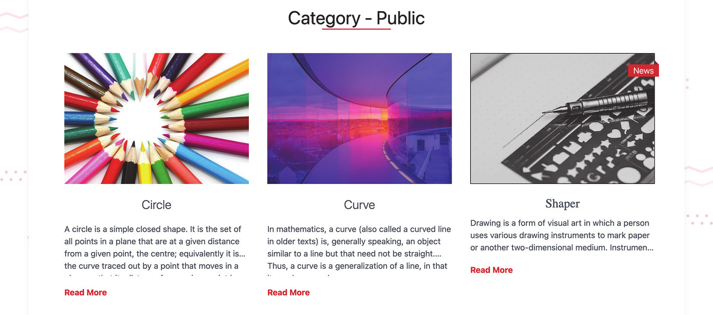

本章包括

* 使用共享基础模板创建多个布局
* 在hugo中使用front matter cascades
* 创建索引(index)和分类页面(taxonomy pages)以浏览网站
* 转换内容类型到主题
* 构建内容视图以在模板之间共享内容

在第6章中，我们开始远离Eclectic主题，开始为新主题奠定基础。我们创建了一个名为modern的新内容类型，它具有自定义模板代码。在本章中，我们将把现代内容类型转换为一个完整的主题（AcmeTheme）。如图7.1所示，我们还将关注所有类型的内容以及这些内容在新主题中的组合方式。

在Hugo中，一个主题没有严格的定义。从技术上讲，可以将内容文件夹呈现给网站的一组模板是一个主题。如果我们采用我们目前拥有的modern内容类型，并将其放在主题`/<themename>/_default/`文件夹中，我们可以将其称为主题，但这不是一个好的主题。它不能很好地呈现列表页面（branch bundle的根页面）。分类页面也将大部分为空白。Hugo中适当的主题应该能够呈现所有标准类型的内容，从常规页面到列表页面和分类。

目前，我们在很多页面上依赖于Eclectic主题。在本章中，我们将一页一页地移动到modern内容类型，一旦迁移完成，我们将能够重组该内容类型以成为主题。


## 7.1布局内容的更多方式

应用程序中有多种类型的页面，每种页面都有不同的外观。例如，博客页面通常有一个侧边栏，其中包含有关博客文章的附加信息。各种类型的页面可以具有不同的CSS样式和不同的HTML结构，以适应其独特的设计。

我们在第6章中使用了一种不同页面样式的方法，即为创建的每个页面类别使用一种新的内容类型。虽然内容类型是强大的概念，提供了一种机制来隔离特定类型内容的呈现代码，但Hugo中还有其他方法可以以不同front matter参数化的设计或新布局呈现内容。这三种方法都有各自的用例、优点和缺点，我们可以在同一个网站中同时使用它们。

对于Acme Corporation网站，我们用于使用条款Terms页面（第6.1.4节）的网页设计非常简单。它不能很好地处理博客和新闻部分的内容页面。我们需要对这些页面进行更精细的设计。新闻页面中所需的更改可以通过CSS实现，而对于博客页面，我们希望添加一个侧边栏，其中包括添加HTML内容。让我们来看看与Hugo一起实现这一目标的各种方式。

### 7.1.1参数化front matter以区分新闻页面界面

当我们在两种不同类型的页面之间进行轻微的HTML更改时，我们可能不想创建新的内容类型。我们可以公开模板代码可以用来提供差异化HTML的变量。使用条件语句if和else，如果需要，我们可以编写不同的HTML内容。这样，较小的HTML更改就存在于同一个文件中，我们不需要在磁盘上管理单独的文件。我们可以最大限度地重用代码，并且不需要将代码分成部分以防止重复。

对于Acme Corporation网站上的新闻页面，我们不需要做很多更改。这些页面附带了我们需要应用的封面图片。请记住，从第6章开始，页面上下文中的.Resources是指该页面的页面捆绑包中的资源。我们可以使用with或if检查来确保如果资源不存在，则不会生成其他HTML。然后，我们可以将其添加到现有的single.html中，如下所示。

```html
<main>
    {{$img:=.Resources.GetMatch "cover.*"}}                                        <!-- 获取封面图像 -->
      {{if $img}}                                                                 <!-- 将图像添加到网页（如果存在）-->
       
    {{end}}
...
{{end}}
```

Acme Corporation网站的新闻部分（图7.2）中的页面与我们迄今为止开发的页面具有相似的HTML结构，所有更改都存在于CSS样式中。因为HTML基本相同，所以切换CSS类的条件语句方法更适合这种用例。虽然我们可以将前面的类名作为变量，并通过调用$.Param函数来使用它，但是我们可以通过一些方法来获取这些信息，而不需要在网站的内容区域中写入任何内容。如果我们没有设置内容类型，我们可以通过`.type`属性为本例使用内容类型。


图7.2通过使用`section`信息切换CSS样式，用不同的UI呈现新闻部分。

我们可以使用页面的文件夹位置来查找其`section`。如果我们为新闻页面运行{{/*path.Base（path.Dir.Page.FirstSection.File.path）*/}}，我们将获得新闻`section`。`Page.FirstSection`指向新闻`section`的`_index`页面，我们可以使用`path.Dir`找到文件夹名称。注意，我们也可以在新闻页面中使用`CurrentSection`，但这将破坏博客部分的`communit` section。我们可以使用此文件夹位置来更改新闻页面的HTML class，使其与其他页面不同，如清单7.2所示。

> 提示 尽量减少在front matter输入数据的需要，有助于保持内容区域的简单。在创建内容时，我们对前端元数据的思考越少越好。我们制作了一个主题，但我们不断地向网站添加内容。

> 清单7.2添加page section名称（layouts/modern/single.html）

```html
{{define "bodyClass"}}
{{ path.Dir (.Page.FirstSection.File.Path) }} page
{{end}}
```

> 提示 最好在define块中的网站header section公开一个条目。这可以覆盖特定于页面的元数据或提供特定于页面CSS/JavaScript文件，从而使主题可扩展。我们甚至可以使用`cover.*`这样的命名约定来加载其他CSS/JS文件。

单页模板可以自动找到section的名称，并为相应的CSS类提供这些更改。由于此代码存在于Hugo中modern类型的单页模板中，因此我们需要将新闻section中的所有页面分配给此内容类型。我们需要在新闻部分的每一页中添加type:modern。考虑到可能有数百个新闻页面，这是一项很大的工作。然而，对于新页面，原型（在第5.4.3节中讨论）可以帮助预先定义它们，但文本仍然是必需的，这可能会导致打印错误和其他错误。

7.1.2使用级联属性(cascade property)将属性应用于多个页面的front matter

Hugo的一个核心原则是尽可能减少工作并防止代码重复。在section中的所有页面之间共享属性对于网站来说是常见的。Hugo认识到了这一点，并提供了一种机制来编写一次该属性并将其应用于所有页面。Hugo在front matter有一个称为`cascade`的属性（图7.3），其子属性作为front matter属性应用于该section的所有页面。


图7.3级联属性(cascade property)允许我们为front matter变量提供值，我们可以在整个section中使用这些值。在图中，`local`指定前面的键，而`cascade`将相同的键设置为级联的子键。顶级`_index`文件指定一个级联，该级联应用于该文件及其子页的子部分,`/C`发出一个级联覆盖，以便它的子树从这个部分获得级联值`/C2`不使用重写，因此，来自`/C`的级联执行。在`/C2b`中，我们有一个接管属性的本地重写。在`/D`中，我们不重写级联属性，但`/D2`执行本地重写`/E`同时具有特定索引页的本地覆盖和子页/E1的级联使用。节`/F`只有一个局部替代，属性从其根一直延续到`/F1`。

级联的概念与CSS中的概念相同，CSS代表级联样式表。我们在顶层定义一个泛型属性，然后在需要重写时定义一个特定属性。更具体的属性将覆盖通用属性。我们甚至可以执行本地重写，其中级联属性应用于子页面，但不应用于当前页面，因为当前页面的前页中的属性具有更高的优先级。

在新闻部分的`_index` page上，让我们通过级联属性启用类型modern，如清单7.3所示。我们将为`news/_index`页面还原它，因为modern类型没有分支列表页面的HTML布局。默认情况下，级联属性适用于section中的所有页面，包括分区index page（list.html）和单个页面（single.html）。

> 清单7.3 所有内容页面中的modern类型（content/news/_index.md）

```bash
cascade:
  type: modern
type: _default
```

> 提示：我们可以在front matter的根级别类型字段中使用垃圾字符串。如果磁盘上不存在前面内容中指定的类型，Hugo会返回`_default`文件夹查找布局。

code checkpoint <https://chapter-07-01.hugoinaction.com>, and source code: <https://github.com/hugoinaction/hugoinaction/tree/chapter-07-01>.

新闻部分中的每个页面都使用级联属性分配给了内容类型modern。启用此选项后，我们可以看到新闻部分中的子页面呈现为新闻页面的新CSS样式。下一组需要不同设计的页面是博客页面。

> 提示：我们仍然可以通过在前面的内容中手动指定来覆盖级联属性；例如，如果我们在新闻部分的任何页面中放置`type:_default`，则该特定页面将以默认内容类型呈现，即使是在将级联内容类型设置为modern的新闻部分中。我们可以在图7.3中查看级联和覆盖的各种排列。

### 7.1.3为博客内容提供不同的布局

博客部分的设计包括一个侧边栏（图7.4）。随着时间的推移，我们预计博客在设计上会与新闻页面或常规网页有所不同。将代码与不相关的页面保持在一起不是一个可扩展的解决方案。当我们有两个以上的条件语句时，事情会变得复杂，特别是当这些条件语句中的内容非常庞大时。如果我们想将基础模板与为各种内容生成的不同HTML共享，我们需要创建一个新的布局。


图7.4通过向modern内容类型网页添加新布局，创建了带有侧边栏的博客页面。
web page/leaf bundle的默认布局是single layout，因此我们有一个名为`single.html`的文件。这是我们为基础模板提供覆盖的地方。但我们并不局限于这种布局。我们可以凌驾于任何我们想要的东西之上。内容类型内的布局共享内容类型内所有模板，包括渲染hook。表7.1将内容类型与布局进行了比较。

> Table 7.1 Content type vs. layout

| Area              | Content type                                                 | Layout                                                       |
| ----------------- | ------------------------------------------------------------ | ------------------------------------------------------------ |
| Usage             | 提供网站一部分内所有页面的模板。例如，博客类型表示博客内容页面和博客索引页面，它可以有多个布局，如带有或不带有边栏的博客文章。 | 为单个页面提供模板（如带有侧边栏的博客文章）。没有侧边栏的博客文章可以采用不同的布局。 |
| Default  mappings | map name将自动映射到section name。除非被覆盖，否则博客内容类型将自动应用于/content/blog文件夹中的页面。 | 每个网页都有一个基于模板查找顺序的默认布局。single和list布局是最常见的。 |

我们希望在博客部分有一个侧边栏，以提供有关博客文章的更多信息。我们可以在front matter提供标签之类的信息，在front matter中提供索引页中使用的摘要以及其他属性之类的front matter。除此之外，Hugo还可以生成一系列其他元数据，例如使用`.ReadingTime`属性的近似阅读时间和使用`.WordCount`属性的近似单词计数。

让我们在`modern`文件夹中创建一个名为`blog.html`的新文件(<https://github.com/hugoinaction/hugoinaction/tree/chapter-07-resources/01>). 在这个文件中，我们将为博客页面定义包含侧边栏的正文块。下面的列表在HTML`<aside>`标记中设置了一个侧边栏，提供Hugo生成的信息。

```html
<div id="content">                                        <!--  在内容div中换行以区分header和footer -->
   <main>...</main>                                       <!-- 与常规单页中的主标记相同-->
   <aside>                                                <!-- 旁边是一个很好的侧边栏HTML标记。-->
       <section>
           <h2>Information</h2>
           <p>{{.Summary}}</p>                            <!-- 侧边栏中自动生成或手动提供的摘要-->
       </section>
       <section>
           <h2>Reading time</h2>
           <p>{{.ReadingTime}} min .</p>                  <!-- Hugo根据单词数和字符长度计算近似阅读时间。->
       </section>
       <section>
           <h2>Word Count</h2>
           <p>? {{.FuzzyWordCount}}</p>                   <!-- 向用户提供大致字数。我们也有一个确切的选择，但这对读者来说可能太过详细了。-->
       </section>
   {{with .Params.tags}}
    <section>
       <h2>Tags</h2>
       {{range .}}                                        <!-- 在提供的tags中循环-->
          <p>
            <a href="{{"/tags/" | relLangURL}}            <!-- 将每个tag路径转换为特定于语言的URL链接 -->
            {{- . | rulize}}" >{{. | humanize}}</a>       <!-- 确保/tags/和tag name之间不存在空格。-->
          </p>
     {{end}}
     </section>
   {{end}}
   </aside>
</div>
```

我们还需要通过级联属性指定博客部分的布局和类型，如下所示。我们使用它来更新博客部分的布局和内容类型。

> 清单7.5更新layout和content type（content/blog/_index.md）

```bash
cascade:
  layout: blog
  type: modern
```

现在，我们已经将博客文件夹中的所有页面从single layout布局更新为blog layout。

> 练习7.1
> Hugo中的______可以与相同内容类型的其他模板共享基本模板和Markdown渲染hook（在6.4节中提到）。

### 7.1.4级联目标

我们还为博客section的社区section提供了一个索引页面。与新闻页面一样，我们不希望新模板覆盖博客部分的索引页面。防止这种重写的一种方法是在`_index.md`中的这两个位置添加一个本地重写。然而，当我们引入新的部分并忘记应用此设置时，这种方法可能会导致错误。更好的解决方案是将覆盖范围限定到正确的页面集。为了做到这一点，连同级联，我们可以使用key `_target`在front matter提供目标信息。我们可以使用此key将级联选项限制为仅适用于Hugo中的子路径、特定语言文件夹或特定类型的页面。为了将目标限制在非索引页面，我们需要理解Hugo中页面类型的概念。

Hugo的页面类型

与布局类似，Hugo中的每一页都有一种kind。一种是表示Hugo中页面的内部数据结构。模板可用的变量集取决于页面的类型。例如，taxonomy page类型始终可以访问taxonomy中的terms列表，而在其他页面类型中可能不可用。无法更改页面的类型。在Hugo中，页面类型是以下类型之一：

* home--- 整个网站的index page。默认情况下对应于index.html。 
* page---单个网页。默认情况下对应于single.html。
* section---网站section或branch bundle的index page。默认情况下对应于list.html（参见第7.2节）。
* taxonomy--- 单个taxonomy list的index page。默认情况下对应于terms.html（而不是taxonomy.html）（请参见第7.3节）。
* term---- 单个taxonomy term的页面。默认情况下对应于taxonomy.html（而不是terms.html）（请参见第7.3节）。

> 主题(theme)、类型(type)、布局(layout)和页面类型(page kind)之间的差异
虽然它们看起来是同义词，但主题、类型、布局和页面类型在Hugo身上是不同的：

* 主题代表整个网站的模板。它包含多种类型。
* 类型（或内容类型）表示网站的一个部分，该部分可以具有多个内容变体和用于为每个变体生成HTML的多个模板。一种类型可以有许多布局。
* 布局映射到可以跨多个页面呈现单个设计的单个模板。使用条件，我们可以使一些内容不同，但必须有一个表示布局的模板。
* Hugo中的一种页面类型定义了模板在呈现时可用的变量。页面类型是固定的，无法更改。

## 在页面类型上应用级联

我们的模板只针对单个页面，所有类型的页面。我们可以通过选择这些页面作为Hugo中的目标来覆盖这些页面的类型和布局。下面的列表显示了博客部分中各个页面的情况。通过这些更改，博客和社区index page应该恢复正常，而博客部分的其他页面将有一个侧边栏。

> 清单7.6 目标级联覆盖（content/blog/_index.md）

```bash
---
cascade:
- _target:
    kind: page
  layout: blog
  type: modern
---
```

code checkpoint <https://chapter-07-02.hugoinaction.com>, and source code: <https://github.com/hugoinaction/hugoinaction/tree/chapter-07-02>.

### 7.1.5通过Hugo的相关页面

在博客部分，我们将介绍更多页面的链接，与网站内的读者相关。相关页面是Hugo的一个功能，它允许我们获得与所提供页面类似的页面。相关页面特性封装了页面的匹配算法，以实现这种复杂的操作，并且具有出色的性能。基于元数据进行相似性匹配，并使用网站配置中的相关部分控制front matter参数。名为`related.yaml`的文件(<https://github.com/hugoinaction/hugoinaction/tree/chapter-07-resources/02>)可以放置在config文件夹中，以控制页面的选择方式。下面的列表显示了如何使用参数查找给定页面的相关页面。

> 清单7.7添加参数以获取相关页面（config/_default/related.yaml）

```yaml
threshold: 10                     # 要求页面最低得分为10分，Hugo才能将其列为相关页面（越高越好）
includeNewer: true                # 允许Hugo使用在提供的页面之后创建的页面查找相关页面
indices:
- name: tags                      # 匹配front matter的tags以创建分数
  weight: 10                      # 每个匹配标签为10分
- name: date                      # 为与日期模式匹配的页面提供分数
  weight: 1
  pattern: 2006                   # 同一日历年的页面得1分。
```

注意，当提供阈值以获取相关页面列表时，它需要是介于0和100之间的数字。在搜索相关页面时，includeNewer参数可能会导致相关页面列表在添加更多内容时发生更改。

`site.RegularPages.Related`函数将页面作为参数，并为网站中与该页面相关的所有页面提供分数，然后对这些页面进行排序。由于Hugo没有限制，这可能会变成一个巨大的列表，因此，最好过滤掉前几页以显示给最终用户（例如，代码中的前5页）。

该页面的卡片视图与我们在最近的博客文章主页上使用的相同（见图5.8）。我们可以将其移动到一个部分。为此，我们可以使用缓存的部分（如第6章所述），因为页面的格式副本在所有页面上都是相同的。下面的列表使用site.RegularPages.Related查找相关页面，然后使用缓存的部分card.html渲染当前页面中的页面。

> 清单7.8为博客使用cache partial（layouts/modern/blog.html）

```html
{{with site.RegularPages.Related .}}
     <div id="related">
       <h2>Related Pages</h2>
          <ul class="posts">
            {{range first 5 .}}
            {{partialCached "card.html" . .Permalink}}        <!-- 通过.Permalink缓存，以便在需要卡片版本的页面的所有位置重复使用卡片内容 -->
            {{end}}
          </ul>
    </div>
{{end}}
```

code checkpoint <https://chapter-07-03.hugoinaction.com>, and source code: <https://github.com/hugoinaction/hugoinaction/tree/chapter-07-03>.

练习7.2
哪个属性决定Hugo中变量的内容和可用性？

* a. Type
* b. Layout
* c. Kind
* d. Content type
* e. Template name
* f. Permalink
* g. Containing folder

## 7.2通过提供内容和小节列表更新index page

`/blog`等index page需要有一个与常规页面不同的界面。使用博客布局渲染它只渲染Markdown内容，我们无法导航到部分和子部分中的子页面。这些页面需要单独的模板。

### 7.2.1使用index page  list模板

index page提供对节内内容的访问。因为我们有多个内容页面，所以index page有一个页面列表。这些被称为列表页。Hugo允许列表页面使用不同的模板来呈现不同的内容。

让我们在`layouts`目录的modern子文件夹中创建一个名为`list.html`的文件。在index page中，我们需要在部分中提供页面列表。如果页面有子页面，则这些子页面在该页面的`.RegularPages`变量中可用。我们可以循环浏览这些页面，以提供用于导航的子页面列表(<https://github.com/hugoinaction/hugoinaction/tree/chapter-07-resources/03>). 以下列表显示了如何为Acme Corporation网站提供页面列表。

> 清单7.9获取页面列表（layouts/modern/list.html）

```html
{{define "bodyClass"}}page list{{end}}

{{define "body"}}
    <h1>{{.Title | humanize}}</h1>
    <center>{{.Content}}</center>
    {{with .RegularPages}}
        <ul class="posts">
            {{ range .}}
            {{partialCached "card.html" . .Permalink}}
            {{ end }}
        </ul>
   {{end}}
{{end}}
```

在`blog/_index.md`中，我们可以返回类型为section的所有页面的modern内容类型。以下列表将这些页面设置为博客页面的列表类型。然后，博客index page页面将直接在具有这些更改的部分中呈现页面列表。

> 清单7.10将kind section设置为list类型（content/blog/_index.md）

```bash
cascade:
- _target:
    kind: section
  layout: list
  type: modern
```

<https://chapter-07-04.hugoinaction.com>, and source code: <https://github.com/hugoinaction/hugoinaction/tree/chapter-07-04>.

### 7.2.2创建多个页面以呈现长列表

我们循环浏览一个部分中的所有页面以形成index pagge。这种方法的一个问题是，即使我们有数百个帖子，所有页面也会在一个页面上一起呈现。这会将其变成一个沉重的网页，并导致加载时的速度减慢。但是，如果我们限制为较少的帖子数量（就像我们在使用`first`函数的index page上所做的那样），所有帖子都将无法导航。我们需要一种机制来提供多个页面，其中包含从一个模板生成的所有帖子（图7.5）。Hugo使用`Paginator`对象来解决这个问题。


图7.5启用分页的博客项目列表页面

`Paginator`是一个Hugo对象，用于通过单个函数调用创建多个页面。我们可以在循环中使用`.Paginator.Pages`而不是`.RegularPages`，如下所示，并在网站配置文件中设置分页选项。`.Paginator`对象自动将页面列表拆分为多个页面，并提供要呈现的正确页面集。

> Listing 7.11 Splitting the index page (layouts/modern/list.html)

```bash
{{ with .Paginator.Pages }}
<ul class="posts">
```

因为我们有少量的帖子，所以我们需要更改每个index page的帖子数量以触发分页。下面的列表更改config.yaml中页面中的元素数，以使分页器生效。

> Listing 7.12  Updating the pagination options (config/_default/config.yaml)

```bash
Paginate: 3             # Hugo应使用.Paginator对象在页面上显示的帖子数
```

> Grouping pages

> Hugo支持使用`.pages.GroupBy`方法集将页面分组为任意组。例如，如果我们希望显示具有基于创建年份的标题的页面，我们可以使用{{range.pages.GroupByDate “2006”}}，然后将年份设置为`.Key`，并将.pages设置为具有该关键字的所有页面。此示例代码未添加到章节资源中，但您可以将其添加到layouts/modern/list.html中。

```html
{{ range .Pages.GroupByDate "2006" }}
Posts in year {{ .Key }}:
{{range .Pages}}
<a href="{{.Permalink}}"> {{.Title}}</a>
{{end}}
{{end}}
```

> 代码段按年份对所有页面进行分组。然后它循环遍历各个年份，在.Key字段中为它们提供属于.pages字段中年份的页面。我们还可以将Paginator对象用于页面组。

要启用页码，我们可以使用.Paginator对象的属性（例如，TotalPages、Next、First、PageNumber等）。Hugo附带了一个内部模板，我们也可以将其用于此任务。下面的列表启用了内部模板，该模板大部分是完整的，很少被主题覆盖。

Listing 7.13 Using the pagination template (layouts/modern/list.html)

```html
{{ template "_internal/pagination.html" . }}
```

虽然默认的分页模板很好，但简洁的分页模板（清单7.14）构建速度更快，因此建议使用。该模板的副本出现在章节资源中，以防在Hugo的未来版本中进行修改(<https://github.com/hugoinaction/hugoinaction/tree/chapter-07-resources/04>).

Listing 7.14 使用简洁的格式 (layouts/modern/list.html)

```bash
{{ template "_internal/pagination.html" (dict "page" . "format" "terse") }}
```

我们现在可以更新新闻index page页面以使用modern内容类型。分页不会显示在新闻部分，因为它只有一页。

<https://chapter-07-05.hugoinaction.com>, and source code: <https://github.com/hugoinaction/hugoinaction/tree/chapter-07-05>.

> 练习7.3
> 是什么使我们能够在Hugo中将单个数组拆分为多个页面？

* a. List template
* b. Bundle
* c. Cascade
* e. Paginator
* f. Taxonomy

### 7.2.3使用自定义分页器

内置的.Paginator有一组很好的默认值，在大多数情况下，可以满足inxex page的需要。如果需要，我们可以进一步定制该页面。在Acme公司网站的一个小节中隐藏的社区博客帖子没有获得太多点击。因此，管理层希望将他们提升到常规博客列表中。默认分页不包括所有子页，只包括直接子页。我们需要使用自定义分页器来同时使用节和子节页面，如下所示。为此，`.Paginate`函数获取页面列表。

> 清单7.15添加自定义分页器（layouts/modern/list.html）

```html
{{$pages := .RegularPages}}                       <!-- 追加所有子页 -->
{{range .Sections}}
    {{$pages = append $pages .RegularPages}}
{{end}}
{{$pages = sort $pages "Date" "desc" }}           <!-- 按创建日期排序页面 -->
{{ with (.Paginate $pages).Pages }}
```

这段代码从更深一层的子部分读取页面，并将它们附加到$pages变量。如果我们需要整个树的导航，我们需要编写一个递归的部分模板。当我们创建自定义分页器时，Hugo不会生成默认分页器。

> 注意 我们可以使用`Paginate`属性重写配置中指定的页面大小，方法是将其作为附加参数传递给`.Paginate`函数。例如，`.Paginate $posts 5`在一个页面中放置5个帖子。

7.2.4 Rendering a list of subsections

社区博客是网站博客部分的一个子部分。每个index page都有一个名为`.Sections`的变量，该变量获取index page的子节列表。使用此变量可以显示当前页面中每个部分的子页面。如果不在列表页面上提供子部分列表，我们会让这些页面无法访问。在本节中，我们还将在第一节页面中添加一个小节列表（图7.6）。


图7.6 Acme Corporation网站的index pagge页面使用liist而不是index模板。

我们可以使用`Paginator`对象来检测这是否是第一页(<https://github.com/hugoinaction/hugoinaction/tree/chapter-07-resources/05>). 如果用户在第1页上，我们可以显示帖子的标题（相对于子部分）和子部分列表。下面的列表使用节的index page中的section来提供Hugo模板中的子节(subsections)。

> 清单7.16提供子部分列表（layouts/modern/list.html）

```html
{{ $paginator := .Paginate $pages }}                         <!-- 获取对分页器的访问权限。我们也可以使用默认的.Paginator对象。-->
  {{if and (eq $paginator.PageNumber 1)                      <!-- 仅在第一页显示子部分 -->
            (gt (len .Sections) 0) }}                        <!-- 仅在子部分存在时显示标题 -->
  <h2>Subsections</h2>
    <ul class="subsections">
    {{range .Sections}}
      <li class="subsection">
        <a href="{{.Permalink}}">
          <h3>{{(default
          (.File.Path | path.Dir | path.Base)               <!-- 使用文件夹名称提供合理的默认值 -->
            .Title) | humanize}}</h3>
          <p>Pages: {{len .Pages}}</p>
          {{$words:= 0}}
            {{range .Pages}}
              {{$words = add $words .WordCount}}            <!-- 汇总所有子页的总字数 -->
            {{end}}
          <p>Words: {{$words}}</p>
        </a>
      </li>
    {{end}}
    </ul>
  <h2>Posts</h2>
  {{ end }}
  {{with $paginator.Pages}}
  ....
```

code checkpoint <https://chapter-07-06.hugoinaction.com>, and source code:<https://github.com/hugoinaction/hugoinaction/tree/chapter-07-06>.

这里需要注意的是，如果我们有多个子部分，我们将不能有多个分页器（一个用于页面，另一个用于子部分）。一个页面只能有一个分页器。这一限制之所以存在，是因为如果我们每页有两个页码（例如，子节和帖子），我们将需要支持独立导航（例如，带有子节页面1的帖子页面2、带有子节页1的帖子页3、带有子小节页2的帖子页2、带有第二子节页2的发帖页3等等）。双分页具有指数（O（nk））组合（n个分页，每个分页k页），这既慢又浪费。

code checkpoint <https://chapter-07-07.hugoinaction.com>, and source code:<https://github.com/hugoinaction/hugoinaction/tree/chapter-07-07>.

## 7.3提供分类页面 taxonomy pages

有两种taxonomy pages：`taxonomy page`（用于每个taxonomy term）和terms page（用于taxonomy list）。terms page提供了taxonomy中所有term的列表（例如，/tags处的所有标记），而taxonomy page列出了具有特定term的所有页面（就像所有带有标记方块的帖子）。在覆盖任何页面之前，让我们看看它们在现有列表模板中的外观。让我们将`content/categies/index`中作为级联属性的类型替换为modern，并查看页面的外观。taxonomy中的term变成了该类别的子页面，而单独的帖子变成了每个taxonomy page的子页面。

Hugo试图通过将各种内容融入两种类型的页面来缓解主题作者的生活：列表页面(list page)和单页(single page)。如果相应的页面不存在，index page、terms page和taxonomy page将返回到列表页面（单个模板用于单个页面）。我们可以通过分别为taxonomy page和term list创建taxonomy.html和terms.html布局来覆盖这些页面。因为list模板不读取taxonomy terms，所以像`/categies`这样的位置还不会显示任何内容。

> 注意 Hugo网站只需要两个模板：`list.html`和`single.html`即可完成。请记住，从第4章开始，Hugo中有两种类型的捆绑包：分支捆绑包和页面捆绑包。两个模板list.html和single.html分别对应于这些捆绑包类型。所有其他模板都是列表模板的特殊情况。如果我们删除index.html，Hugo将为网站的index page选择list.html。类似地，taxonomy页面使用列表模板进行渲染，除非我们提供自定义模板。

<https://chapter-07-08.hugoinaction.com>, and source code: <https://github.com/hugoinaction/hugoinaction/tree/chapter-07-08>.

7.3.1 The terms page

terms page显示taxonomy中的terms list。我们可以为各个terms定义页面，并将内容与它们关联以提供摘要。我们很少需要这样的东西。我们很少为网站中使用的每个标签写摘要。更好的展示方式是提供标签列表（图7.7）。


图7.7 Acme Corporation网站中类别分类类型的term页面。terms页面提供了唯一的变量来访问所有terms，并在列表模板似乎不适合特定页面时使用terms中的页面。
在`layouts/modern/terms.html`中，我们将提供与我们将要转移到部分的小节相同的最小细节(<https://github.com/hugoinac-tion/hugoinaction/tree/chapter-07-resources/06>). 注意，因为并非所有taxonomy都有一个文件，所以我们需要将h3包装在if检查中的partial中。`.Data.Terms`变量允许访问给定分类类型中的所有terms。我们有很多选项来获取这些数据的排序版本。按字母顺序排列，我们将在下面的列表中使用的是最受欢迎的。

Listing 7.17 生成一个列表来自 taxonomy terms (layout/modern/terms.html)

```html
{{define "bodyClass"}}page terms{{end}}
{{define "body"}}
  <main>
      <h1>{{.Title | humanize }}</h1>
      <center>{{.Content}}</center>
      {{with .Data.Terms.Alphabetical}}
        <ul class="section">
           {{range .}}
              {{partialCached "subsection" .Page .Page.Permalink}}
           {{end}}
       </ul>
     {{end}}
  </main>
{{end}}
```

注意，在上一个列表中，terms页面的标题来自网站配置（例如，类别），但可以通过为分类列表创建单独的`_index.md`（例如，`content/categies/_index.md`）来覆盖。下一个列表提供了用于将子节呈现为卡片的子节部分。分类列表中的各个terms将呈现为一个子部分。

> 清单7.18在分类列表中将单个term呈现为卡片的部分

```html
<li class="subsection">
  <a href="{{.Permalink}}">
    {{if .Title}}
    <h3> {{.Title | humanize}} </h3>
    {{else if .File}}
    <h3>{{.File.Path | path.Dir | path.Base | humanize}}</h3>
    {{end}}
    <p>Pages: {{len .Pages}}</p>
    {{$words:= 0}}
      {{range .Pages}}
        {{$words = add $words .WordCount}}
      {{end}}
    <p>Words: {{$words}}</p>
  </a>
</li>
```

code checkpoint <https://chapter-07-09.hugoinaction.com>, and source code:<https://github.com/hugoinaction/hugoinaction/tree/chapter-07-09>.

### 7.3.2 taxonomy page

大多数开发人员不需要覆盖taxonomy page，因为列表模板适用于这些页面。列表页面非常好，定制分类页面的一个好开始就是使用列表模板并创建一个名为`taxonomy.html`的副本。现在我们可以自定义`taxonomy.html`模板。与taxonomy page相关联的部分是terms页面，可以访问与`terms.html`相关联的所有变量。我们可以使用它来更改分类页面的标题，如下面的列表所示。

清单7.19更改taxonomy标题（layouts/modern/taxonomy.html）

```html
<h1>
{{$.CurrentSection.Data.Singular | humanize}}
- {{.Title | humanize}}
</h1>
```

注意： 记住，在第4章中，我们为taxonomy提供了单数和复数文本。Hugo允许访问这两个字符串供我们使用。它不会自动转换这些数据，因为如果没有庞大的数据库，跨语言（不是编程，而是人类语言）无法可靠地转换这些数据。我们可以使用模板中适合的任何字符串。

练习7.4

Hugo模板系统中两个最重要的模板，可以以有意义的方式映射到所有其他模板，包括（选择两个）：

* a. list.html
* b.baseof.html
* c. terms.html
* d. taxonomy.html
* e. single.html
* f. index.html
* g. hugo.html
* h. partial.html

## 7.4创建我们自己的主题

现在，我们已经将主题的重要部分转移到modern布局上，我们不再需要Eclectic。我们可以安全地将其从代码库中删除，并将所有页面移到我们的自定义主题中。

要转到自定义主题，我们需要确保不使用Eclectic的任何特性。我们不希望在新主题中出现需要更多工作的破碎页面。注意，我们不需要复制所有的Eclectic。只需关注我们需要什么，然后决定可以删除的内容。为了进行验证，我们将在网站的index page上添加一个级联类型开关，使其成为modern的内容类型，如下清单所示。

> 清单7.20将所有页面移动到内容类型modern（content/_index.md）

注意： 我们也可以使用Hugo配置来提供顶级级联属性。这使我们可以将此配置保留在内容之外。

随着这一变化，我们将内容类型modern应用于网站上的所有页面。我们可以验证没有主题的网站看起来很好。请注意，有一些像data-driven.md这样的破碎页面，因为我们没有添加使用其front matter键创建某些元素的支持。我们在Acme Corporation网站中不需要此页面，因此我们可以从`config/_default/config.yaml`中删除themes/eclectic文件夹和主题eclectic的设置 `config/_default/config.yaml`。

code checkpoint <https://chapter-07-11.hugoinaction.com>, and source code:<https://github.com/hugoinaction/hugoinaction/tree/chapter-07-11>.

下一步是将布局移动到不同的主题。Hugo中的主题概念是多变的。网站可以选择部分模板内容并将其移动到主题。要创建新主题，我们需要在主题文件夹中创建一个子文件夹，其中包含主题的名称。我们可以选择为主题命名。对于本书，我们选择`AcmeTheme`作为主题名称。我们可以将布局文件夹移动到`themes/AcmeTheme`文件夹，以将布局作为主题的一部分进行升级。接下来，我们需要更新配置文件`config/_default/config.yaml`中的主题。以下列表将更新主题。

> 清单7.21将主题设置为AcmeTheme（config/_default/config.yaml）

```bash
theme: AcmeTheme
```

<https://chapter-07-12.hugoinaction.com>, and source code:<https://github.com/hugoinaction/hugoinaction/tree/chapter-07-12>.

如果我们运行清单7.21中的代码，我们应该得到与使用我们的现代类型构建的所有页面相同的网站。然后，我们可以通过从主题文件夹中删除它来完全删除Eclectic主题。

### 7.4.2 将内容与主题整合

从技术上讲，我们现在有一个主题。内容类型（或迄今为止我们已覆盖的主题的任何其他部分）与主题之间的一个重要概念差异是，我们构建了一个主题，以便在多个网站之间重用。但现在，它与内容结构紧密相连。如果我们在第4章（使用代码检查点第-04-11章）之后选择了这个项目，并将其主题与我们现在拥有的主题进行了交换，那么什么都不会起作用。我们需要提供有意义的默认值，并使人们能够轻松地选择一个简单的Hugo项目的主题。所有添加的功能都可以通过配置、front matter或硬编码文件位置访问（就像我们对background.svg所做的那样），但基本功能应该是现成的。

第一步是删除内容类型的要求。为此，我们需要将主题`/AcmeTheme/layouts/modern`重命名为主题`/AcmeTheme/layouts/_default`，这使我们的布局成为默认布局。我们的代码应该继续工作，即使它引用了modern的内容类型。在缺少内容类型的情况下，Hugo返回默认内容类型。我们现在可以从代码库中完全删除`type:modern`。

code checkpoint <https://chapter-07-13.hugoinaction.com>, and source code: <https://github.com/hugoinaction/hugoinaction/tree/chapter-07-13>.

我们将博客页面移动到一个名为`Blog`的新布局。Hugo中的布局存在可发现性问题。除非有人知道，否则找不到布局的可能性很高。博客成为一种新的内容类型更有意义。因此，我们将创建一个名为主题`/AcmeTheme/layouts/blog`的新文件夹，并将主题`/AcmyTheme/laylayouts/_default/blog.html`移动到主题`/AcmeTheme/layouts/blog/single.html`。这样，博客文件夹中的所有页面都会自动选择内容类型blog并使用single.html模板。


很高兴看到博客页面自动获取这些信息。如果没有特定的布局，Hugo将返回到该文件的默认布局。由于blog文件夹中存在单个布局，因此该文件夹中的条目会自动选择此布局。有了这个，我们可以删除博客页面front matter的布局更改。

code checkpoint <https://chapter-07-14.hugoinaction.com>, and source code:<https://github.com/hugoinaction/hugoinaction/tree/chapter-07-14>.

当我们创建博客内容类型时，博客的`single.html`模板会自动从`_default`类型中提取基本模板（`baseof.html`）。如果特定内容类型中不存在基本模板，则即使是基本模板也可以回退到默认类型。默认内容类型在Hugo中是唯一的，因为它可以为所有内容类型提供基本模板。因此，大多数默认基本模板都是通用的和可扩展的。我们在同一个网站上需要完全独立的HTML页面是偶然的。如果我们覆盖主题中的默认内容类型，那么主题的其余部分要正常工作就很困难。

7.4.3提供主题assets

主题中定义的模板引用了`assets`文件夹中的多个资源，如CSS文件和图像。我们需要将这些移动到主题`/AcmeTheme`文件夹中，以使主题独立。虽然移动CSS文件不是什么大问题，但`logo`和`products.csv`文件信息是Acme Corporation网站特有的，不属于主题。我们可以将空`products.csv`和占位符图像放在主题文件夹中，以允许网站编译和执行(<https://github.com/hugoinaction/hugoinaction/tree/chapter-07-resources/07>). 一旦我们移动了CSS文件并提供了主题资产，主题就可能独立存在。

code checkpoint <https://chapter-07-15.hugoinaction.com>, and source code:<https://github.com/hugoinaction/hugoinaction/tree/chapter-07-15>.

提示： 您需要在配置中将主题名称更改为Acme，以获取此主题。

为了检查这一点，我们可以移动第4章中的源代码（内容和配置文件夹），清空资产和原型文件夹，然后进行测试。

code checkpoint <https://chapter-07-16.hugoinaction.com>, and source code: <https://github.com/hugoinaction/hugoinaction/tree/chapter-07-16>
(reverted in chapter-07-17)

我们刚刚创建的主题可以在我们的网站之外使用。现在，我们可以将其独立存储在自己的独立存储库中，或将其作为文件夹提供，供其他网站集成。我们也可以将这个主题提交给Hugo主题画廊。

注：并非所有Hugo网站都创建独立主题。如果你只是为你的网站建立一个主题，那么在主题文件夹中保持这个状态可能是最好的方法。

在网站中嵌入主题提供了最大的易用性，因为您只需管理一个代码库；您只需要满足单个网站的内容，而不是多个网站的通用用例。然后，您可以获得主题的所有灵活性，而无需为代码创建多个存储库。

不需要公开分享所有主题。您可以在一个组织中使用具有相同共享主题的多个网站。销售团队可以拥有独立的网站和内容文件夹，而文档团队也可以建立独立的网站。他们都可以共享由工程团队管理的自定义主题。

## 7.5通过内容视图启动

通过主题，我们可以访问多种内容类型。我们已经看到了内容类型如何自动映射到section name。内容类型也可以具有内容视图。内容视图是在另一个布局中内联呈现的部分布局。创建这些类似于创建布局。要了解内容视图解决的问题，请导航到Acme Corporation网站上的公共类别页面(`http://localhost:1313/categories/public/`). 它包含三个页面：圆形、曲线和形状。虽然Circle和Curve来自网站的博客部分，但Shaper页面来自新闻部分。新闻部分看起来与网站的博客部分不同，并且有一个单独的模板。但分类模板在这些部分之间共享。

内容视图是我们可以从另一个模板内部呈现的子模板。我们需要将卡片视图`themes/AcmeTheme/layouts/partials/card.html`移动到卡片模板的默认条目`themes/acmeThemy/layouts/_default/card.html`。
清单7.22显示了如何通过`Page.Render`函数在所有引用页面中调用此模板。请注意，在下面的列表中，您需要对主题`/AcmeTheme/layouts/_default/taxonomy.html`、主题`/AcmyTheme/laylayouts/_default/list.html`、主题`/AkmeTheme/layouts/blog/single.html`和主题`/AcmeTheme/layouts/_dedefault/index.html`进行更改。

> 清单7.22通过内容视图而不是部分视图呈现卡片视图

```html
{{.Render "card"}}
```

现在，我们可以为新闻部分创建card.html，它不同于常规卡，可以唯一标识该部分（图7.9）。注意，我们将为新闻页面创建不同的内容类型，以自动映射到新闻部分。



图7.9新闻部分具有不同卡片视图的公共类别页面，其中包含突出显示该页面的徽章。

我们可以决定不覆盖任何其他布局，让它们使用默认布局(<https://github.com/hugoinaction/hugoinaction/tree/chapter-0-resources/08>). 下面的列表为新闻特定card.html中的新闻帖子添加了一个徽章。通过这些更改，新闻部分应该可以作为卡片在任何地方轻松识别。

> 清单7.23向新闻帖子添加徽章

```html
<li class="post news-item">
    <div class="badge">
       News
    </div>
</li>
```

code checkpoint <https://chapter-07-18.hugoinaction.com>, and source code: <https://github.com/hugoinaction/hugoinaction/tree/chapter-07-18>.

练习7.5

以下哪些是内容视图的功能？（选择所有适用项。）

* a. 每次使用视图时，不会缓存和生成内容视图。
* b. 内容视图允许向内容传递任意参数。
* c. 内容视图在与父布局相同的上下文中呈现。
* d. 可以从其他布局中呈现内容视图
* e. 可以根据内容类型重写内容视图。
* f. 可以基于布局覆盖内容视图。

创建主题是开发人员迈向Hugo之旅中的一项重大成就。主题作者精通Go模板语言，了解布局内容的关键原则以及确保Hugo网站卓越性能的内部功能。主题作者可以将任何内容映射到网站，并有效地使用Hugo提供的所有功能和灵活性。

总结

* 我们可以使用布局对同一内容类型中的不同内容进行排序。
* front matter中的级联选项允许我们与branch bundle中的所有页面共享前端属性
* 模板`single.html`和`list.html`对于完成Hugo主题至关重要。它们分别对应于leaf bundles（或单个页面）和branch bundles。
* 如果不存在`index.html`、`taxonomy.html`和`terms.html`文件中的任何文件，则这些文件默认为list.html。
* 文件`taxonomy.html`和`terms.html`提供了对网站分类的精细控制。
* Hugo主题是模板、shortcodes、assets和其他资源的集合，当在内容文件夹中提供时，这些资源用于呈现网站。
* 作为模板作者，我们应该致力于创建一个可以使用任意内容文件夹呈现的模板。所有功能都应该是可选的，并提供合理的默认值。
* 内容视图是在另一个模板中呈现的子模板。它们作为覆盖内容类型的分部的更灵活的替代品。

