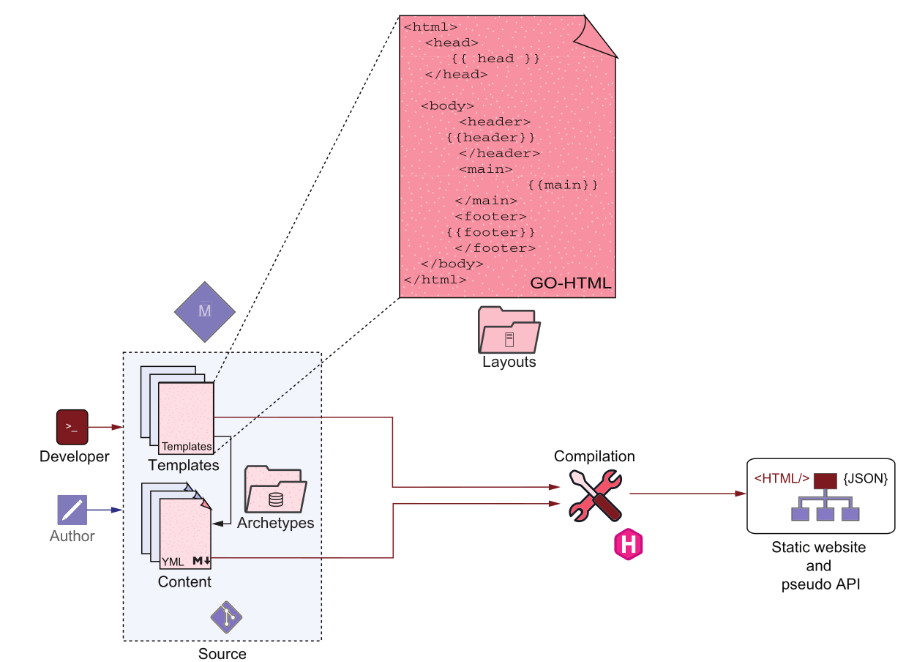
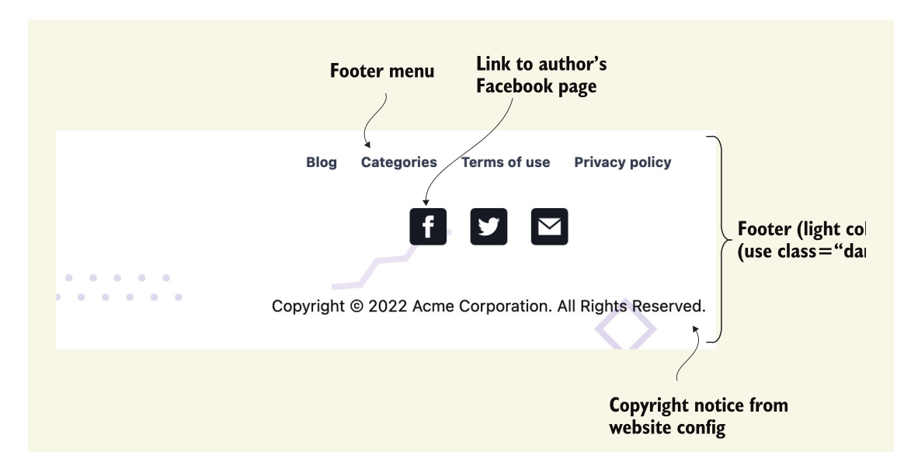
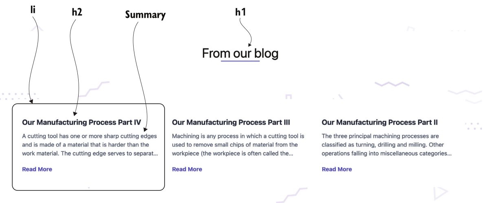
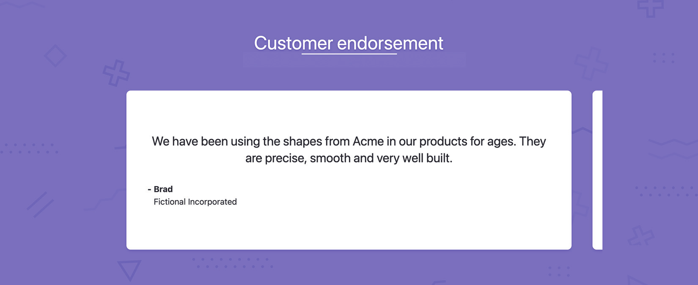
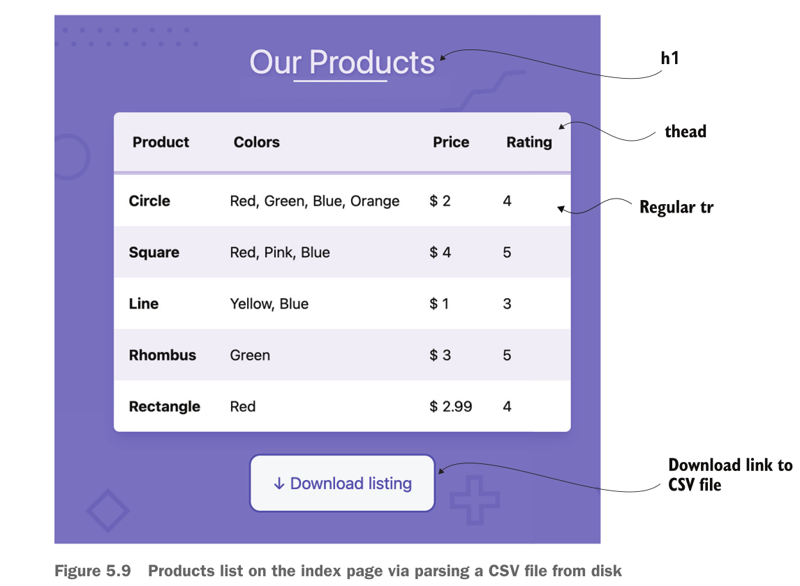

本章包括

* 自定义页面和shortcode
* 使用Go模板语言渲染内容并访问变量和函数
* 访问Hugo的配置和front matter在代码中
* 从文件系统读取
* 创建称为原型的可重用页面模板

Hugo的一个优点是它将内容（Markdown）和表示（ze函数（layouts/index.html）HTML/CSS/JavaScript）之间的关注点清晰地分离开来。当我们创建内容时，我们很少需要处理HTML。不精通HTML或CSS的团队成员可以使用Hugo作为使用功能的内容管理系统获得成功
我们在这本书中已经讨论过了。然而，我们可以通过深入挖掘布局和HTML生成来释放更多的功能。

第2章有一节，我们将跳出主题，以纯HTML创建主页。在这样做的过程中，我们避开了内容创建者的角色，进入了web开发模式，同时主要为其他页面提供内容。在本章中，当我们改进Acme Corporation网站的主页时，我们将获得Hugo模板语言及其呈现机制的第一手经验。此外，我们将根据静态HTML页面无法提供的内容添加一些功能。

我们目前为Acme Corporation网站提供的纯HTML索引页面混合了内容和布局。这种方法存在大量问题：

* 我们不能在页面之间共享部分、HTML片段或数据。
* 数据和布局散布在HTML文件中，因此更改文本内容需要了解HTML。
* HTML不像Markdown和YAML那样易于人类阅读。
* HTML没有变量、条件和循环，因此很难管理内容重复的页面。

即使对于单个页面，使用模板逻辑编写也比使用纯HTML更好。我们可以通过使用模板而不是简单的HTML来简化网站的可维护性。Hugo的一个重要优点是主题和内容之间界限的模糊。Hugo提供了部分使用主题并覆盖部分网页的功能，或者使用主题可用的所有功能编写自定义页面的功能。在接下来的两章中，我们将远离Eclectic主题。因为我们是以零碎的方式来做的，所以我们的网站将始终保持正常运行。

本章介绍一个单页模板，如图5.1所示。在第5.1节中，我们将对Acme Corporation网站索引页面的布局和内容进行拆分。在第5.2节中，我们将使用Hugo基于网站其余部分的内容生成的信息来增强索引页面。第5.3节简要介绍了使用结构化front matter和数据文件构建的数据驱动网页。最后，在第5.4节中，我们将使用本章中的教程指导内容编辑，作为开发人员提供一些内容自动化。

## 5.1分离数据和设计

要使用标记文档控制网站的索引页面，我们需要首先创建标记文档。Content文件夹是整个网站的分支捆绑包。我们需要放置`_index.md`(<https://github.com/hugoinaction/hugoinaction/tree/chapter-05-resources/01>)以表示`/index.html`网页。请注意，如果我们改用`index.md`，则网站的根将成为一个leaf bundle，不会使用我们在layouts文件夹中提供的模板。有了标记文档，我们可以将当前在`index.html`中硬编码的数据移动到该标记文档的front matter。下面的列表显示了使用Markdown作为标记语言的索引页的内容。我们将在index.html页面中使用这些信息。


图5.1 Hugo结合标记内容编译layouts文件夹中提供的模板文件，以生成网页的HTML内容。开发人员提供模板文件并使用一些内容来确保Hugo构建过程正确生成网页的内容。本章将介绍开发人员需要在模板和内容之间创建的程序逻辑，以生成单个网页。

## 清单5.1 Markdown（content/_index.md）中索引页

```yaml
---
title: Acme Corporation
description: Welcome to the website of Acme Corporation, the
    leading creator of digital shapes on the planet, providing
    precise shape creations that are ready to use.
subtitle: shaping the world for you to live in
explore: blog
---
```

5.1.1 访问Go模板语言

Hugo使用不同于Go编程语言的Go模板语言来创建模板。Go模板语言可以通过使用双花括号（{{...}}）又称为胡子标签,在模板页面中使用.
附录D提供了Go模板语言的简短概述。本章的资源还包括一个名为模板游乐场的文件夹，我们可以将其放置在layouts文件夹中，并使用Hugo的模板技术进行游戏。如果我们将template.md放置在content文件夹中，则可以从/template端点查看相应的更改(<https://github.com/hugoinaction/hugoinaction/tree/chapter-05-resources/02>). 虽然这本书介绍了Hugo常用的大部分功能，但如果您想要更全面的功能列表（在附录之外），Hugo的官方文档位于<https://gohugo.io/documentation/does>很好地列出了这些。

Hugo将胡子标签之外的内容视为原始字符串，我们可以将其原样传递给最终的HTML。content文件夹中的所有信息也可以通过模板中的变量获得。Hugo提供了一些访问content的顶级变量，包括：

* $----此变量表示模板的顶级上下文。对于页面模板，此变量表示当前页面。页面级元数据（如标题）可用为`$.title`，描述可用为`$.description`。页面级变量通过Page属性链接到自身，因此我们可以将网站的标题写成`$.Page.title`。
* site----此变量提供整个网站的数据。我们可以使用此变量访问config.yaml中的配置，通过`site.pages`浏览网站页面，使用`site.taxonomies`浏览分类，并使用`site.Params`查看自定义参数。
* hugo----此变量提供对hugo编译器的访问。编译器包括`hugo.IsProduction`（检测我们是否为生产而构建）和`hugo.Version`（通知我们Hugo版本）等方法。

Exercise 5.1
Hugo中的短代码也允许使用Go模板。顶级上下文$在短代码中代表什么？

* a. The shortcode
* b. 包含的页面
* c. 整个站点
* d. 以上都没有

front matter提供的元数据在页面级变量中可用，该变量可以访问为$或$.page。此外，页面级变量具有多个属性和子属性，我们可以使用这些属性访问用户提供的和Hugo生成的有关页面的元数据。我们可以通过使用页面级变量$.Title和$.Description在索引页面（layouts/index.html）的模板中使用这些变量。下面的列表提供了我们将用于填充网站`<head>`部分的页面级变量。

## 清单5.2使用页面变量（layouts/index.html）

```html
<head>
    <meta charset="UTF-8">
	<meta name="description" content="{{$.Description}}">
    <meta name="viewport" content="width=device-width, initial-scale=1.0" />
    <link rel="stylesheet" href="./index.css">
	<title>{{$.Title}}</title>
  </head>
```

我们可以在index页面的主体中重用页面标题。这样，我们就不需要在网页上重复这些信息。下面的列表显示了如何在Hugo模板中多次访问同一参数以重用页面标题。

## 清单5.3访问相同的参数（layouts/index.html）

```html
<h1>{{$.Title}}</h1>
```
Hugo标准化了网页的标题和描述属性。这些在顶级页面对象中可用。自定义元数据项副标题在Hugo的顶层不可用。要访问副标题变量，我们需要在页面中使用`Params`对象。这样，`Params`对象将所有用户定义的元数据保存在前面。通过将所有自定义元数据移动到Params对象，Hugo团队能够向页面变量添加更多属性，而不会破坏与旧网站的兼容性。下面的列表显示了如何访问`Params`对象中的副标题变量。

清单5.4访问非标准参数（layouts/index.html）

```html
<h2>{{$.Params.Subtitle}}</h2>
```

提示：尽管我们将元数据项定义为副标题，但在列表中，我们将其访问为副标题。`$.Params`中的变量不区分大小写。提供的标题也存在于`Params`中，可以作为`$.Params.title`访问。

code checkpoint <https://chapter-05-01.hugoinaction.com>, and source code: <https://github.com/hugoinaction/hugoinaction/tree/chapter-05-01>

5.1.2 存在性检查

尽管我们的代码提供了所需的数据，但在某些情况下代码会失败。编写标记驱动的网站时，一条经验法则是假设所有属性都是可选的。这使得所有内容都是可移植的。如果用户从一个不同的主题切换到一个更流行的主题，他们强烈希望网站始终保持功能。他们可以慢慢地提供数据来支持特定主题的功能。如果我们不提供任何元数据，我们刚刚创建的主页将呈现空字符串来代替所有自定义数据。但我们可以通过提供默认值和运行存在性检查来做得更好。

清单5.5提供了一种使用Hugo中的if语句进行存在性检查的方法。在列表中，if语句检查其参数为标题、描述和副标题的真实值。当提供的参数为真时，if语句将在if块内执行模板代码。此外，如果我们不提供内部内容，则容器HTML标记不存在。if检查失败的值包括false、0、不存在的变量（nil）、slice、map或长度为零的字符串。

清单5.5使用存在性检查（layouts/index.html）

```html
...
{{if $.Description}}
<meta name="description" content="{{$.Description}}">
{{end}}
...
{{if $.Title}}<title>{{$.Title}}</title>{{end}}
...
{{if $.Title}}<h1>{{$.Title}}</h1>{{end}}
{{if $.Params.Subtitle}}<h2>{{$.Params.Subtitle}}</h2>{{end}}
```

code checkpoint<https://chapter-05-02.hugoinaction.com>, and source code:<https://github.com/hugoinaction/hugoinaction/tree/chapter-05-02>.

## 5.1.3 使用站点变量作为默认值

页面标题也是可选的。如果我们没有提供主页的标题，我们可以返回到config.yaml文件中提供的网站标题。下面的列表显示了如何在页面标题不可用的情况下使用site.Title变量来实现这一点。我们可以使用else逻辑返回到site.Title。

> 清单5.6 返回网站标题（layouts/index.html）

```html
{{if $.Title}}
    <title>{{$.Title}}</title>
    {{else if site.Title}}
    <title>{{site.Title}}</title>
{{end}}
```

code checkpoint <https://chapter-05-03.hugoinaction.com>, and source code:<https://github.com/hugoinaction/hugoinaction/tree/chapter-05-03>.

我们还可以使用`$.Site`作为站点变量。由于Hugo模板中的`site`是全局可用的，可以访问所有`site`变量，因此建议使用`site`而不是`$.site`。这是因为$.site可能不适用于所有模板类型。

## 5.1.4 为简化创建变量

虽然主页上需要两次页面标题，但这是不必要的重复。我们可以将标题存储在一个名为$title的变量中，并使用它，如下清单所示。

> 清单5.7 用默认值声明$title（layouts/index.html）
{{$title := $.Title}}  声明名为$title的变量
请注意，所有用户定义的变量都以美元符号（$）开头。声明还要求：=用于赋值。我们就可以在后面的赋值中使用一个等号（=）。如果需要，下面的列表显示了如何为Hugo变量提供回退值。

```bash
...
{{if not $title}}
{{$title = site.Title}}
{{end}}
```

在列表中，则检查页面标题是否不存在，如果是不存在，则将$title变量重置为网站标题。在Go模板语言中，not是一个布尔函数。它接受一个参数并翻转其真实性。
注意，我们可以使用=重置现有变量，使用：=声明新变量。Hugo将变量的范围限定到它们所在的代码块。换句话说，在if块内部声明的变量在其外部是不可访问的。因为我们之前用默认值定义了$title，所以我们不需要else语句来匹配前面列表中的if语句。

还要注意，我们不能在不声明变量的情况下使用变量。在声明之前使用变量失败。因为我们在清单5.7中声明了title变量，所以我们现在可以在任何需要页面标题和站点标题作为后备的地方使用$title。下面的列表显示了这种用法。

> 清单5.9提供网页标题（layouts/index.html）

```bash
{{if $title}}<title>{{$title}}</title>{{end}}
```

code checkpoint <https://chapter-05-04.hugoinaction.com>, and source code:<https://github.com/hugoinaction/hugoinaction/tree/chapter-05-04>.

## 5.1.5 使用标准库函数减少代码大小

虽然我们没有做任何特殊的事情来获得标题，但我们的代码可能会不必要地冗长，而且难以编写和理解。
Hugo在其网站中为常见的代码模式提供了预定义的功能。这些可以显著降低模板的复杂性及其代码大小。
通过使用清单5.8中的not函数，我们了解了Hugo的函数。接下来我们来看另一个Hugo函数。

如果缺少值，我们可以使用默认函数提供默认值。我们可以用默认函数的用法替换if检查。
以下列表使用默认值作为快捷方式，为我们的网站提供默认标题。

> 清单5.10声明默认标题（layouts/index.html）

```bash
{{$title:= default site.Title $.Title}}
```

Hugo函数用空格分隔参数。函数调用可以用括号（）包装。除非我们在有歧义的地方使用多个嵌套函数，否则在调用Hugo函数时，括号是可选的。
我们可以将清单5.7中的not调用写成（not $.Title），而默认调用的版本将是（default site.Title $.Tittle）。

默认函数的第一个参数是默认值，而第二个参数是要检查并使用的值（如果存在）。默认和常规if检查的一个区别是，默认检查值的存在，而if验证值
的为true还是false。空字符串、false和0将无法通过bool测试。if语句还将检查else代码块是否可用。
（这仅对副标题字段有效。请注意，Hugo将Title作为字符串属性提供，并将false强制为字符串“false”，这对于$.Title来说是判断的结果为true）。
要将默认行为与if语句匹配，我们应该使用isset函数。以下列表使用此函数检查变量是否未定义。

> 清单5.11使用isset函数（layouts/index.html）

```bash
{{if isset $.Params "subtitle"}}<h2>{{$.Params.subtitle}}</h2>{{end}}
```

如果我们将false作为网页的副标题传递（通过在.md文件的front matter设置副标题：false），Hugo仍然会渲染网页。
这里值得一提的另一个函数是`$.Param`。此函数与`$object`绑定，因为它访问`site.Params`和`$.Params`。访问页面变量并返回到站点变量的
模式非常常见，因此Hugo有一个内置的方法来执行此操作。我们可以在只传递副标题调用来访问标题时使用`$.Param`。
下面的列表显示了如何声明`$.Param`函数以提供副标题。`$.Param`函数提供页面副标题，如果页面副标题不存在，则返回到站点副标题。

> 清单5.12使用$.Param函数（layouts/index.html）

```bash
{{$.Param "subtitle"}}
```

code checkpoint <https://chapter-05-05.hugoinaction.com>, and source code: <https://github.com/hugoinaction/hugoinaction/tree/chapter-05-05>.

练习5.2
即使某些front matter属性不存在，继续渲染网站也是一种良好的做法。_default___函数允许我们在前面的条目不存在时填写自定义回退值。

## 5.1.6通过带有条件的使用上下文开关，以简化进一步检查

在site等对象中深度嵌套了属性。`site.Params`使模板冗长且难以读取（和写入）。这种冗长不鼓励用户正确分组key，这会影响网站的可维护性。
例如，我们提供了site.Params.Footer[0].title作为Eclectic主题的属性。很容易想象为什么我们不想在代码中写五次这行代码。
Hugo提供了一个特殊的上下文变量，一个点（.）来解决这个问题。

上下文变量可以松散地与面向对象编程语言中的此变量进行比较，后者成为方法的对象。
当呈现一个页面时，上下文变量表示一个页面，但是如果我们呈现一个分类法(taxonomy)，它就变成了那个分类法。如果我们呈现一个shortcode，
上下文变量就变成了那个shortcode。在属性的上下文中工作时，我们可以使用该属性重写上下文变量，并使用.访问该属性变量

Hugo为此提供了`with`，该`with`覆盖了其代码块中的上下文变量。使用`with`，我们可以编写一个不那么冗长的存在性检查。这是因为如果为变量提供了值，
`with`将调用其内部代码块。我们可以将变量或表达式传递给`with`。如果它演变为真实值（不是nil、0、false或空切片、字典或字符串），
则将该值设置为的值（.）包含在with语句中的块内。如果该值不为真，将跳过`with`块。下面的列表显示了如何使用`with`重写上下文变量。
这个. 表示传递给的变量的值。

> 清单5.13重写上下文变量（layouts/index.html）

```bash
{{with $title}}<title>{{.}}</title>{{end}}
```

在with代码块中，上下文变量。替换为$title变量的值。注意，如果不设置$title，则不会执行此代码。然而，如果我们在with块中提供一个else代码块，
Hugo将运行该代码。

<https://chapter-05-06.hugoinaction.com>, and source code: <https://github.com/hugoinaction/hugoinaction/tree/chapter-05-06>.

默认情况下，$是顶级上下文变量，但我们可以从代码中删除不必要的$符号，将其转换为典型的Hugo主题开发人员编写的内容仅当我们需要访问
with块中的顶级上下文时才需要。

练习5.3
Hugo模板中何时应使用with？
* a. with是Hugo的“坏”部分之一，具有巨大的负面性能影响，不应使用。
* b. with可用于检查值的存在性，并在缺少值时提供默认行为或值。
* c. with 仅依赖于变量的子属性，则可以使用with更新上下文以编写更少的代码。
* d. with可用于提供map属性的内联处理，而无需编写嵌套函数（如索引）来访问属性。
* e. b和c两者。
* f. c和d。
* g. b,c和d。

## 5.1.7添加内容处理

在本节中，我们将使用更多Hugo功能来增强主页，使其与图5.2所示的设计相匹配。到目前为止，我们呈现的副标题字段是纯文本。我们希望从大写字母开始，并提供对副标题使用基于Markdown格式的功能。因为副标题已经是一个变量，所以这个任务需要将副标题传递给一个适当的函数来做进一步的处理。为了使副标题以大写字母开头，我们可以将其赋予如下列表所示的humanize函数。

> 清单5.14添加humanize函数（layouts/index.html）

```bash
{{with .Param "subtitle"}}<h2>{{humanize .}}</h2>{{end}}
```

在将副标题“人性化”之后，我们可以通过Markdown函数将数据传递给Markdown解析器，从而进一步使用Markdown处理。在3.1.4节中，我们讨论了主题作者如何从front matter数据解析Markdown；`markdownify`就是这样做的功能。下面的列表显示了如何添加此函数以获得未来的Markdown支持。

> 清单5.15添加markdownify函数（layouts/index.html）

```bash
{{with .Param "subtitle"}}<h2>{{markdownify (humanize .)}}</h2>{{end}}
```


图5.2 Acme Corporation主页，其中我们在副标题上使用Markdown和标记来控制layouts文件夹中的index.html页面

虽然使用括号调用嵌套函数是一种非常有效的方法，但Hugo还支持管道运算符（|）以实现更具功能性的编程风格。这允许我们获取上一个函数的输出并将其传递给下一个函数。下面的列表显示了如何通过管道传递函数。

> 清单5.16使用管道操作符（layouts/index.html）

```bash
{{with .Param "subtitle"}}<h2>{{. | humanize | markdownify}}</h2>{{end}}
```

> 清单5.17突出显示部分副标题（content/index.md）

```bash
subtitle: shaping the **world** for you to **live in**   使用Markdown突出显示字幕的部分
explore: blog       数据驱动的“浏览”按钮配置的浏览选项（已在front matter）
```

Hugo中的`ref`函数采用文件或文件夹名称，并提供此内容的相应URL。我们也可以使用`relref`作为相对路径。下面的列表调用`ref`函数将文件转换为相应
的URL。

清单5.18使用Go模板语言使用ref函数（layouts/index.html）自定义页面和自定义内容

```bash
<a href="{{ref . (.Param "explore")}}"
>Explore</a>
```

code checkpoint <https://chapter-05-07.hugoinaction.com>, and source code:<https://github.com/hugoinaction/hugoinaction/tree/chapter-05-07>.

> 5.1.8添加标记(Markdown)内容

我们在内容文件中有Markdown内容。此内容可以通过根上下文（$）变量上的.content变量以HTML形式提供。我们可以使用模板中的｛｛.Content｝｝将其放置在页面上的任何位置，以启用主页上的新部分，如图5.3所示。


图5.3将Markdown内容添加到主页。

让我们将一些Markdown数据添加到Acme Corporation的网站主页(<https://github.com/hugoinaction/hugoinaction/tree/chapter-05-resources/03>). 下面的列表提供了索引页的数据。

> 清单5.19在Markdown（content/_index.md）中添加描述性内容

```markdown
Acme is the **best**
==================

The finest in this field
------------------------

Acme Corporation&trade; is the _ world's leading manufacturer
of digital shapes_. From squares and circles to triangles and
hexagons, we have it all. Browse through our collection of various
forms with different thicknesses and line styles.

[About Us](./about)

* * *


Personalized especially for you
-------------------------------

We convert dreams into designs. Our artists are one of a kind.
We provide full support for customizing your designs with multiple contact
sessions to understand your problems and get a satisfying result.
[Talk to us today](./contact)
```

要使用此内容，我们还需要两个图像，contact.jpg和about.jpg，它们可以放在内容文件夹中网站索引的页面包中。为了适应当前网站的设计，我们将在当前部分添加ID`intro`，并在Markdown内容中创建一个带有ID `description`的新部分。下面的列表显示了如何做到这一点。

> 清单5.20呈现Markdown内容（layouts/index.html）

```html
<section id="intro">
...
</section>
<section id="description">
{{.Content}}
</section>
```

code checkpoint <https://chapter-05-08.hugoinaction.com>, and source code:<https://github.com/hugoinaction/hugoinaction/tree/chapter-05-08>.
Hugo通过Markdown解析器自动运行Markdown文件中提供的内容，并提供一个HTML字符串直接放在文档中。

## 自定义从Markdown生成的HTML

在从Markdown生成HTML时，Hugo为开发人员提供了定制为特定元素生成的HTML的灵活性。称为渲染挂钩模板的特殊模板可以精确控制渲染的方式。例如，我们可以使用`layouts/_default/_markup/render-image.html`、`layouts/_default/_markup/render-link.html`或`layouts/_default/_markup-render-heading.html`中的自定义模板，然后决定如何渲染Markdown中提供的内联图像、链接和标题。

这些模板可以访问整个页面和站点变量集，以及HTML标题、显示文本、附加标题和Markdown中提供的URL的唯一变量，如`.Level`、`.Text`、`.Title`和`.Destination`。在第6章中，我们将创建自定义渲染挂钩来控制Markdown渲染。

请注意，`_default`文件夹中的模板适用于整个网站。通过将这些模板移动到特定的内容类型，我们可以将其限制为一组页面。我们将在第7章讨论内容类型。开发人员可以使用`findRE`等方法进一步处理生成的HTML字符串，以替换某些子字符串。

## 5.2 使用外部数据添加内容

虽然我们可以从标记文档中获取大多数网页数据，但也可以在标记文档之外获取一些数据。这些数据包括网站的菜单、其他部分和页面以及Hugo从网站或网页数据生成的内容。

## 5.2.1添加菜单

主页上主页的链接打破了这些页面的独立性。如果我们删除其中一个页面，就会有一个悬空链接。向该页面添加链接涉及复制和粘贴内容，然后更改HTML文件中的文本。此解决方案不可扩展。更好、更具可扩展性的解决方案是为该内容提供菜单。这样，页面可以独立地分配到具有配置或front matter的菜单。

虽然我们可以为这些信息创建一个新菜单，但Acme Corporation网站的一个更好的想法是在主页上呈现整个网站使用的主菜单。`site.Menus.main`变量中已存在主菜单。我们可以通过循环来为主页上的各种菜单项创建锚标记。清单5.21在当前上下文区域下为菜单添加了一个新部分，其中包含此信息。稍后，我们将增强菜单以匹配图5.4。


图5.4主页中的新部分，主菜单呈现为主页上的一个部分

> 清单5.21在主页上呈现菜单（layouts/index.html）

```html
{{with site.Menus.main}}                        # with语句确保如果主菜单不存在，Hugo不会渲染该部分。
      <section id="menu">
        <h1>Website sections</h1>
         <h2>This website has these major areas</h2>
        <ul>
            {{range .}}
            <li>
            <a href="{{.URL}}">                    # 使用菜单项的URL导航
            <i class="icon-{{.Identifier}}"></i>   # CSS文件根据标识符提供图标。
             {{.Name | humanize}}                # 这个名字是人性化的，以便于正确的观看。
            </a>
            </li>
            {{else}}                               # 对于数组（切片）为空的情况，range支持else块。
               {{/* Log for the website editor/developer */}}
               <!-- No menu entries present -->
            {{end}}
       </ul>
      </section>
{{end}}
```

在清单5.21中，range是Go模板语言中的主要循环函数。range函数在每次运行中更新下一个菜单项的上下文（.）。如果没有条目，Hugo不会处理范围内的代码块。如果需要，我们可以为此提供else代码块。range函数还有一种替代形式来填充变量，而不是用值更新上下文并提供索引。不过，上下文更新版本更受欢迎。

site.Menus是一个Hugo生成的对象，其中包含网站上每个菜单的子属性，内部包含根据提供的权重排序的所有菜单条目。每个菜单项都提供名称和URL子属性。注意，主菜单有子菜单，在本例中我们忽略了这些子菜单。我们可以使用humanize函数将名称的第一个字母大写，从而透明地处理所有小写条目。

else代码块在Go模板语言中引入注释。我们可以自由使用HTML注释，但它们确实有一些陷阱：

* HTML注释生成并在输出中公开。除非我们在minification过程中去掉它们，否则它们会增加页面大小。
* Hugo在（｛｛…  ｝｝）中执行任何Go模板代码，甚至在HTML注释块中也是如此。

HTML注释适合主题或页面开发人员向网页的内容作者发送消息。另一方面，Go模板注释在编译时被剥离，仅对主题或布局开发人员有用。

虽然菜单只需要名称、标识符和权重，但我们可以向菜单条目添加自定义的前置和后置属性，以向模板提供额外的数据，供其在菜单之前或之后使用。在章节资源中，我们向主菜单添加了一个post属性(<https://github.com/hugoination/hugoinaction/tree/chapter-05-resources/04>)其可用于填充内容。现在，我们可以在模板中使用这个属性，如下面的列表所示，更新主页上主菜单的呈现。

> 清单5.22向主菜单（layouts/index.html）添加post部分

```html
<li>
    <a href="{{.URL}}"><i class="icon-{{.Identifier}}"></i>{{.Name | humanize}}</a>
   {{with .Post}}<p>{{.}}</p>{{end}}    # 将.Post包装在with语句中，以允许模板呈现，即使.Post不存在
</li>
```

> 创建新菜单

在Hugo中创建新菜单没有什么特别的需要做的。我们需要做的就是为菜单分配页面。例如，我们可以将以下内容添加到“关于”页面以创建单独的主菜单：

```bash
menu:
  home:
    name: About
    identifier: about
    weight: -500
```

这样，我们就可以在`site.Menus.home`中运行范围循环，而不是在`site.Minus.main`中循环，其余代码保持原样。

我们还可以使用相同的主菜单生成网页的标题。我们将把网站logo从introl section移到header，并如图5.5所示进行渲染。清单5.23提供了设置header的代码。


> 清单5.23为Acme Corporation设置标题（layouts/index.html）

```html
     <header>
        <a href="{{site.BaseURL | absLangURL}}">
           Acme Corporation
        </a>
        {{with site.Menus.main}}
         <nav>
                <button class="hamburger">☰</button>
                <ul>
                {{range .}}
                     <li>
                        <a href="{{.URL}}">{{.Name | humanize}}</a>
                     </li>
                {{end}}
               </ul>
        </nav>
       {{end}}
    </header>
```

注意，当我们开发主页时，我们可以使用`.Permalink`链接到当前页面。使用`site.BaseURL`作为主页的链接可以确保我们可以在其他页面中重用此header（我们将在下一章中进行此操作）。我们还可以更新网站的页脚，以使用页脚菜单代替类似方式的硬编码文本。最后，`absLangURL`函数将URL转换为当前语言的绝对链接。当我们在第13章中转换为多语言网站时，该功能将非常有用。

练习5.4

通过生成与图5.6中的视图匹配的HTML，构建Acme Corporation网站的页脚<https://chapter-05-09.hugoinaction.com>.

* a. 要填充社交媒体图标，请使用配置中提供的作者信息。
* b. 版权信息存在于网站参数中。
* c. 页脚菜单在网站内容中已经可用，您应该使用它。



Acme Corporation网站主页的更新页脚（以浅色方案显示）。使用menus，内容作者可以更新header和footer，而无需深入模板代码。
CSS文件默认为浅色页脚，但我们可以通过在页脚标记中添加深色类来使其变暗。我们将在网站的其余部分使用黑色页脚。我们还将借此机会在页脚中添加Credits页面的链接。在Credits.md中，添加以下内容：

code checkpoint <https://chapter-05-09.hugoinaction.com>, and source code:<https://github.com/hugoinaction/hugoinaction/tree/chapter-05-09>.

> section page作为菜单

编写一个带有指向网站各部分索引页面链接的菜单条目是一项非常常见的任务，因此Hugo使用了一个更简单的默认值来定义它。
例如，如果我们在配置参数`sectionPagesMenu:<name>`中添加`sectionPagesMenu:sections`(<https://gohugo.io/templates/menu-templates/#section-menu--for-lazy-blog-gers>自动创建一个名为Sections的菜单，其中包含网站中每个部分的条目。我们不需要对内容中的节菜单进行任何引用，只需在配置中使用`sectionPagesMenu:sections`，即可使用指向每个节的索引页的链接填充节菜单。

## 5.2.2添加最近的博客文章

到目前为止添加的数据大多是静态的，不会频繁更改，因此在使用模板时几乎没有什么好处。静态站点框架的一个主要好处是使用更改的数据自动更新页面。我们将在Acme Corporation网站的主页上添加最近的博客文章列表，当我们添加更多博客文章时，该网站将自动更新新条目。为此，我们将在网站主页上再创建一个section，其中包含最近的博客文章列表(<https://github.com/hugoinaction/hugoinaction/tree/chapter-05-resources/06>). 图5.6显示了本节的输出。


Acme Corporation网站主页上最近的博客文章section

为了提供内容，我们将获得属于博客部分的网站的子页面列表，然后将其呈现在带有标题和摘要（手动或自动生成）的小卡片布局中。
我们将在下一章中为博客文章添加图像。清单5.24提供了我们将在Acme Corporation网站主页上进行的更改。
这包括过滤网站页面中的博客文章，并获取前三个。模板中最有趣的代码是过滤逻辑，如图5.7所示。

> 清单5.24更改最近的文件列表（layouts/index.html）

```html
{{with (where site.RegularPages ".Section" "blog")}}        # 根据该部分是否为博客过滤页面（稍后将详细介绍）
        <section id="blog">
          <h1>From our blog</h1>
          <ul class="posts">
            {{range first 3 .}}                             # 循环通过第一个函数提供的上下文切片中的前三个页面
                 <li class="post">
                    <a href="{{.Permalink}}">               # .Permalink提供页面的URL。
                        <h2>{{.Title}}</h2>
                    <article>
                      {{.Summary}}                          # 摘要提供网页的自动生成或手动提供的摘要。
                    </article>
                  <div>Read More</div>
                   </a>
                 </li>
           {{end}}
         </ul>
        </section>
{{end}}
```

在列表中，我们使用来自网站`RegularPages`属性的where语句内容过滤了页面。该属性为我们提供了所有内容页的列表，不包括支持页，如分类法(taxonomies)和索引(inxex)，按日期字段降序排序。虽然我们可以使用sort函数更改排序顺序，但按日期降序通常是所需的行为，我们不需要更改它。where函数接受一个切片（列表）、一个键(key)和一个值(value)。它根据提供的`key`（.Section）的`value`与值（blog）匹配的元素过滤列表。虽然默认运算符是equality（=），但我们可以通过在值之前传递自定义运算符来重写它。

> 提示：因为站点是全局的，所以所有模板都可以使用site.RegularPages。

外部带有`with`语句执行两个任务：它更新上下文变量，这样我们就不需要重复两次哪里检查，并确保博客部分中有内容（如果该部分存在）。Hugo的模板引擎足够聪明，可以识别具有语句中的空切片，在这种情况下不会呈现。

虽然我们使用的过滤代码是功能性的，但我们已经在模板中硬编码了关键博客。如果我们的网站布局具有不同的部分(section)名称，这将成为一个问题。Hugo有一个用于此场景的标准化key，其默认值是Hugo自动生成的。

我们可以使用`site.Params.mainSections`获取网站中的主要部分。默认情况下，它包含具有最大页数的节，但我们可以重写此变量以支持多个节或添加或删除它们。因为它是一个列表，所以默认的等式检查操作不起作用的地方，我们需要为此提供in运算符。下面的列表更新了页面过滤逻辑，以查找主部分而不是硬编码的博客部分。

> 清单5.25更新页面过滤逻辑（layouts/index.html）

```bash
{{with 
    (where site.RegularPages                                # 筛选常规页面
     ".Section"  "in" site.Params.mainSections)             # 使用扩展的where格式，其中指定了“in”运算符
}}
```

code checkpoint <https://chapter-05-10.hugoinaction.com>, and source code: <https://github.com/hugoinaction/hugoinaction/tree/chapter-05-10>.

## 5.3 使用结构化数据

网页中有两种常见的数据类型：非结构化、自由流动的文本（由Markdown文档表示）和结构化或分组数据（由数据库中传统定义的键和值或行和列表示）。例如，在购物车应用程序中，产品描述应该是非结构化的，但是如果我们将价格字段放在Markdown中，那么提取要在多个地方显示的价格将是乏味的。有多种方法可以分别提供结构化数据。一种方法是从磁盘读取文件。另一种选择是使用front matter内容与元数据一起提供结构化数据。

## 5.3.1 在front matter 中使用结构化数据

网站中的.Params对象和页面级变量属于主题。主题作者可以自由决定向这些变量添加什么以提供结构化数据。让我们将这个概念用于Acme Corporation网站主页。我们将使用图5.8所示的标题在网站主页上添加一个推荐列表。然后，在清单5.26中，我们将在前面的内容中添加一个名为推荐的字段，并将所有推荐放在那里



图5.8 Acme Corporation 网站主页上的Testimonial(推荐) section

所有的推荐(Testimonial)都在这里 (<https://github.com/hugoinaction/hugoinaction/tree/chapter-05-resources/07>).

练习5.5

以下哪一项是结构化数据的示例，这些数据将从Markdown内容之外的内容移动到结构化数据，并移动到front matter或单独的文件中？（选择所有适用项。）

* a. 音乐播放列表
* b. 作者传记
* c. 实物产品审查
* d. 十大最受欢迎的博客文章列表
* e. 关联链接到正在审核的产品

> 清单5.26数据驱动推荐的文本（content/_index.md）

```yaml
testimonials:
    - author: Brad
      from: "Fictional Incorporated"
      content: >
                We have been using the shapes from Acme
                in our products for ages. They are
                precise, smooth, and very well built.
    - author: Random
      from: "Random Education"
      content: >
                Sharp and sturdy - Just like you want them.
    - author: Richter
      from: Richter Measures
      content: >
             Undoubted accuracy. Safety guarantee.
             We love what Acme delivers.
```

现在我们可以在页面上读取这个变量并适当地呈现它。清单5.27提供了显示推荐的更改。这种类型的逻辑支持HTML中的数据驱动自定义元素，这些元素使用作为参数提供的结构化数据。如果列表为空，最好检查它们的存在，并且不要在列表周围创建HTML标记。如果它不为空，我们可以循环访问它并访问内部属性，如Content、From和Author

> 清单5.27对推荐的更改（layouts/index.html）

```html
 {{with .Param "testimonials"}}         # with语句提供外部存在性检查和上下文更新。它使用.Param函数读取front matter内容，可以回退到站点配置。
     <section id="testimonials">
        <h1>Customer endorsement</h1>
        <div>
            <ol>
                {{range .}}             # Content 循环
                <li>
                  <p>{{.content}}</p>
                    <div>
                        <h2>{{.author}}</h2>
                        <h3>{{.from}}</h3>
                    </div>
                </li>
                {{end}}
            </ol>
        </div>
     </section>
 {{end}}
```

code checkpoint <https://chapter-05-11.hugoinaction.com>, and source code: <https://github.com/hugoinaction/hugoinaction/tree/chapter-05-11>.

在清单5.27中，带有with调用的顶层确保了如果前面没有提供推荐部分，我们不会添加任何内容。然而，如果它存在，我们将遍历推荐列表，并在HTML中打印每一个。

我们在第3.6.2节中使用了相同的技术，使用Eclectic模板构建了一个数据驱动的登录页面。主题作者使用结构化数据创建了边栏、旋转木马、手风琴和其他高级用户界面元素。

## 5.3.2分析数据文件

对于与其他系统的互操作性，基于文件的数据收集方法非常有用。Hugo支持解析结构化内容，我们可以使用这些内容从基于CSV的电子表格、基于JSON的API输出或单个YAML文件中提供原始数据。我们可以将这些数据转换为Hugo中的切片（数组）和字典（map），然后使用这些数据将数据显示为HTML。该功能在基于另一个以机器可读格式提供输出的系统创建网站时非常有用。

有许多方法可以访问文件。例如，您可以将JSON、CSV、YAML或TOML文件与内容文件夹并行放入数据文件夹。文件中的数据在site.data变量中作为字典提供。我们还可以将文件放在一个固定的位置，使用`readFile`获取其内容，然后使用`transform.Unmarshal`将其从原始文本转换为字典。页面捆绑包也可以用于这些文件，我们可以在其中使用`$.Page.Resources.Get`，然后使用`transform.Unmarshal`

对于Acme Corporation，我们有一个名为products.csv的文件，其中列出了该公司销售的产品的产品信息。单独的库存管理系统管理和导出Excel支持的CSV格式。我们需要在网站主页中将其呈现为表格（图5.9）。



图5.9通过从磁盘解析CSV文件，索引页面上的产品列表

我们可以将products.csv放在content文件夹的根目录中，使其成为index page branch bundle的一部分(<https://github.com/hugoinaction/hugoinaction/tree/chapter-05-resources/08>). 以下列表中的代码循环遍历products.csv文件，并将值打印到表中。我们将表的第一行标记为标题。

清单5.28在products.csv（layouts/index.html）中循环

```html
  {{with .Resources.GetMatch "products.csv"}}                            # 查找名为products.csv的文件
            <section id="products">
                <h1>Our Products</h1>
            {{with . | transform.Unmarshal (dict "delimiter" ",")}}      # 使用逗号作为分隔符分析文件并更新上下文
                <table>
                {{range $i, $value := .}}                                # 交替范围语句，循环遍历每一行并将行索引保存在变量$i中
                      {{if eq $i 0}}                                     # 将第一行标记为标题行
                        <thead>
                      {{end}}
                       <tr>
                         {{range $value}}                                # 通过当前行中每列的内部循环打印行列组合的内容
                         <td>{{.}}</td>                                  # 打印行列组合的内容
                         {{end}}
                       </tr>
                        {{if eq $i 0}}                                   # 将第一行标记为标题行
                          </thead>
                        {{end}}
                 {{end}}
               </table>
            {{end}}
            <a download href="{{.Permalink}}" >                          #提供下载资源的链接
                    Download listing
            </a>                  
          </section>
 {{end}}
```

code checkpoint <https://chapter-05-12.hugoinaction.com>, and source code: <https://github.com/hugoinaction/hugoinaction/tree/chapter-05-12>

我们可以使用资源API在当前页面的页面捆绑包中查找products.csv文件。资源API是访问资源、处理、管理和转换资源的强大方式。我们将在第6章中深入研究Hugo Pipes的资源API。

在上一个列表中，我们使用逗号（，）作为CSV的分隔符来解析文件，CSV返回一个表示二维数组的切片（嵌套数组）。在外循环中，我们使用了范围表达式的替代形式。代替设置上下文变量。，返回范围中的对应值$value及其索引$i。接下来，我们使用索引来标识标题行。最后，我们循环遍历具有内部范围的条目，为所有行创建表。在本节的底部，我们使用相同的资源API提供了CSV文件的可下载链接。

## 5.4使用Go模板语言增强

我们可以用模板语言做很多事情，而不仅仅是构建网页模板。我们可以在不同的地方使用Go模板语言来消除重复性工作，并增强处理内容的日常工作流程。我们可以发明新的shortcodes来增强Markdown，从而提供新的功能。我们可以为内容创建archetypes或模板，这样当我们稍后开始编写内容时，就会有一个预先填充了基本元数据的页面。

### 5.4.1短代码(shortcodes)中的模板代码

短代码（我们在第4章中使用的）不仅仅是HTML的片段。它们是可以访问完整模板功能的模板片段。我们可以访问站点中的所有变量，并可以使用这些变量以及传递的参数和内部内容来编写逻辑以呈现shortcode。

使用我们迄今为止开发的Go模板语言技能，我们可以编写一个shortcode，该代码接受产品名称，解析价格，并将其呈现到网站上。为了使shortcode在整个网站中工作，我们需要将products.csv移动到更容易访问的位置，例如assets文件夹（assets文件夹是通过Go模板语言访问的内容的全局文件夹）。)注意，我们还需要更新索引页模板以使用此新位置（使用`.resources.getinstead of.resources.Get`）(<https://github.com/hugoinaction/hugoinaction/tree/chapter-05-resources/09>).

> 清单5.29产品价格的shortcode（layouts/shortcodes/price.html）

```bash
{{- $product := default (.Get 0) (.Get "product") -}}           # 如果传递了上下文变量中的shortcode，则命名参数将返回到给定的第一个参数。
{{- if $product -}}
  {{- $products := resources.GetMatch "products.csv" -}}        # 从全局资产中读取products.csv文件；resources（小写“r”）指的是全局资产。
{{- $parsedProducts := $products | transform.Unmarshal (dict "delimiter" ",") -}}    #以逗号作为分隔符分析为CSV
  {{- range $r := $parsedProducts -}}                    # 循环通过CSV的行
    {{- if eq (index $r 0) $product -}}                 # 如果任何行的第一列（索引0）与传递的产品完全相同，则打印该行的第三列（索引2）
     $ {{- trim (index $r 2) " " -}}               #trim函数删除我们从CSV中获得的任何空间。
    {{- end -}}
  {{- end -}}
{{- end -}}
```

code checkpoint <https://chapter-05-13.hugoinaction.com>, and source code: <https://github.com/hugoinaction/hugoinaction/tree/chapter-05-13>.

清单5.29中需要注意的主要事项是上下文变量。，shortcode不同。这是因为它引用的是shortcode，而不是呈现它的页面。此外，在列表中，我们使用了{{- -}}而不是标准的{{}}Go模板八字胡（八字胡是双花括号的另一个常见名称）。使用{{- -}}（虚线胡须）的原因是它们从字符串输出的两侧删除所有空格。在大多数情况下，我们不需要激进的空间调整，因为我们确实需要一个空间，HTML忽略了额外的空间。

在像当前示例这样的情况下，我们需要绝对零空间来允许Markdown文档中的完全空间控制，虚线胡须和修剪功能非常方便。我们还可以使用单个虚线胡须，如
{{-… }}或{{… -}}，分别从左侧和右侧修剪空间。

我们可以使用Hugo中的index函数访问特定索引处列表中的值。我们可以通过使用参数｛｛＜price “Square” ＞｝｝或使用诸如｛｛＜price product=“Square“＞｝等命名参数来调用该shortcode。我们将把它添加到Building Squares和Circle博客帖子中，如下代码片段所示。此外，通过使用resources.GetMatch而不是.resources.GetMatch，我们将内容定位到全局资产文件夹。

```bash
{{/*< price "Circle" >*/}}           $4
{{/*< price product="Square" >*/}}   $2
```

### 5.4.2 Inner content in shortcodes

短代码也可以包含内部内容（在第4.5.1节中讨论）。我们可以使用Go模板语言访问这些内容并对这些信息进行任何处理。例如，以下列表中的短代码重复内部内容n次，其中n作为参数提供(<https://gitub.com/hugoinaction/hugoinaction/tree/chapter-05-resources/10>).

> 清单5.30重复消息的短代码（layouts/shortcodes/repeat.html）

```bash
{{$count := default 5 (default (.Get 0) (.Get "count"))}}   # 就像价格简码中的产品参数一样，查找计数。如果不存在任何内容，则默认为5而不是零。
{{/* Preprocess to speed up */}}
{{$inner := .Inner | markdownify}}            # 使用Markdown将提供的内部数据从Markdown转换为HTML。我们正在进行预处理以获得更好的性能。
{{if gt $count 0}}
<ul>
  {{ range seq $count}}              # seq获取一个数字并生成从0到该数字的切片。我们使用它来循环$count次，以在HTML无序列表中打印$inner。
  <li>{{$inner}}</li>
  {{end}}
</ul>
{{end}}
```

code checkpoint <https://chapter-05-14.hugoinaction.com>, and source code: <https://github.com/hugoinaction/hugoinaction/tree/chapter-05-14>.

前面清单中的代码应该不难理解。重复短码需要记住的关键是循环的性能成本。我们应该尽可能避免在循环中进行繁重的处理和预先计算（如在本例中运行Markdown解析器）。我们可以在网站的“关于”部分使用这种方法来提醒团队，重复五次，“The customer is our **number 1** priority.”下面的列表使用重复短代码来添加此提醒。

> Listing 5.31 Adding the repeat shortcode (content/about/index.md)

```bash
Input
{{/*< repeat 5 >*/}}
Customer is our **number 1** priority.
{{/*< /repeat >*/}}
Nothing else.
```

```bash
Output
<ul>
    <li>The customer is our <strong>number 1</strong> priority.</li>
    <li>The customer is our <strong>number 1</strong> priority.</li>
    <li>The customer is our <strong>number 1</strong> priority.</li>
    <li>The customer is our <strong>number 1</strong> priority.</li>
    <li>The customer is our <strong>number 1</strong> priority.</li>
</ul>
Nothing else.
```

5.4.3使用原型(archetypes)节省一些时间

编写内容所涉及的一系列步骤是重复的。它包括创建文件夹，填写front matter，在许多情况下，放置封面图片。虽然这些任务是重复的，但它们是主题及其布局所独有的。通过为Hugo中的大多数front matter和其他变量设置良好的默认值，可以在所有网站上推广任何内容。

随着网站变得越来越复杂，添加了更多功能，为网页设置内容变得越来越困难。当我们开始在内容文件夹中放置Markdown文件时，我们已经转移到页面捆绑包。在可预见的未来，我们可以想象密集的front matter，如日期(date,、草稿(draft)等，这些都可以成为必填字段.

Archetypes  是Hugo文章的模板，我们可以使用它自动创建文件夹结构，填充标题，并为内容提供占位符图像，以便我们快速写作。当我们使用hugo new＜filename＞时，会在内容文件夹中创建一个占位符文件。当我们为Acme Corporation制作网站时，第2章中的hugo new site命令创建了一个默认原型。通过发出以下命令，我们可以将其用作生成博客文章的模板：

```bash
hugo new blog/line.md
```

此命令在内容文件夹中创建一个line.md文件，该文件标记为草稿。我们可以开始添加内容，当我们准备发布此页面时，我们可以从标题中删除草稿字段。我们可以使用hugo服务器--buildDrafts预览草稿页面。

当默认原型(archetype)填充基本内容时，我们可以向博客模板添加更多内容。对于常规Markdown帖子，我们可以创建一个新文件，例如blog.md(<https://github.com/hugoinaction/hugoinaction/tree/chapter-05-resources/11>)在原型(archetype)文件夹中，内容如下所示。

> 清单5.32博客原型的内容(archetypes/blog.md)

```bash
---
date: {{ .Date }}
title: "{{ replace .Name "-" " " | title }}"
draft: true
tags:
- unknown
categories:
- general
---
Provide an awesome introduction here
<!-- more -->

Here goes the main content.
```

我们现在可以删除content/blog/line.md 并生成一个新的。这一次，Hugo自动为博客部分中的内容选择博客模板。

练习5.6

原型是_content_帮助_front matter_设置大量默认值的一种方法。

我们还可以在原型中创建page bundles。要添加页面page bundles，请在原型文件夹中创建一个名为blog的子文件夹，并将blog.md移动到其中，重命名文件index.md(<https://github.com/hugoinaction/hugoinaction/tree/chapter-05-resources/12>). 现在，我们可以通过在新命令行中使用`kind`标志为博客文章创建一个页面包。为此，我们删除line.md并运行以下列表中的命令。

清单5.33通过指定kind创建新的博客文章

```bash
hugo new blog/line --kind blog
```

注意blog.md和blog文件夹不应同时存在。

code checkpoint <https://chapter-05-15.hugoinaction.com>, and source code: <https://github.com/hugoinaction/hugoinaction/tree/chapter-05-15>.

现在，博客将有一个名为line的文件夹，其中包含index.md。如果我们向原型页面捆绑包添加图像，Hugo会将其复制到模板中。通过这种方式，我们可以使用占位符数据定义复杂的模板，以便内容创建者快速入门。例如，当我们在开发模式下运行Hugo时，Line页面会显示，因为我们在开发配置中将buildDrafts设置为true。使用这些功能，我们可以在Hugo网站上制作自定义页面，或通过将重复工作转移到短代码和原型来简化日常活动。

## 总结

* Go模板语言完全支持变量、函数、条件和循环
* 我们可以使用变量访问网站和页面元数据，包括菜单和网站中的所有页面等信息。
* Hugo可以从front matter以及磁盘上的文件中获取结构化元数据。结构化数据允许更容易地将单个值用作变量。 
* 我们可以以编程方式在短代码(shortcodes)中使用Go模板语言来为Markdown创建新功能。
* Archetypes 是内容文件的模板，可用于预填充特定的主题字段，创建正确的文件夹结构，并为内容创建者提供占位符。
