本章包括

* 在Hugo网站上,将页面组织为sections与menus
* 使用Hugo的taxonomies将相关内容进行分组
* 用page bundle方法构建页面内容
* 使用Hugo的内置和社区提供的更多Markdown功能的shortcodes

网站不仅仅是分散在随机URL位置的一堆网页。这个页面需要是可发现的，组织成有意义的部分需要一种导航到它们的方式，读者才能成功。内容很多,网站布局要有策略；显示分组、标记和导航提示-以供读者导航到其他页面。

网站开发团队中有两个不同的角色：内容所有者以及主题开发者。内容所有者决定显示在上面的内容网站和主题开发人员专注于呈现内容。在本章中，我们将扮演以Acme Corporation网站内容的所有者（也称为作者或网站编辑）的角色。

我们将在本章中探讨内容组织和管理（见图4.1）。在第4.1节中，我们将在配置文件夹中组织配置。在部分4.2到4.4中，我们将讨论如何管理和关联Hugo网站上的内容的地方，第4.5节将进入布局文件夹中的shortcodes。shortcodes-提供扩展Markdown和在不同页面之间共享内容的方法.

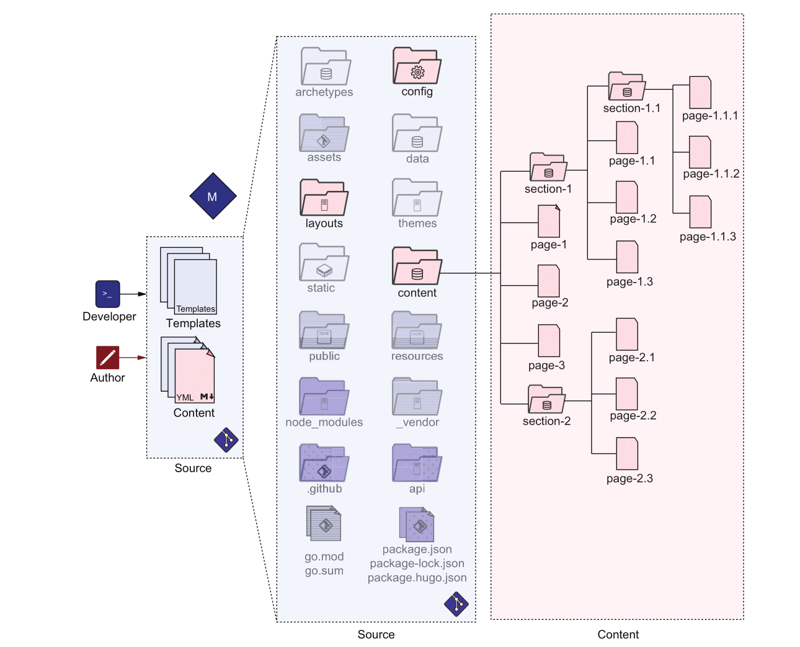
图4.1作者和开发人员将网站内容组织到文件和文件夹中，然后存储在`content`目录中。本章重点介绍`content`目录的组织，以优化资源管理。我们还将组织配置文件夹中的配置，并将创建`layouts`文件夹中的`shortcodes`以扩展Markdown。

## 4.1 自定义Hugo的配置

在Acme Corporation网站上，到目前为止，我们只有一个配置文件，config.yaml，我们一直在那里堆积配置。如果我们看看Hugo文档中，我们注意到许多配置参数可以更改.单个配置文件会很快变得难以承受。成为管理的瓶颈.

配置文件的另一个问题是我们不能有不同的集合,在一个文件中进行开发和生产不是一个好主意。然而web开发的基本实践,发展就是要有不同的环境。这样，许多团队可以独立地做出贡献。为了易于调试，web开发人员需要用尚未过时的HTML,通过缩小（处理以减少文件大小，以便通过Internet更快地提供服务）。在测试环境中，我们可能需要更多的日志记录来支持开发,团队快速重现问题并修复错误。内容团队需要一个网站稳定的生产团队。

Hugo认识到这些问题，并支持使用通过配置文件夹对基本配置进行特定于环境的覆盖。在这个部分，我们将配置文件拆分为多个文件，构建单独的文件覆盖默认配置。为此，我们将创建一个名为`config`的文件夹,并在`config`文件夹中添加一个名为`_default`的文件夹，然后将Acme Corporatau网站中的配置移动到这些文件夹中。`_default`文件夹是特殊的；Hugo默认值指向该文件夹中的内容。此名称不仅用于配置，还用于项目-我们将在第7章中看到。

如果我们将config.yaml文件移动到`config/_default`文件夹，网站将继续工作。但是现在它的内容在一个文件夹中，我们可以将配置文件转换为多个部分的多个文件。我们现在可以移动配置文件中的`author`部分设置为`config/_default/author.yaml`，我们可以将`params`和`markup`部分移动到单独的文件中。文件名自动映射到Hugo解析的配置key中，这样，这些信息虽然是孤立的，但更易于管理。我们还将在menu.yaml中拆分菜单并扩展它.见第4.2节。本章的参考资料中还提供了拆分文件(<https://github.com/hugoinaction/hugoinaction/tree/chapter-04-resources/01>).

Hugo支持使用每个文件夹的特定环境配置覆盖环境。这些环境采用`_default`文件夹中的值，并覆盖特定于环境的值。我们可以创建一个名为production的文件夹，并将特定于生产的覆盖放在该文件夹中的配置参数中。类似地，我们可以添加一个名为development for development specific的文件夹
配置 清单4.1提供了用于拆分 Acme Corporation网站。

当Hugo通过Hugo服务器使用实时重载服务器运行时，它默认为开发配置（“开发development”和“生产production”名称在Hugo中是硬编码的默认值）。默认情况下，由hugo命令构建时，模式将更改为生产模式。我们可以通过在环境变量`HUGO_ENV`中指定配置或在HUGO命令行中使用`--environment`标志，将配置重写为所需的任何名称。例如，可以使用此重写来调试开发服务器模式下的仅生产错误。

## 将config.yaml文件拆分为多个文件

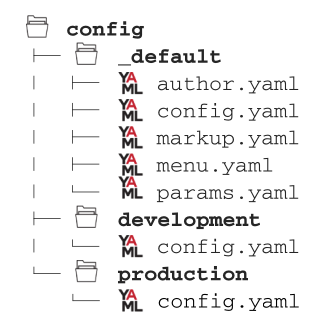

> 运行环境
> 大多数托管软件都有环境的概念。如果我们需要确保在我们开发过程中没有停机时间，我们需要有一种方法来确保稳定版本上线。标记稳定的构建并将其移至 更高的级别是至关重要的，以便在上线前进行进一步测试。运行环境的数量取决于参与的人数和所需的独立程度用于独立任务。大型项目中的标准环境集可以包括
>
* Development---这就是积极发展的地方。开发人员可能有单独的分支或特定于分支的环境，但我们需要一个共享分支，所有开发团队都可以在其中合并代码并解决冲突。当Hugo以实时服务器模式运行时，开发模式是默认模式。
* Testing--- 一个具有所有已完成功能的环境，目前正在进行自动化和手动测试。
* Staging /Alpha---公司团队间测试的稳定环境。这些公司还可能向一些正在帮助微调软件的选定客户提供对该环境的访问。
* Beta--- 一个准备上线的公共预发行版，公司邀请每个人验证他们的工作流程。
* Production--- 当前的实时/活动环境服务于最终用户。当您在没有实时服务器的情况下运行Hugo时，生产环境是默认环境。

> 每个团队都不同，可以决定使用不同的环境。Hugo提供了命名环境和特定设置的完全灵活性。正在开发的特性的代码更改应由Git等版本控制系统管理。

在开发环境中，让我们通过将minify设置为false来更新设置以禁用缩小。（您也可以使用此设置控制单个文件类型的缩小设置。）此外，Eclectic主题支持调试栏（最初由Juggler X创建），该栏在网页的可见部分提供了主要内容，如图4.2所示。我们可以通过在用于开发的params部分中将DebugMenu设置为true来启用此功能，并且可以通过单击调试栏右下角的红色扳手图标来启动此功能。在第8章中，我们将向您展示如何使用Hugo模块在其他网站中集成此调试栏。
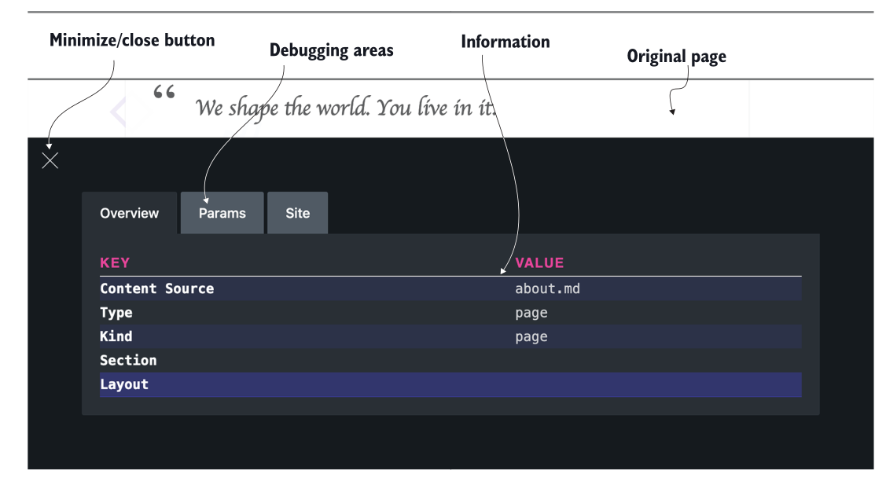
图4.2  Eclectic debug bar 调试栏（仅在开发环境中运行时）
清单4.2设置开发环境的重写，以启用调试栏、禁用缩小和构建草稿。然后，清单4.3设置了生产环境的覆盖，以启用robots.txt和minification。

清单4.2启用调试栏（config/development/config.yaml）

```yaml
buildDrafts: true
minify: false
params:
  DebugMenu: true  #通过参数启用调试菜单
```

清单4.3通过params启用Debug菜单启用robots和minification（config/production/config.yaml）

```yaml
enableRobotsTXT: true
minify: true
```

Hugo中的默认值是特定于环境的；Hugo天生理解开发和生产环境。因此，许多使用Hugo的网站不需要单独的环境特定配置。

chode checkpoint: <https://chapter-04-01.hugoinaction.com>and source code:<https://github.com/hugoinaction/hugoinaction/tree/chapter-04-01>

> 练习4.1
Hugo中的两个默认环境是development和___production_____。

您还可以使用环境变量为Hugo提供配置选项。例如，如果将环境变量`HUGO_ENABLEGITINFO`设置为`true`，则会覆盖Hugo配置中的`enableGitInfo`配置设置，强制其为true。我们可以使用环境变量重写配置设置的能力，通过Hugo之外的配置系统在构建服务器上设置Hugo。请注意，环境变量不同于命令行标志。它们可以在运行的shell中设置，并且在设置后运行的所有程序都可以访问它们。有关环境变量的更多信息，请访问<https://help.ubuntu.com/community/EnvironmentVariables>.
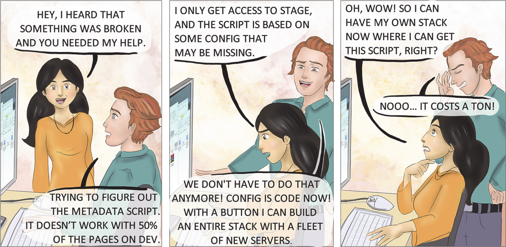
图4.3代码配置。Bob了解到，由于其开销，代码配置不如实际代码灵活。

## 4.2 使用分区(sections)和菜单(menus)组织内容

创建的网站的所需结构布局到`content`中的。如果我们能够在物理上逻辑地表示我们想要在网站地图上表达的内容，这将使我们的生活更轻松。本节提供了一些关于如何布局`content`中内容的见解。

## 4.2.1 Sections

当一个网站有很多内容时，将所有内容放在顶层页面会使管理内容变得困难。因此，我们可以将内容分为博客、新闻或产品等部分。我们可以使用网页URL的路径组件来标识其部分。例如，在URL中`https://example.org/blog/community/welcome`，名为welcome的页面属于example.org网站blog部分的community子部分。在Hugo中，子部分并不是一个特殊的结构；这只是一节中的一节。节(sections)也有一个index page，如`https://example.org/blog`它介绍了`sections`，并提供了其中的子部分和页面列表。

我们可以在主菜单或主页上列出网站中的所有区域(sections)。要在Hugo中创建节(sections)，我们在`content`文件夹中创建一个子文件夹。可以为嵌套节设置嵌套子文件夹。从技术上讲，包含整个网站主页（也称为根页面或index page页面）的内容文件夹（也称为内容根）也是一个部分(sections)，所有网站部分都是`content`根的子部分。我们可以使用`content/_index.md`文件覆盖主页的主题。content root是唯一一个`_index.md`可选的部分。因为我们在Acme Corporation网站中用一个纯HTML文件覆盖index page模板，所以在`content/_index.md`中添加特定于页面的标题没有效果。

> 注意
> 我们需要在每个节(section)的根位置创建一个名为`_index.md`的标记文件，即使是空的。Hugo使用此文件标识网站部分(section)。Hugo不认为文件夹是没有此文件的部分，并且可能不会显示其内容。

每个部分(section)可以有多个页面组成其内容。这些部分有一个index page页面模板，我们可以在其中访问所有页面和子部分。我们使用节的index page页帮助用户浏览节。自定义参数和数据可以通过section文件夹中的`_index.md`文件自定义index page模板。我们可以自由选择页面的组织，因为我们希望获得我们想要的内容结构。

让我们在Acme Corporation的网站上添加新闻和博客部分。在博客部分，让我们为使用Acme产品的社区成员的博客文章添加一个社区小节。此外，我们将通过在配置文件中设置`enableGitInfo:true`来启用内容的Git作者日期的自动设置。以下列表允许在构建网站时访问Git提交信息。

## 清单4.4 访问Git提交信息（config/_default/config.yaml）

```yaml
enableGitInfo: true
```

这些章节的内容在章节资源中提供（<https://github.com/hugoinaction/hugoinaction/tree/chapter-04-resources/02>）。图4.4
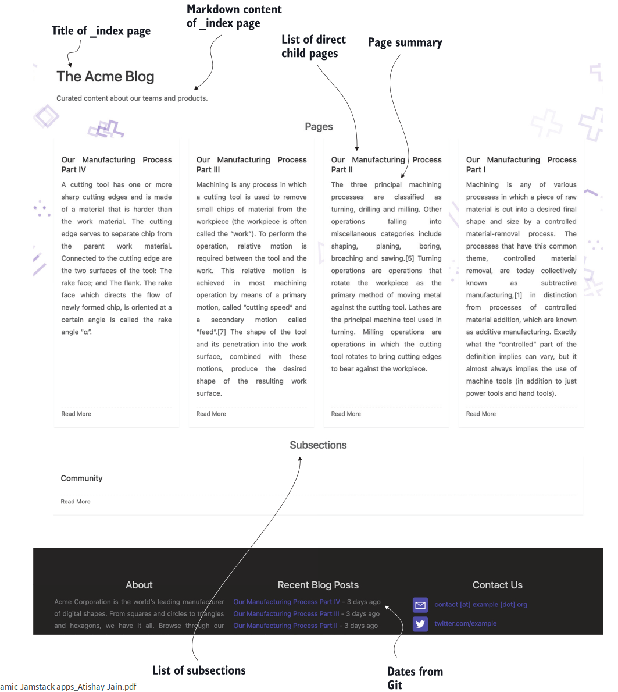

图4.4 Acme Corporation网站的博客显示了不同页面（顶部）和子部分（底部）的摘要
显示了相应的博客页面。Acme Corporation网站上的部分在右侧显示为文件名。以下列表提供了Acme Corporation网站各部分内容的组织代码。（该列表的Markdown图标来自octoicons；文件夹图标来自flaticons。）

## 清单4.5 在`content`文件夹中按节（section)组织内容

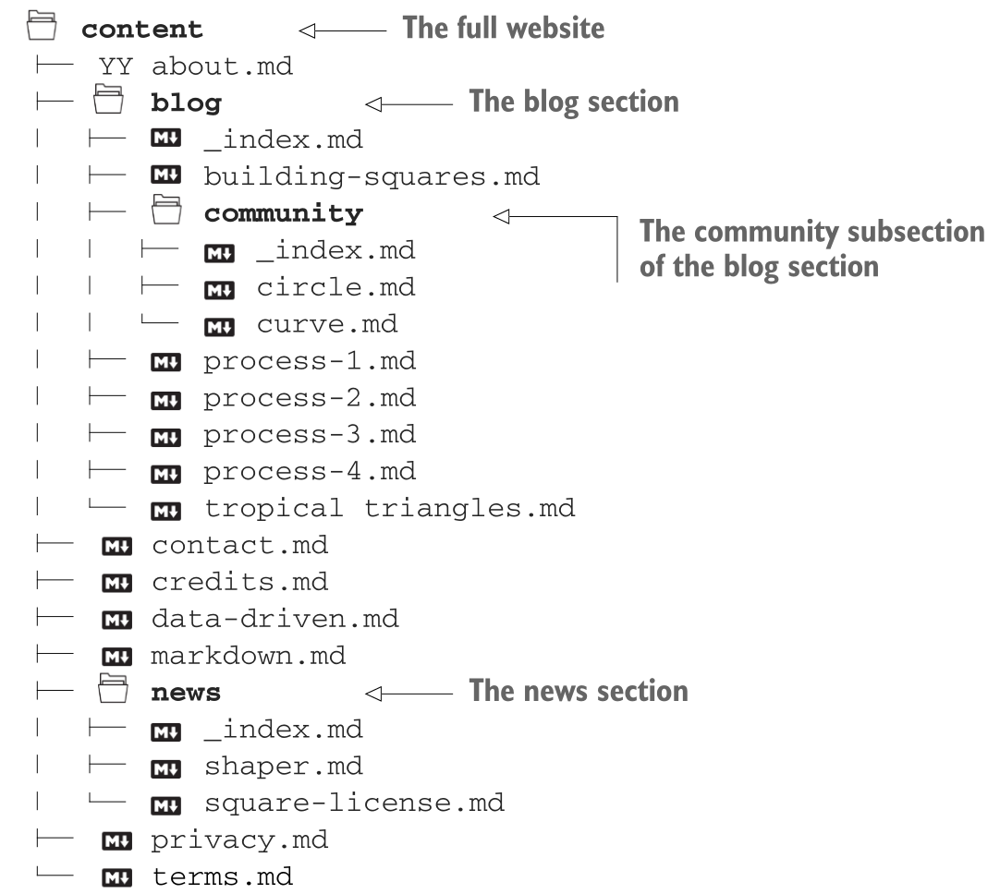

我们可以导航到<http://localhost:1313/blog>要查看博客部分中的条目，到<http://localhost:1313/blog/community>查看该小节中社区提供的条目的帖子，以及<http://localhost:1313/news>在新闻部分看到这些。

> 注意：您需要将文件提交到Git存储库，以便Hugo从Git中读取日期。

我们可以使用blog文件夹中的`_index.md`文件来提供/blog页面上显示的设置和内容。我们还可以为index page添加Markdown内容，以供选择，然后使用标题覆盖设置。index page页面可以访问博客部分中的所有页面和子部分。

chde checkpoint:<https://chapter-04-02.hugoinaction.com>，和源代码：<https://github.com/hugoinaction/hugoinaction/tree/chapter-04-02>.注意：尚无法从主页访问更改。

### 内容概要

Acme Corporation网站中各部分的index page页自动提供该部分中文章的摘要和标题。如果我们不提供摘要信息，Hugo会自动生成摘要信息。虽然index page是我们可以使用文章摘要的最常见位置，但它也可以用于主题的其他位置。以下是提供总结的方法：

* 自动默认情况下，Hugo选择内容的前70个单词作为主题的摘要。网站配置文件中的summaryLength变量控制默认摘要中的字数。
* 手动---我们可以使用标记<!--more-->如果需要，在内容中的某个位置进行更多<!--more-->剪辑摘要。注意<!--more-->由Hugo逐字匹配。Hugo不理解添加空格、更改为大写或没有正确的HTML注释。您可以在`content/blog/tropriatridges/index.md`文件中看到这一点。
* Front matter我们可以在Front matter中使用`summary`变量来提供摘要文本。

请注意，摘要变量与`description`变量不同。Hugo中的`summary`变量是内容的摘要，而description变量更多的是发送给搜索引擎的内容。描述字段只能通过front matter提供，不具有基于内容的自动值。一些主题，如“Eclectic主题”，在索引页中给予描述更高的优先级，并返回到摘要。

## 4.2.2 Menus

我们添加到Acme公司网站的sections没有链接，因此无法从主页或任何内容页面中发现。Hugo提供了一种通用的方法，使内容能够显示在菜单中。我们可以在一个网站上包含多个菜单，每个主题都定义了自己的一组菜单和子菜单。每个菜单都有一个名称，就像主菜单的main一样，以Eclectic和Universal主题命名。每个菜单都包含组成整个菜单的条目列表。

我们已经在第4.1节的配置文件中拆分了第2章中创建的菜单。清单4.6显示了我们在menu.yaml中创建的配置。让我们查看一下该配置中的一些字段。每个菜单项有多个字段：

* 标识符identifier字段唯一地定义了菜单，因此Hugo可以找到它。
* 权重 weight 字段对条目进行排序
* url字段提供从配置中定义的网站基本URL到页面的相对路径。

Hugo对其他字段及其设置都很灵活。一些主题使用菜单显示文本的名称字段，其他主题使用标题字段。要创建子菜单，我们需要为父字段提供父菜单的标识符（子菜单示例见清单4.9）。

## 清单4.6配置文件（config/_default/menue.yaml）中的菜单项

```yaml
main:
  - identifier: about
    name: About
    url: /about
    weight: 100
  - identifier: contact
    name: Contact
    url: /contact
    weight: 200
```

Hugo提供了两种在网站菜单中包含页面的方法。首先，我们可以在配置文件中为页面添加菜单项。这种方法有助于本地化并严格监控菜单。第二种方法是在标题中指定页面菜单。这样，菜单变得更加动态，并由内容控制。如果我们删除一个页面，菜单会自动被修剪，我们不必担心清理过时的链接。使用哪种方法取决于我们的用例。如果目标是将菜单放在一个地方，那么配置文件就是最好的方法。如果我们想在网站不同内容部分的所有者之间划分菜单的所有权，那么使用front matter的内容是正确的做法。两者都可以根据需要进行混合和匹配。

Eclectic主题有两个菜单：主菜单和页脚菜单。到目前为止，我们只使用了主菜单。让我们在博客部分的`_index.md`文件的前面添加一个菜单项，以允许博客显示在主菜单和页脚菜单中。清单4.7显示了此配置。我们还将在主菜单中添加“新闻”子菜单。清单4.8显示了这种配置，图4.5显示了启用所有菜单的结果。

## 清单4.7 blog部分(section)的菜单（content/blog/_index.md）

```yaml
menu:
   main:
     name: Blog
     identifier: blog
     weight: 110
   footer:
     name: Blog
     weight: 100
```

## 清单 4.8 news部分(section)的菜单 (content/news/_index.md)

```yaml
menu:
  main:
    name: News
    identifier: news
    weight: 120
```

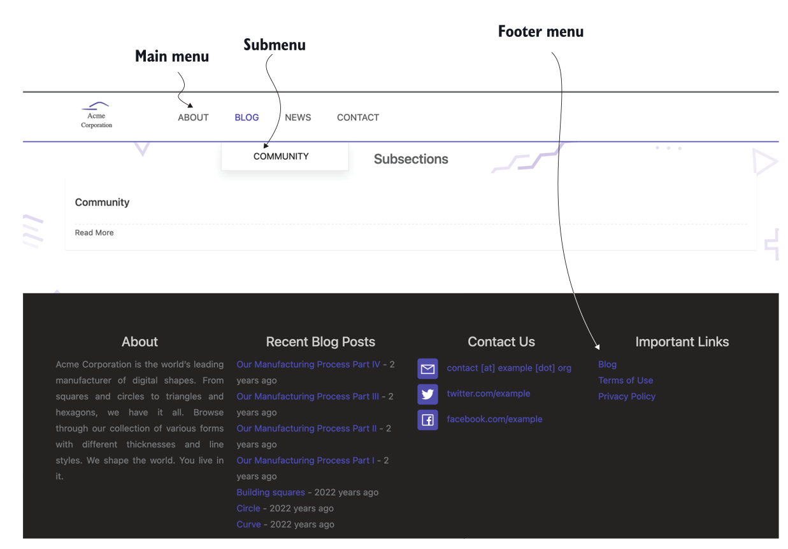

图4.5 hugo 管理Acme Corporation网站的博客页面显示主菜单、子菜单和页脚菜单

community section的`_index.md`在博客菜单中为该部分启用一个子菜单。以下列表显示了其配置。

## 清单4.9 社区博客菜单（content/blog/community/_index.md）

```yaml
menu:
  main:
    name: Community
    parent: blog
```

我们还需要在页脚菜单中添加使用条款和隐私政策。以下两个列表显示了这些配置。

## 清单4.10使用条款菜单（content/terms.md）

```yaml
menu:
  footer:
    name: Terms of Use
    weight: 200
```

## 清单4.11隐私策略菜单（content/privacy.md）

```yaml
menu:
  footer:
    name: Privacy Policy
    weight: 300
```

虽然页脚菜单有内容，但只有在页脚部分的 `config/_default/params.yaml`文件中添加`menu:true`，Eclectic才会显示它。下面的列表显示了如何做到这一点。请注意，您可能需要重新启动开发服务器才能使这些更改生效。

## 清单4.12启用页脚菜单（config/_default/params.yaml）

```yaml
- title: Contact Us
    contact: true
  - title: Important Links
    menu: true
```

因为主页还没有使用菜单，我们需要手动更新网站的主页，将浏览按钮更改为链接到博客页面，然后在`layouts/index.html`的页脚中添加博客和新闻页面的条目。下面的列表允许直接链接到网站页脚中的博客和新闻部分，并将浏览按钮改为链接到网站索引页面中的博客页面。

## 清单4.13启用直接链接并更改按钮（layouts/index.html）

```html
...
<a href="./blog">Explore</a>
...
<footer>
    <a href="./blog">Blog</a>
    <a href="./news">News</a>
...
</footer>
```

code checkpoint <https://chapter-04-03.hugoinaction.com>, and source code: <https://github.com/hugoinaction/hugoinaction/tree/chapter-04-03>.

练习 4.2
如果我们想将页面从一个Hugo网站剪切并粘贴到另一个网站，哪个菜单位置更好？

* a. Layouts
* b. Front matter  :heavy_check_mark:
* c. Theme
* d. Config

## 使用GUI进行内容管理

对于需要图形化环境来管理内容而不损失性能优势的作者和编辑，如Hugo等静态站点构建器，有Forestry.io、Hokus CMS和Netlify CMS等包装器。
这些内容管理系统具有图形形式，而不是YAML和Markdown。像这样的工具可以帮助具有不同需求的团队加入进来，并从使用Hugo中获益。
喜欢图形形式的非技术团队成员可以从Jamstack中受益，Jamstack顶部有一个舒适的GUI。这些表单将文件放置在适当的位置，并更新前端和配置文件中的相应条目。
我们可以互换使用它们，也可以直接编辑文件。

附录C介绍了将Netlify CMS与您的网站集成，作为内容管理系统的管理界面。从第-04-03章开始，所有代码检查点都有相应的更改。

4.3更好地与页面捆绑(page bundles)在一起

网站源代码的一个常见问题是内容分散在数据库、文件系统和第三方位置。此外，与页面关联的图像位于不同的位置。
这使得在我们从网站上删除一个页面后，很难正确清理。由于网页不可跨网站移植，作者需要访问多个地方才能创建网页。
然而，Hugo试图使网页的内容更加独立。前面的菜单字段（我们刚刚了解到）是Hugo用来实现这一点的功能之一。

Front matter菜单允许每个页面拥有其菜单项，并允许我们独立添加和删除它们。实现这种独立性的另一个功能是页面捆绑包。
页面包是文本和非文本（如图像、PDF文件和字体）资源的集合，足以表示单个或一组相关页面。
页面捆绑包可以独立放置或从Hugo网站移除，以添加相关的网页。它们帮助内容作者将网页或部分的更改本地化到磁盘上的特定文件夹。
页面包有两种主要类型：叶包和分支包。除此之外，我们还有不太常用的无头捆绑包。

## 4.3.1 (叶)leaf  bundles

leat bundles 是独立表示单个网页的核心内容所需的文本和非文本元素的集合。叶包的文件夹包含标记、元数据和特定于页面的资源（图像、PDF文件等）。
这些文件还可能包括特定于页面的CSS和JS文件。

我们可以将Hugo中的任何网页转换为leat bundles，方法是在与标记文件相同的位置创建一个具有相同名称（不带扩展名）的文件夹，
然后将标记文件移动到此新文件夹中，并将其重命名为index.md。我们还应将所有特定资源移动到此文件夹中的网页。
网页可以使用此文件夹及其子文件夹中的任何资产，包括图像、PDF文件和元数据（YAML、TOML或JSON）文件。

我们可以将一个leat bundles独立地移动到不同的Hugo网站，该网站提供正确渲染所需的一切。一个leat bundles可以有多个标记文件，
但在渲染过程中，它被视为一个单独的网页，除了index.md之外，不能直接访问包中的任何其他标记文件。

> index.md vs. _index.md
> 虽然`_index.md`和`index.md`是相似的名称，但它们是两个非常不同的文件：index.md表示单个网页的内容，而_index.md表示一个部分的根，
这是一组网页。为了更好地理解这一点，让我们看一个例子。
> 设想一个具有以下URL端点的网站：/（the root）、/about、/blog、/terms、/blog/process-1和/blog/proprocess-2。
> 在本网站中，/about、/terms、/blog/process-1和/blog/proprocess-2页面没有子页面，而是表示单个网页。
这些页面可以用index.md表示。/和/blog端点有子页面，因此需要用_index.md表示。
> 注意，对于/about这样的单页端点，如果不想使用页面绑定，我们可以创建about.md。对于/blog和/，我们没有这样的选择。

leaf bundler的独立性提供了大多数其他静态站点构建器所不具备的内容创建和管理功能。两位作者可以在各自的分支中独立处理内容，
合并冲突的可能性极小。通过清空内容文件夹，然后将其用于内容创建，可以轻松创建精简版的网站，而编译开销最小，并且完全支持预览。
承包商可以被指派使用通用的hugo主题开发内容，他们可以将自己的leat bundler提交到主网站。整合工作将是最小的。

Acme公司网站上的“关于”页面是一个完美的页面。draw.jpg图像在页面中使用，而不是在其他任何地方，我们应该将其本地化到该页面。
我们将在content文件夹中创建一个名为about的子文件夹，并将draw.jpg从static/image文件夹中移动，将about.md从content文件夹移动到此about文件夹中，
并将about.md重命名为index.md。对于正确的leaf bundler，图像现在应该相对于网页，我们应该从页面中引用它。
img标记中的路径需要替换为本地路径：从/image/draw.jpg到draw.jpg。如果我们想将图像资源保存在这样的文件夹中，
我们也可以在leaf bundles中创建一个图像文件夹，并将路径设置为image/draw.jpg。
我们可以导航到<http://localhost:1313/about>并验证页面是否与之前相同。

leaf bundler不需要有index.md以外的任何文件。我们可以通过创建文件夹，将.md文件移动到其中，并将文件重命名为index.md，
将任何页面转换为leaf bundler。例如，通过创建文件夹并将原始文件作为index.md移动到文件夹，
我们可以将`content/blog/tropolic triangles.md`转换为page bundler。

code chechkpoint <https://chapter-04-04.hugoinaction.com>, and source code:<https://github.com/hugoinaction/hugoinaction/tree/chapter-04-04>.

> 哪些图像文件放在哪里
> 我们已经提到了三个存储图像的位置：一个是page bundle 中和两个名为`static`和`assets`的文件夹。当我们试图决定哪幅图像要放在哪里时，
> 这可能会让人很困惑。这个决定实际上很简单。特定于page bundle的图像属于page bundle。当我们创建更多网页时，我们应该尽量保持在内容文件夹中，
> 很少更新此文件夹之外的任何内容。主题用于渲染网站的图像不属于该文件夹。
> 静态static and assets的内容类型相似，只有一个区别：assets文件夹中的图像可以由Hugo进行预处理和优化（通过Hugo Pipes，我们将在第6章中介绍）
> 。我们需要按原样使用static文件夹中的图像。理想情况下，我们应该将尽可能多的图像移动到assets文件夹中，以利用Hugo为这些文件提供的一整套图像
> 优化功能。在这种情况下，static文件夹只能用于直接从HTML访问而未经Hugo处理的图像。

## 4.3.2 Branch bundles

Branch bundles是表示网站section中的文本和非文本资源的集合。从技术上讲，为博客创建的section文件夹、为Acme Corporation网站及其子页面创建
的新闻部分以及`_index`文件符合branch bundle的定义。然而，为了满足以上的定义，index page所需的所有资源也应该存在于文件夹中。理想的
Branch bundles包含部分中所有页面的`page bundle`、`_index`文件和index page中引用的资源。

独立Branch bundles的目标与leaf bundles 相同：允许将部分放入网站，并在网站中不做其他更改的情况下发挥功能。
理想情况下，Branch bundles应该设置其菜单项，并提供分支中引用的所有资产，然后就可以使用了。图4.6显示了到目前为止Acme Corporation网站中的
各种branch和leaf bundles。

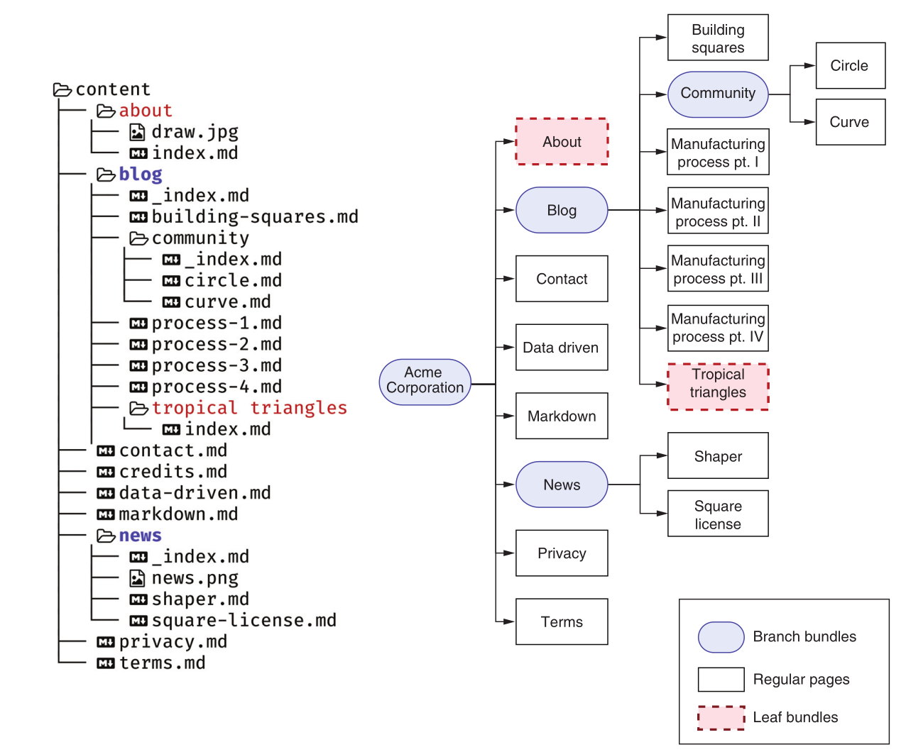
图4.6 Hugo的branch和leaf bundles。左边是创建page bundles后的文件夹结构。右边是站点地图。branch bundles在站点地图中显示
为带有子节点的节点（圆角），而leaf bundles是站点地图中的结束节点，就像常规页面一样。

我们在Acme Corporation网站的任何`_index.md`页面上都没有任何资源。我们将向新闻部分添加一个图像（news.png），
并通过引用它将其转换为适当的branch bundles(<https://github.com/hugoinaction/hugoinaction/tree/chapter-04-resources/03>).
请注意，我们不能为与branch bundles关联的资产添加子文件夹。在本练习中，我们将使用Markdown属性强制新闻图像位于新闻页面的中心。以下列表
显示如何添加此图像。

> 重用page bundles
> page bundles用于隔离而不是重用。如果希望重用图像，我们需要将它们放在顶级`assets`文件夹或static文件夹中。我们可以将page bundles与共享图像
一起使用。用于特定页面的一次性图像应出现在page bundles中，理想情况下，我们应将共享图像（用于大量页面）放置在顶级文件夹中。
然而，共享资源会带来额外的清理和集成工作，但重用这些资源可以节省带宽和存储空间。权衡是留给web开发人员的选择，他们应该根据具体情况进行评估。

使用Markdown属性将新闻图像置于新闻页面的中心。下面的列表显示了如何添加此图像。

清单4.14将图像添加到新闻部分（content/news/_index.md）

```yaml
menu:
  main:
    name: News
    identifier: news
    weight: 120
```

branch bundle是网站分支到一个或多个页面的位置。注意，在边缘情况下，branch bundles尚未添加页面，它将在站点地图中显示为叶子，
尽管Hugo将其视为branch，并在呈现时显示子页面的空列表。branch和leaf branch的比较见表4.1。

练习4.3

以下哪些文件适合放在page bundle中？

1. `section`的logo
2. 主题中使用的独特边框图像
3. 网站的logo
4. 网站的字体

答案是 1.

<https://chapter-04-05.hugoinaction.com>, and source code:<https://github.com/hugoinaction/hugoinaction/tree/chapter-04-05>.

## Table4.1 Branch vs leaf bundles

| Area     | Branch  | Leaf     |
| -------- | ------- | -------- |
| 被用作   | Section | 单个网页 |
| Contents |标题和（作为主题的一部分）section中的页面列表         | 网页内容 |
| Index Page | _index.md | index.md |
| Template layout page (chapter 6) | list.html | single.html |

## 4.3.3 Headless bundles

Headless bundle是leaf bundle，其中索引文件的front matter属性`Headless`设置为true。Headless pages没有单独的URL，Hugo也不会呈现这些bundles。
一些主题使用这些存储共享数据。例如，主题作者可以为更非结构化的页脚使用headless page bundle，而不是为结构化页脚选择参数。带有名称页脚的
headless page可以存储其及其相关资产的基于标记的内容。此bundles提供了将资产与页脚和标记一起关联的优点。没有多少主题
使用headless page bundles，我们不会为Acme Corporation网站使用它们。

## page bundles的巧妙使用

在page bundles中链接的特定于页面的资产允许主题标准化这些资产的命名约定，这样我们就可以不用编写代码就可以使用它们。
Eclectic支持在页面包中创建名为cover.png（或cover.jpg）的文件，并将其作为页面的封面图像。然而，这并没有提供比Universaluse这样的主题更少
的主题条目（例如横幅）的可发现性。为了使事情更简单，我们可以在页面的原型（在第5章中讨论）中放置默认图像。

Acme Corporation网站上所有页面的封面图片都包含在章节资源中(<https://github.com/hugoinaction/hugoinaction/tree/chapter-04-resources/04>）。
你可以用这些来让你的博客文章看起来更好看。请注意，本书提供的Universal主题版本支持通过page bundles提供封面图像，但这在Hugo中不是标准的，大多数
主题都不支持。

code checkpoint <https://chapter-04-06.hugoinaction.com>, and source code: <https://github.com/hugoinaction/hugoinaction/tree/chapter-04-06>.

## 4.4 More than tags: Taxonomies

要在Hugo中将内容组织成sections，我们需要对文件进行物理组织。更容易将每个网页的单个文件整齐地组织到文件夹和子文件夹中。
在许多情况下，网站的逻辑组织与磁盘上的物理组织相匹配。这就是为什么默认情况下，Hugo会生成包含section的URL作为URL的一部分。
但仅凭这一点可能不足以发现好的内容。组织内容的方法有很多种，每个用例都是不同的。

当我们组织内容时，我们很快意识到需要对页面进行分组，使同一页面成为多个类别的一部分。
例如，我们可以在iPhone和Android部分放置一个关于iPhone和Android之间差异的网页。拥有两份副本对维护来说很糟糕。
两个不同的URL会导致许多问题，因为我们需要同步评论、社交媒体外观和搜索引擎内容。
在这种情况下，最好有一个实际内容的URL，它可以显示在iPhone和Android类别的索引页面中。

除了类别之外，可能还需要具有具有唯一索引页的组。我们的用户需要支持标签来查找类似的内容。
网站可能需要链接到作者所有帖子的页面。可能有一个系列，读者应该按照作者预定义的特定顺序阅读文章。

Hugo了解组织内容的无限方式的需求，并提供了通用解决方案。在内容组织的顶层，Hugo允许我们定义所谓的分类法。
分类是更高级的构造，我们可以使用它来对描述网页之间关系的页面进行分组。
在第1章中，我们将内容从数据库移动到标记文件。我们获得了更好地表示非结构化内容的能力，但失去了一些提供结构化关系的能力。
分类法试图建立网页之间的关系。

图4.7显示了定义关系的关系数据库方法和Hugo方法之间的概念映射。在关系数据库中，内容存储在表单元格中。
这些表有一个主键字段。两个表中的主键字段放在第三个表中，以在这些表中的内容之间建立多对多关系。
在Hugo中，表中的每一行都对应于文件系统中的一个单独文件。为了定义关系，我们可以在内容文件的前面提供相关文件的名称（用作标识符），
Hugo负责创建这些关系。我们不必创建联接查询来获取这些关系。它们在两个页面中都可用作变量。

Taxonomies有两部分：列表(lists)和terms。每个`taxonomy list`都是`taxonomy terms`的集合。一个页面可以与许多`taxonomy terms`相关联，
而一个`taxonomy terms`可以与许多页面相关联。
Hugo在页面和分类法之间建立了多对多的关系。我们可以自由定义taxonomies，并根据我们所希望的领域组织我们的内容。
例如，如果我们正在建立一个关于电影的网站，我们会希望页面上有一系列电影，如流派或演员姓名。我们还想按导演、演员、音乐导演和索沃斯列出电影。
在Hugo中，这些将变成`taxonomy list`，其中每个特定的类别或名称都将成为一个带有索引页的`taxonomy terms`。

默认情况下，Hugo将`categories`和`tags`定义为`taxonomy lists`。我们可以将内容分成`categories`和`tags`。
因为`tags`和类别`categories`是逻辑结构（它们与文件系统不匹配），所以我们可以在多个`categories`中创建具有多个`tags`的网页。
请注意，如果没有其他内容可供提供，则不需要为所使用的每个`taxonomy list`或`terms`创建单独的页面。
在编译过程中，Hugo计算出网站中使用的`list`和`terms`，并为其创建页面。

图4.7从传统数据库结构映射到Hugo分类法，以定义网页之间的关系

让我们来研究Acme Corporation网站的taxonomies。首先，我们将为其帖子添加标签和类别。我们可以将这些直接添加到页面的front matter。

## 单个页面的多个格式副本

一个页面可以有多个URL。使用front matter内容的别名允许我们多次渲染相同的内容。模板作者可以针对不同的格式副本以不同的方式实现页面的
用户界面（UI）。拥有多个页面副本并不意味着这是一个好主意：

* 搜索引擎惩罚复制品。
* 来自一页的评论不会流入另一页
* 用户对网站的绝对正确感到困惑。

我们应该使用此功能在向后兼容等情况下具有多个格式副本。如果您来自不同的URL方案或过去支持各种URL的东西，并且希望维护链接，那么别名
就很有用了。主题创建者在主题的头部提供规范引用，以防止搜索引擎对这些别名的惩罚。内容的多个副本的其他管理问题仍然存在，
但Hugo提供了一种机制，为每个句柄提供一个唯一的模板，即使它可能不会出现在许多主题中。请注意，我们不建议创建单个页面的多个副本。

此添加将自动填充内容中的标记，并生成类别页面。在tropical triangles的index.md中，我们将添加tags和categories，以获得类似于图4.8的视图。
下面的列表显示了这个的语法。

## Listing 4.15 Adding tags and categories (content/blog/tropical triangles/index.md)

Eclectic主题显示页面右下角的标记和索引页面中的类别以及摘要。Hugo还为网站上的每个标签创建了一个索引页面（例如，/tags/shape），
并创建了列出网站上所有标签的顶级/tags网页。
章节资源中提供了相应的文件(<https://github.com/hugoinaction/hugoinaction/tree/chapter-04-resources/05>).

code checkpoint <https://chapter-04-07.hugoinaction.com>, and source code: <https://github.com/hugoinaction/hugoinaction/tree/chapter-04-07>.
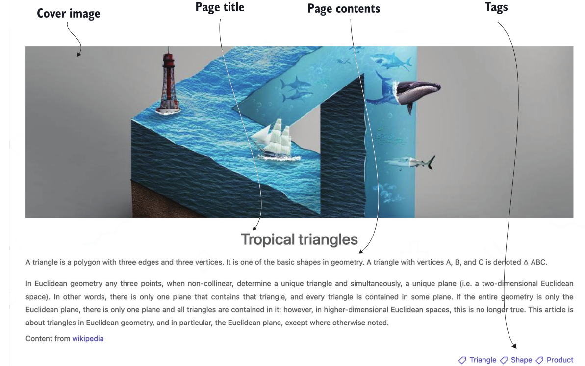
图4.8添加标签后的页面元素。该图显示了封面图像、页面标题、内容和标签。

我们还将向页脚菜单添加顶级类别页面。尽管我们可以使用配置文件执行此操作，但我们可以为Categories创建branch bundle taxonomy list
以隔离此信息。下面的列表创建了一个显示在页脚菜单中的顶级“类别”页面。

## Listing 4.16 A top-level Categories page (content/categories/_index.md)

```yaml
---
title: Categories
menu:
  footer:
    weight: 150
    name: Categories
---

At Acme corporation, we produce shapes and love to talk about them.
Here are the various categories of content we have at Acme.

The corresponding file is present in the chapter resources (https://github.com/hugoinaction/hugoinaction/tree/chapter-04-resources/06). 
The generated Categories page should look like that shown in figure 4.9. You might need to restart your dev server for the changes to take effect.
```

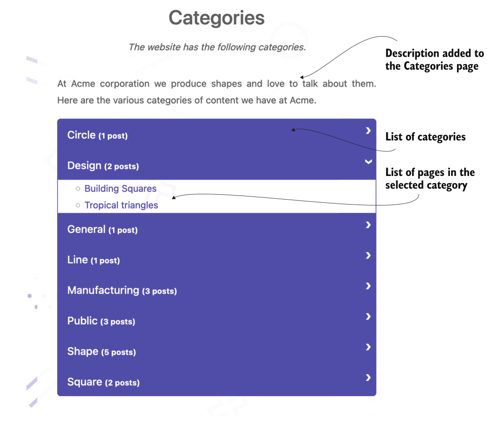
图4.9 Acme Corporation的类别分类列表页面，其中列出了网站中所有可用的类别及其页面

我们还可以为每个类别创建Markdown页面。我们可以使用这些页面提供描述类别的Markdown内容。
为此，我们将在`content/categies/<term>`处创建branch bundle。通过将`_index.md`文件放置在content/categies/design文件夹中，
我们可以向为design类别生成的页面提供信息。

code checkpoint <https://chapter-04-08.hugoinaction.com>, and source code: <https://github.com/hugoinaction/hugoinaction/tree/chapter-04-08>.
> Restart your dev server.

标记(Tags )和(categories)类别是默认`taxonomies`。对于我们的示例网站，Acme Corporation有一系列关于其制造过程的帖子。我们需要将其迁移到新网站。为此，我们需要创建一个名为series的新分类法(`taxonomies`)（参见图4.10）我们可以修改站点配置（config.yaml）中的taxonomies选项，或者创建一个称为taxonomies.yaml的新文件

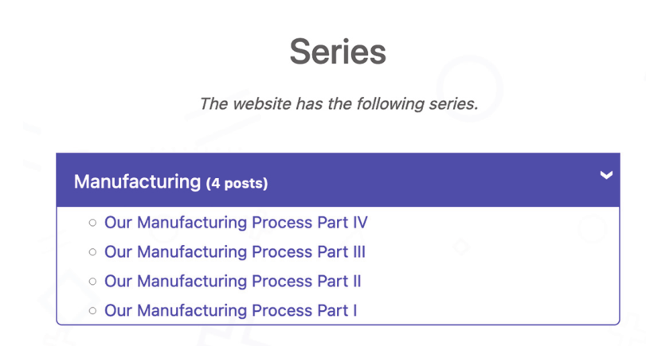
图4.10 Acme Corporation的系列分类(series taxonomy)列出了Acme Corporation网站上提供的所有系列。
(<https://github.com/hugoinaction/hugoinaction/tree/chapter-04-resources/07>)config/_default文件夹，内容如下所示。

Listing 4.17 创建taxonomies (config/_default/taxonomies.yaml)

```yaml
category: categories
tag: tags
series: series
```

Hugo要求分类法(taxonomies)既有复数值，也有单数值。使用这些信息，Hugo在索引的＜domain＞/＜plural value复数值＞处创建页面，在分类列表中的
各个术语的＜domain＞/＜plural value复数值＞/＜term＞处创建网页。Hugo在渲染模板时使用模板中的单数值。

我们可以更新Acme Corporation网站上与制造工艺相关的帖子，并为他们分配制造系列(manufacturing series)。一旦我们将series:[manufacturing]添加到帖子的标题，我们可以在<http://localhost:1313/series>以及<http://localhost:1313/series/manufacturing/>。（您可能需要重新启动实时服务器才能查看此内容。）我们可以根据需要向网站添加任意数量的系列。它是对内容进行分组的有效构造，也是标记(tags)和类别(categories)。

## 练习4.4

在多作者网站中，我们希望使用hugo分类法(taxonomies)来表示作者。以下哪个选项最适合列出单个作者的作品？

* a. Taxonomy list   :heavy_check_mark:
* b. Taxonomy term
* c. Single post page
* d. A list/index page
* e. The website index
* f. 我们需要创建一个新页面

code checkpoint:<https://chapter-04-09.hugoinaction.com>, and source code: <https://github.com/hugoinaction/hugoinaction/tree/chapter-04-09.>
↻ Restart your dev server.

## 4.5 YouTube、Gists和其他shortcodes代码片断

尽管Markdown功能强大，但它并没有我们在内容页面中可能需要的所有功能。YouTube视频、GitHub Gists、Tweets等所需的元素不是普通Markdown的一部分。虽然我们可以将这些添加为HTML，但Hugo提供了一个更好、更干净的解决方案-短代码。短代码是可以包含在内容文件中的模板片段。这些在编译时被替换为实际内容。它们相当于编程世界中的函数。

使用短代码，我们可以将可重用的HTML片段包装到页面编译期间编译的函数中。这样，内容创建者就不必为shortcodes作者处理的特定情况生成完美的HTML。短代码可以采用可以在模板代码中处理的参数。短代码作者可以访问整个网站配置及其所有变量和Hugo的内置函数，以及生成HTML的整个主题。

短代码可以在标记中使用双花括号，后跟类似HTML的尖括号：（`{{/* < ... > */}}`）。尖括号和内部内容之间的间距是可选的。短代码采用短代码的名称，后跟一些参数。短代码支持命名参数（如果短代码支持）或未命名参数。下面的清单显示了如何调用名为myshortcode的短代码。

## 清单4.18在Hugo网站中使用自定义短代码

```bash
  #使用尖括号和未命名参数创建调用shortcodes

{{/*<myshortcode name1=arg1 name2=arg2>*/}}  #使用命名参数
```

Acme公司的网站上有一段公司希望在“关于”页面中包含的摘要视频。在“关于”页面中，我们可以添加{{/*< youtube nLAVanlu5js >*/}}或{{/*< youtube id=“nLAvanl5js”*/>}}，以获取嵌入id为nLAvanll5js的youtube视频。幸运的是，Hugo提供了一个内置的短代码来渲染YouTube视频。注意，YouTube视频的ID可用作YouTube URL中v之后的参数（例如。<https://www.youtue.com/watch?v=nLAVanlu5js>是Acme Corporation视频的URL）。您还可以将自动播放等参数传递给YouTube短代码（见图4.11）。

> 注：目前正在积极讨论如何将内置于Hugo的短代码从Hugo的核心转移到一个单独的存储库中。这将允许我们链接到特定版本的短代码，并在Hugo发布周期之外进行更新。

您可以在Acme Corporation网站的layouts/shortcodes文件夹中找到本书中使用的youtube和高亮显示(highlight)等捆绑短代码的副本(<https://github.com/hugoinaction/hugoinaction/tree/chapter-04-resources/08>)以防止不兼容问题。

<https://chapter-04-10.hugoinaction.com>, and source code:<https://github.com/hugoinaction/hugoinaction/tree/chapter-04-10>.

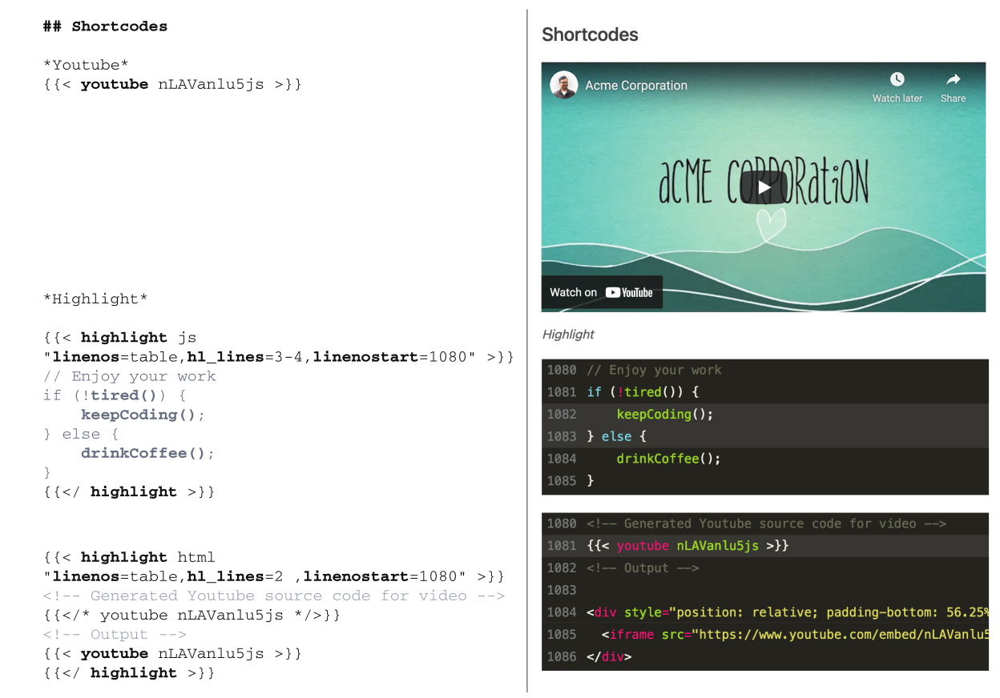

图4.11 Hugo中有多种使用内置短代码的方法。您可以直接调用youtube短码，将内容传递到高亮短码，或嵌套短码。

## 4.5.1短代码(shortcodes)及其内容

短代码也可以在内容中可以使用Go模板语言处理。通过这种方式，短代码创建者可以在呈现最终HTML之前对传递的内容进行处理。我们提供给Hugo短代码的内容可以是HTML或标记的形式。

我们可以在双花括号内使用类似HTML的开括号和闭括号，为短代码提供开和闭标记。Hugo将短代码边界中的内容原样传递给短代码，然后短代码作者可以根据自己的意愿对所提供的内容进行任何处理。

Hugo中使用的一个流行的短代码是高亮显示短代码，它提供语法高亮显示。这个短代码是代码围栏的替代品，提供了相同的功能（见图4.11）。下面的列表显示了添加高亮短码的语法。

Listing 4.19  Using the highlight shortcode

```bash
{{/*< highlight js
    "linenos=table,hl_lines=3-4,linenostart=1080" >*/}}
// Enjoy your work
if (!tired()) {
   keepCoding();
} else {
   drinkCoffee();
}
{{/*</ highlight >*/}}
```

## 4.5.2 嵌套shortcodes

我们可以通过在另一个shortcode中插入一个shortcode来构建嵌套的shortcode。首先处理最里面的短代码，其结果传递到最外面的短代码。此功能的一个巧妙用法是通过将短代码传递给高亮短代码来查看短代码处理的结果。下面的列表显示了如何做到这一点。注意`{{ < /* …  */ > }}`是Hugo短代码的注释语法；Hugo不会将此块中的内容作为shortcode处理（见图4.11）。

## 清单4.20 使用嵌套的短代码突出显示生成的代码

```bash
{{/*< highlight html "linenos=table,hl_lines=3-4,linenostart=1080" */>}}

    #生成视频的YouTube源代码（作为评论传递）
    {{/*< youtube nLAVanlu5js >*/}}    #生成youtube shortcode的html代码内容
{{/*< /highlight >*/}}
```

4.5.3内置短代码

Hugo自带内置通用shortcode。一些主题可能会与用户的短代码捆绑在一起。我们还提供了社区构建的短代码，可以添加到我们的网站，并根据需要使用。我们可以在layouts文件夹的shortcodes子文件夹中自由创建自定义shortcode。一些内置的Hugo短代码包括以下内容：

* gist---- 将用户和gist ID作为参数，并呈现GitHub gist。如果gist有多个文件，也可以传递文件名。
* ref----在Hugo网站中获取文件路径，并提供指向该文件的绝对链接。如果url或slug在页面的front matter被覆盖，则ref短代码将跟随新提供的位置。
* relref---- 提供Hugo网站中文件的相对链接。此短代码的工作原理与ref类似。
* figure---- 渲染带有标题的图像。
* tweet---- 使用给定的ID呈现推特。
* instagram---- 嵌入具有给定ID的Instagram图像
* vimeo---- 使用给定的ID渲染Vimeo视频。
* youtube---- 使用给定ID呈现YouTube视频。
* highlight---- 为提供的源代码添加语法高亮显示。
* param---- 打印传递的参数（对于调试也很有用）。

## 4.6使用自定义shortcode共享内容

虽然共享复杂的逻辑是shortcode的一种用途，但我们也可以使用shortcode来最小化复制和粘贴工作，并保持内容的清洁。短代码可以简单到HTML片段，甚至Markdown内容，需要共享以防止重复。管理内容变得更加容易。在创建内容时，如果我们发现正在重复复制和粘贴某些文本，最好将该文本包装在shortcode中，然后调用shortcode来提供内容。对于内容共享，我们可以创建两种类型的短代码，如下所述。

## 4.6.1  HTML shortcodes

我们可以通过在layouts/shortcodes文件夹中添加HTML文件，使用自定义shortcode在Markdown文件中放置内联HTML。然后，我们可以使用该文件名作为短代码在文档中呈现它。

我们将通过短代码添加分隔符来修饰Acme Corporation网站的About页面（图4.12）。为此，我们将在布局文件夹中创建一个名为divider.html的文件，并添加章节资源中提供的内容(<https://github.com/hugoinaction/hugoinaction/tree/chapter-04-resources/09>)在纯HTML中创建一个漂亮的分隔符。然后，我们可以在网站的任何位置使用该文件在页面上放置分隔符。下面的列表显示了如何将此分隔符添加到“关于”页面上的多个位置。请注意，您可能需要重新启动开发服务器才能使更改生效。

清单4.21 The divider shortcode（layouts/shortodes/divider.html）

```html
<div style="background-image:
    linear-gradient(to right, transparent, #4f46e5, transparent);
    margin:15px 0;height:2px;position:relative">
  <!-- Additional trick: We can add Unicode
  characters as-is in HTML to render them.-->
  <span style="position:absolute;
    left:calc(50% - 10px);
    line-height:2px;
    font-size:30px;
    padding: 0 5px;
    background: white;
    color:#4f46e5">☺ </span>
</div>
```

<https://chapter-04-11.hugoinaction.com>, and source code:<https://github.com/hugoinaction/hugoinaction/tree/chapter-04-11>.
↻ Restart your dev server.

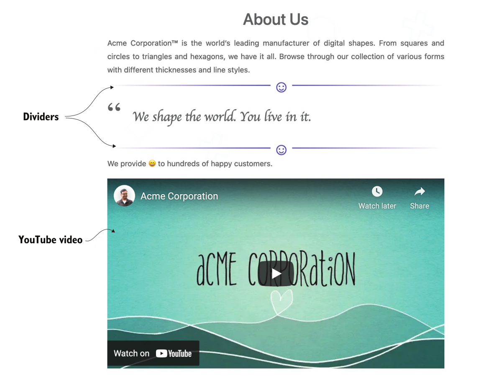

## 4.6.2基于标记的 shortcode

虽然大多数shortcode都是HTML，但我们可以选择用Markdown等标记语言编写shortcode。如果我们使用百分号（%）而不是尖括号（<>）来调用Markdown shortcode，Hugo会将其转换为HTML，就像我们在常规shortcode中所做的那样。通过这种方式，我们可以在一个共享的地方移动数据，然后从任何需要的地方使用数据。

## 练习4.5

shortcode在Hugo网站的__layouts/shortcodes__顶级文件夹中声明，并在_page___中使用。

我们可以将产品信息表从About页面移动到一个短代码中，并在Acme Corporation网站上关于制造过程的博客文章中共享。让我们在layouts/shortcodes文件夹中创建一个名为productInfo.md的文件，并将产品信息的内容移动到此页面。然后，我们可以将字符串{{/*%productInfo%*/}}放在内容的任何位置，以获取产品信息表。让我们在Acme Corporation网站上的“关于”页面和制造过程页面上这样做(<https://github.com/hugoinaction/hugoinaction/tree/chapter-04-resources/10>).

code checkpoint:<https://chapter-04-12.hugoinaction.com>, and source code:<https://github.com/hugoinaction/hugoinaction/tree/chapter-04-12>

4.6.3 Inline shortcodes

我们在一个单独的文件（如productInfo.md）中构建了短代码，该文件在全局范围内可用，并在整个网站中共享。或者，如果我们希望有一个特定于页面的短代码，我们可以在页面的Markdown内容中声明该短代码，并在该页面中使用它。这个shortcode可以做常规shortcode所能做的一切。这不会在页面外创建变量，因此，在保持shortodes的全局列表干净的同时,加快了编译速度。这些shortcode称为内联短代码，因为它们在我们调用它们的文件中声明为内联。

默认情况下，内联shortcode被禁用，因为shortcode可以访问整个网站配置。如果所有内容都来自可信来源，这不是问题。我们可以通过使用`enableInlineShortcodes:true`设置创建安全配置文件（`config/_default/security.yaml`）来启用内联短代码。一旦我们做到了这一点，我们就可以在我们的内容中声明一个短代码

内联短代码在声明后立即执行，并且不能嵌套。我们可以生成HTML和基于标记的shortcode。下面的列表显示了如何使用内联短代码。与常规短代码不同，我们声明这些短代码与内容内联。

## 清单4.22在Hugo中使用内联短代码

```bash
      #声明一个内联shortcode，并将其作为HTML执行。我们也可以用%作为Markdown执行。
Reused _content_ here


     #Shortcode usage as HTML
{}     #Shortcode usage as markup
```

我们可以用shortcode做更多的事情，所以我们将在第5章中探讨一些高级shortcode。本章总结了Hugo作为内容管理系统的使用。使用到目前为止讨论的功能，并依靠现有的主题（如Eclectic），我们可以构建和维护复杂的网站。

许多Hugo用户在学习Hugo的过程中并没有超越这一点。虽然我们可以在Hugo主题的范围内做很多事情，但Hugo模板系统仍有更多的力量。在下一组章节中，我们将构建一个独立的主题，以各种方式获取数据，包括从front matter、单独的文件或通过互联网创建自定义网页。此外，我们还没有完成Hugo的内容管理功能。我们将在以下章节中介绍一些特性，如级联属性。

## 总结

* Hugo提供了覆盖全局配置变量并通过多个文件在各种环境中管理它们的灵活性。通过将配置从单个文件移动到文件夹，我们可以根据多种条件选择选项。
* 我们可以通过将相应的标记内容放置到文件夹中，将Hugo中的网页组织成section。这些section可以嵌套，通常与网站的URL方案匹配。
* 我们可以使用不同section的索引页面来访问内容，并将这些页面添加到菜单中。
* 为了实现内容跨网站的可移植性，Hugo提供了拥有独立数据的能力。我们可以通过将菜单项放在front matter并使用page bundles来实现这种隔离。
* 使用left和branch bundles，我们使所有资产更接近内容。我们可以将特定于页面的图像和文件捆绑在与页面的标记内容相同的文件夹中。
* Hugo提供了通过taxonomies以任意方式逻辑组织内容的能力。每个taxonomies都由terms组成，一个页面可以以多个taxonomies存在，并且有许多terms。
* Taxonomies创建列表页面，并支持页面和taxonomy terms之间的多对多映射。我们可以根据需要定义尽可能多的taxonomies。
* shortcodes是一种提供片段的方法，我们可以使用这些片段来扩展Markdown的新功能。Hugo附带了各种用例的短代码，从YouTube视频到语法高亮显示。
* 我们可以根据内容定义标记和HTML格式的自定义shortcode，以防止复制和粘贴呈现逻辑。

