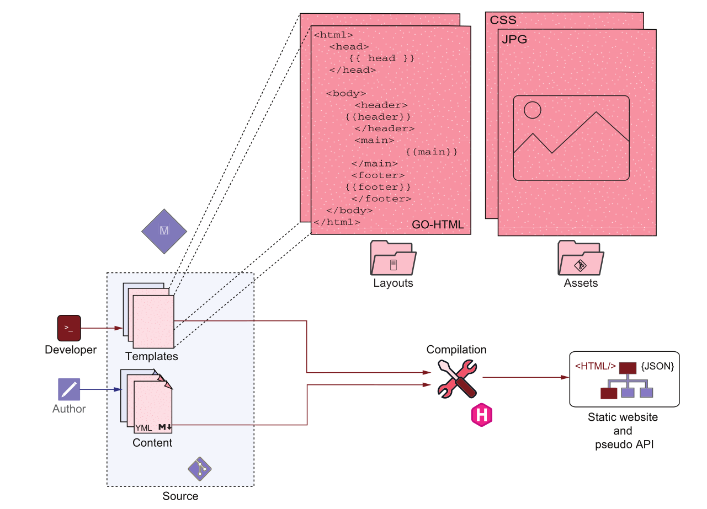
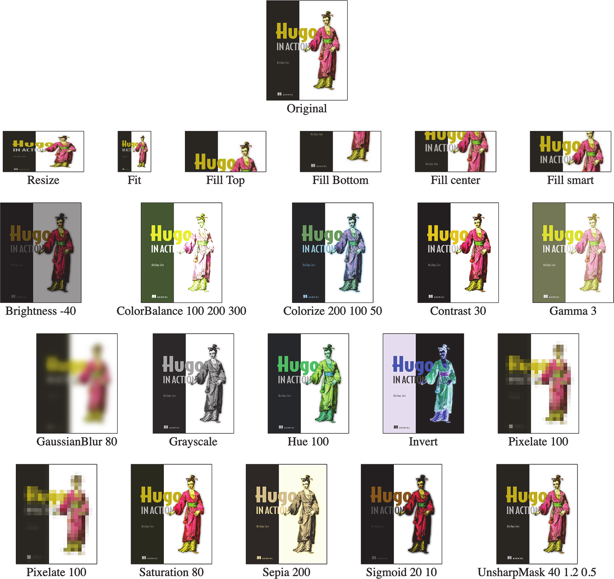
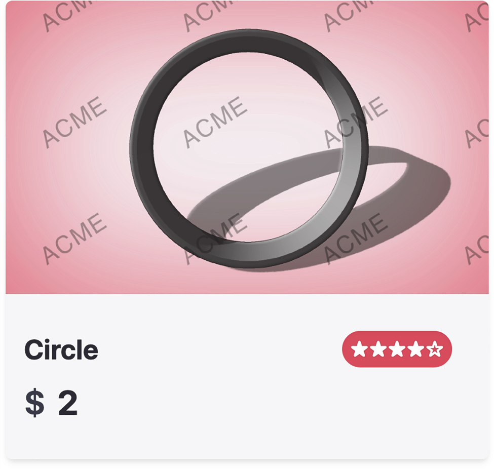

## This chapter covers

* 组织模板以更好地理解和重用
* 使用布局和部分来构造代码并提高编译速度
* 使用内容类型组织模板
* 使用Hugo Pipes操纵资源
* 使用与Hugo捆绑的模板

使用Hugo中的Go模板语言，我们可以根据需要为标记控制的HTML页面构建模板。在本章中，我们将启用多种类型的页面，在它们之间共享模板代码和片段（图6.1）。我们还将了解Hugo如何使用Hugo Pipes帮助处理JavaScript、图像和CSS文件。我们将建立我们的基础，远离Eclectic主题，并使用自定义模板代码对网站渲染进行更多控制。


图6.1第6章重点介绍如何让多个页面协同工作，在它们之间共享正确的代码片段集，以及如何最佳地使用图像、CSS文件和HTML等资产。

## 6.1使用内容类型、基本模板和块来结构化模板

到目前为止，我们专注于使用Go模板语言为主页创建index.html。虽然我们还没有一个大的、不可管理的文件，但如果我们继续向这个文件添加代码，它会很快失控。此外，对于一个文件，我们不能在略有不同的不同网页之间共享模板代码。

在本节中，我们将开始为index page之外的可访问性构建模板。当我们制作新的模板系统时，我们仍然会有一个功能强大的网站，尽管有两个模板设计：一个是Eclectic的，另一个是我们正在并行构建的。我们将缓慢地将网站迁移到新代码，以确保最小的破坏。为此，我们将使用我们正在构建的所有自定义模板代码创建一个新的内容类型，并允许页面在Eclectic和新模板之间切换。然后，我们将使用使用条款作为迁移到新内容类型的示例页面，为index page和data page之间的可重用部分创建代码共享的基本布局。

### 6.1.1封装具有不同内容类型(content types)的模板

Hugo content types是一组模板，可以根据独特的设计从标记中呈现页面。从概念上讲，content types类似于主题，但内容类型不是整个网站的设计，而是仅呈现给一个部分。每个网站可以有多个内容类型，每个内容类型可以显示不同的内容。例如，在一个典型的网站中，我们可以为与新闻帖子相关的页面设计一个页面，为博客帖子设计一个不同的页面，以及为隐私政策页面设计另一个页面。我们可以用不同的内容类型对每种类型的页面（博客、新闻、通用文本等）进行建模。每种内容类型都可以有一个独立的呈现模板。

主题是链接到网站不同部分的多种内容类型的集合。并非网站中的所有页面都需要看起来完全相似，内容类型也允许这种多样性。每个主题都定义了所有页面恢复到的默认类型，除非它们使用由主题为网站中的各个部分定义的自定义内容类型。通过在`layouts`目录中放置名为`index.html`的文件，我们可以覆盖主题定义的默认类型的index模板。Hugo支持覆盖主题中的任何模板，方法是在`layouts`目录中的确切位置创建一个文件，就像在主题中一样。Hugo将所有代码路径重定向到新文件。

除非我们研究主题的内部，并确保我们没有破坏任何代码路径的渲染，否则很可能会在某个地方导致意外行为。我们应该避免直接覆盖模板，除非我们正在对主题进行小的错误修复。将模板更改放置在不干扰主题的新内容类型中更安全。然后，我们可以慢慢地将所有页面移动到该类型，并在页面不再使用该主题时将其从网站中删除。这种方法允许我们从一个主题逐渐移动到另一个主题或自定义代码（就像我们正在做的那样），从而实现更多的控制。新的内容类型为不同于主题的基于标记的内容定义了一种新的呈现类型。

在向网站添加更多模板代码之前，我们将创建一个新的内容类型(content types)来隔离我们的更改。我们可以为主题未使用的内容类型选择任何名称，以防止冲突。我们将此内容类型命名为modern（用于现代设计），并将index page移动到此类型定义。要执行此任务，让我们在`layouts`目录中创建一个名为`modern`的文件夹，并将`index.html`移动到该文件夹。接下来，在主页的索引文件`content/_index.md`中，我们将更新类型为`modern`，如下所示。

> 清单6.1更新内容类型(content types)（content/_index.md）

```bash
type: modern
```

Hugo使用主题提供的默认模板来呈现index page的内容，除非存在`type`字段。

code checkpoint <https://chapter-06-01.hugoinaction.com>, and source code:<https://github.com/hugoinaction/hugoinaction/tree/chapter-06-01>.

> Hugo巧妙的模板查找顺序

Hugo根据网站开发人员的意图巧妙地分配了一个合适的模板。例如，如果我们在内容目录中创建一个名为`blog`的文件夹，Hugo会将该文件夹中所有文件的内容类型设置为`blog`。然后，如果我们在`layouts`文件夹中创建一个名为`blog`的文件夹，并开始为这些页面定义模板，它们将自动被网站中的`blog`部分选中。另一方面，如果未指定此类内容类型，则会自动加载默认模板。

Hugo中设计良好的模板查找顺序使这种内容类型选择成为可能。当Hugo需要渲染页面时，它会遍历一个有序的文件列表，并执行第一个文件作为网页的模板。由于向后兼容，此列表非常庞大，它提供了许多命名模板文件的方法。但是，我们强烈建议在代码中坚持直接的type到文件夹的约定，使用前面的type字段手动重写。Hugo的网站在<https://gohugo.io/templates/lookup-order/>.

### 6.1.2提供重复使用的基础模板

大多数网页都有类似的HTML结构。有一个包含元数据的header，以及定义整个网站中main和footer。Hugo有一个基本模板的概念，它可以保存整个网站共享的这些常见元素。基本模板包含网站的骨架。它包含网页公共部分的默认HTML，如果需要，可以在特殊情况下覆盖该HTML。类型中的所有模板都可以继承并自定义该类型的基础模板。如果类型没有提供基本模板，我们可以为整个网站使用默认的基本模板。

Hugo中的基本模板名为`baseof.html`。让我们在现代文件夹中创建一个基本的`baseof.html`文件。此文件存储Acme Corporation网页骨架，我们将在所有使用modern类型的网页中使用该骨架。通过创建`baseof.html`，我们切断了与Eclectic提供的模板的联系，可以专注于我们的自定义主题。

### 6.1.3定义代码块

让我们在基本文件`baseof.html`中创建一个骨架。index page中的`<head>`标记不特定于主页，因此我们可以将其移动到基本模板。`＜body＞`标记中的内容是页面特定的，我们将在`index.html`指定的模板中保留它。然后，在`baseof.html`中，我们将放置基本模板(<https://github.com/hugoinaction/hugoinaction/tree/chapter-06-resources/01>).

块定义了我们可以在专用模板中覆盖的内容。基本模板使用子模板可以覆盖的内容块。我们可以为非重写模板提供默认值。如果特定页面使用的模板未覆盖此块，Hugo将在基本模板的块内执行代码。我们可以在模板中拥有任意数量的块，包括嵌套块。下面的列表显示了在Hugo中创建块的语法。

> 清单6.2理解Hugo中的一个块（不要将其添加到网站中）

```bash
<!-- 块创建 -->
<!-- In baseof.html -->
{{block "blockname" blockArgument}}
{{end}}
<!-- 在派生模板中 -->
{{define "blockname"}}
<!-- 点（.）引用此处提供的块参数 -->
<!-- 如果需要顶级模板（页面）变量访问，我们仍然可以访问$ -->
{{end}}
```

块有两个参数：块的名称和要传递给块的上下文变量。传递上下文变量的值将替换的值。在块中。我们将从基本模板中向块提供当前上下文（也是全局上下文$）。

当我们添加块以允许覆盖模板的可定制部分时，我们还需要确保从基本模板派生的页面可以从所有URL正确加载。在清单6.3中，我们将URL更改为index.css，并基于网站的基本URL，而不是相对于当前页面的URL。请注意，基本模板应尽可能通用，以处理特定类型的所有内容。还要注意，所有块都应该具有合理的默认值，并且所有参数都应该是可选的。

> 清单6.3添加内容类型基本文件（layouts/modern/baseof.html）

```html
<!DOCTYPE html>
<html lang="en">
<head>
     <meta charset="UTF-8">
     {{with defalut .Summary .Description}}             <!--顶级上下文引用当前页面-->
     <meta name="description" content="{{.}}">
     {{end}}
     <meta name="viewport" content="width=device-width, initial-scale=1.0">
     <link rel="stylesheet" href="{{site.BaseURL}}/index.css">       <!-- 为CSS文件设置网站的绝对基本URL-->
     {{$title:=defalut stie.Title .Title}}
     {{with $title}}
       <title>{{.}}</title>
     {{end}}
</head>
<body class="home"> 
    {{block "body" .}}                                    <!-- 将当前上下文传递给代码块，不隐藏任何信息 -->
     <main>
         {{with .Title}}                                 <!-- 由于$title在块中不起作用，因此它需要基于所提供的上下文独立 -->
           <h1>
             {{.}}
           </h1>
         {{end}}
        <div class="content">
          {{.Content}}
        </div>
     </main>
   {{end}}                                              <!--如果描述不可用，则向摘要添加默认值-->
</body>
<html>
```

在基本模板中，顶级上下文引用当前页面。所有页面类型都具有Title和Description属性。然而，这些仍然可以是未定义的，因此我们需要检查它们。如果.Description不可用，我们将向.Summary添加默认值。因为页面可以位于任何位置，所以我们使用网站的绝对基本URL作为CSS文件。

block语句用于定义可以在子模板中重写的块。我们为基础模板中的块提供默认内容，这样，如果我们创建一个新模板，即使没有覆盖所有块，它也会提供有意义的渲染。块语句的最后一个参数类似于with语句，它成为块的上下文变量。在清单6.3中，我们将当前上下文传递给block，而不隐藏任何信息。注意，$title在块中不起作用，根据提供的上下文，块需要是自包含的。

> 练习6.1
> Hugo网站中包含HTML框架的根模板称为___c___

* a. root .html
* b. base.html
* c. baseof.html
* d. primary.html
* e. index.html
* f. parent.html

清单6.3中的代码与从index page中提取的头部几乎相同。在index.html页面上，我们现在可以使用`define`关键字填写block的值，如清单6.4所示。当我们使用define时，我们通知Hugo模板在基础模板中定义了块。如果模板中没有定义，Hugo将不会使用基础模板。还要注意，$title需要重新定义才能在正文中使用。

> 清单6.4填写块值（layouts/modern/index.html）

```bash
{{define "body"}}
{{$title := default site.Title .Title}}         # 重新定义$title
...Contents of the body tag...
{{end}}
```

code checkpoint <https://chapter-06-02.hugoinaction.com>, and source code: <https://github.com/hugoinaction/hugoinaction/tree/chapter-06-02>.

在前面的列表中，我们在基础模板中定义了主体块。上下文变量。由基本模板提供。当我们使用define关键字时，不使用基本模板中的块的默认实现。index page现在看起来应该和以前完全一样，但Hugo是从两个文件组成的，第一个来自于基本模板,第二个来自于index模板组成的。

### 6.1.4在不同布局中重复使用基础模板

有了基本模板，代码就可以在其他页面上重用了。我们使用index.html表示网站的index page。名称“index”不是随机的。Hugo开发人员选择这意味着整个网站的主页是日常web开发中经常需要的，index file代表特定部分（或文件夹）的主页。在Hugo  layouts中，它总是指网站的主页。在Hugo中，我们呈现的各种类型的页面被称为`layouts`。Hugo支持四种主要布局：

* `list layout`呈现网站中各部分的索引页面。这通常会提供一个所有子部分的列表和该部分中所有页面的列表。呈现每个分支捆绑包（`_index.html`）的基本页面使用list layout。
* `single layout` 表示包含存储在标记文档或leaf bundle中的内容的常规网页。所有leaf bundles（index.md）和普通Markdown文档（mypage.md）都使用single layout布局。
* `index layout`布局呈现整个网站的主页，该主页位于网站的根位置。此布局是列表布局的一种特殊化，因为主页通常不同于分区列表页面。如果没有`index layout`，Hugo将使用网站主页的`list layout`。
* `404 layout`构成了网站内所有错误页面的基础。此布局创建了一个唯一的页面（`/404.html`），我们可以在宿主服务器上为页面未找到（HTTP404）错误配置该页面。我们可以为503服务器错误创建更多错误页面，例如503.html，尽管使用Jamstack进行静态托管时，发生500系列错误的可能性很低。许多开发人员不需要404页面以外的任何东西。

除此之外，我们还有两种布局：taxonomy和terms。这些用于呈现terms list（例如，tag列表）和与terms相关联的页面列表(例如tag为正方形的页面列表）。这些布局通常可以重用我们为列表布局所做的大部分工作。（我们将在第7章中更详细地讨论这些。）`list`和`single`布局是Hugo中最关键的布局，分别对应于branch 和leaf bundles。

让我们为网站中的单个页面添加`single.html`。我们可以在这里添加特定于单个页面的代码。在Acme Corporation网站的`single.html`中，我们不想覆盖基本模板，而是按原样使用基本模板的内容。如果模板不是以定义的块开头，Hugo会将模板视为整个网页。如果我们将页面留空而不是运行基本模板，Hugo将呈现一个空页面。为了通知Hugo加载基本模板，我们需要定义一个不使用的虚拟块。下面的列表显示了如何做到这一点。

清单6.5将虚拟内容添加到single.html（layouts/modern/single.html）

```bash
{{define "garbage"}}
<!-- Never gets rendered -->
{{end}}
```

请注意，如果我们将注释放在define块之外，这将不起作用。它将失败，因为在覆盖模板部分的模板中只允许定义块。

接下来，我们将此模板分配给使用条款页面。在`terms.md`中，我们将在前面添加type：modern以执行此任务，然后将其转换为图6.2所示的设计。“使用条款”页面的内容现在使用了主页的CSS，它不能提供良好的格式。清单6.6显示了如何添加特定于布局的类重写。我们将在baseof.html中的body标记中执行此操作。


图6.2使用Acme类型中创建的single.html模板渲染的使用条款页面

> 清单6.6添加对样式类重写的支持（layouts/modern/baseof.html）

```html
<body class="{{block "bodyClass" .}}{{end}}">     <!-- 无需在块中转义引号。-->
```

我们可以在模板中的任何地方使用代码块。它们执行简单的字符串替换，而不关心网页的HTML结构。因此，如果我们在某些标记中放置错误的HTML（例如，bodyClass中的引号），输出可能会被破坏。注意，模板自动对来自标记文档的特殊字符进行XML编码，因此，我们可以将它们添加到HTML标记属性中，而无需额外编码。以下两个清单分别显示了如何覆盖`index.html`和`single.html`中的`bodyClass`以满足这一要求。注意，在我们向单个页面添加了一个正确的定义（清单6.8）之后，我们可以删除伪定义“垃圾”（清单6.5）。

> 清单6.7使用home定义主页（layouts/modern/index.html）

```bash
{{define "bodyClass"}} home {{end}}
```

> 清单6.8使用page定义常规页面（layouts/modern/single.html）

```bash
{{define "bodyClass"}} page {{end}}
```

code checkpoint <https://chapter-06-03.hugoinaction.com>, and source code: <https://github.com/hugoinaction/hugoinaction/tree/chapter-06-03>.

> 练习6.2
> Hugo用于常规网页的布局存储在名为__single.html____的文件中。

我们可以在一个文件中定义所需的多个覆盖。Hugo不检查最终HTML的有效性。我们应该确保不会因为重写的内容而导致无效的HTML。在我们的示例中，在class属性bodyClass中使用引号（“）关闭该属性并产生意外结果。

我们的使用条款页面仍然不完整。主页上有一个header和footer，可以移动到基本模板。当我们这样做时，应该始终创建一个新的块，以允许根据需要进行覆盖。我们将通过使图像路径绝对化，从而允许在任何子页面中使用图像路径，从而将代码推广到所有页面。下面的列表将header和footer移动到基础模板，以便在所有页面上共享。

清单6.9移动header和footer（layouts/modern/baseof.html）

```html
<body class="{{block "bodyClass" .}}{{end}}">
{{block "header" .}}       <!-- 将基础模板的部分包装为块，以允许在子模板中覆盖 --> 
  <header>
   ...
   <a href="{{ site.BaseURL | relLangURL }}" >      <!-- 向主页添加链接。我们在这里使用relLangURL，因为我们通过相对路径链接到网站根 -->
                       <!-- 将logo.svg的路径转换为绝对URL，以允许从所有页面加载 -->
      Acme Corporation
   </a>
   ...
  </header>
{{ end }}
{{block "body" .}}
  <main>
   ...
  </main>
{{ end }}
{{block "footer" .}}                               <!-- 将基础模板的部分包装为块 -->
  <footer>
  </footer>
{{end}}
</body>
```

code checkpoint <https://chapter-06-04.hugoinaction.com>, and source code: <https://github.com/hugoinaction/hugoinaction/tree/chapter-06-04>.

通过这些更改，index page模板现在只有该页面特有的内容，我们可以在其他地方使用的共享部分（如header和footer）已移动到共享模板。使用条款页面看起来像一个完整的网页。然而，我们将返回主页以进一步改进它。

## 6.2使用部分内容

当我们在主页上引入新的部分时，它将header菜单向下推，远离网站顶部。虽然这些链接没有标题那么重要，但我们希望它们可以在不滚动的情况下使用（通常称为折叠上方，这来自于报纸，在头版折叠下方隐藏的文章被认为不太重要）。理想情况下，我们希望重用代码来呈现footer。

由基本模板和代码块提供的继承（模板获取或继承基本模板的全部代码，并有权修改或变异某些部分）不适合在网页上的任意位置重用代码。为此，我们需要组合，其中我们有一段可重用的模板代码，可以在任何地方插入。我们可以使用shortcodes共享标记数据中的共享功能片段，也可以使用部分代码共享模板中的公共代码片段。

Partials是标准编程语言中的函数等价物，它支持隔离一段计算，该段计算生成一些输出到渲染的HTML文件并返回一些数据。Partials接受参数，使用这些参数进行一些处理，并将数据记录到输出HTML文件中，将计算结果返回给调用者。Partial是Hugo最重要的模板特性之一，理解Partial的概念对于Hugo的成功至关重要。

Table 6.1 Partials vs. base template-based code 重用

| Area                         | 基于partial的代码重用   | 基于基本模板的代码重用 |
| ---------------------------- | ----------------------- | ---------------------- |
| 重复使用的主要方法           | 在调用模板中使用partial | 在基础模板中使用 block |
| 可在一个页面内多次使用       | yes                     | no                     |
| 默认值自动启用               | No                      | Yes                    |
| 可以缓存以提高生成性能       | Yes                     | No                     |
| 可以接受参数                 | Yes                     | No                     |
| 可以返回计算结果             | Yes                     | No                     |
| 轻松覆盖布局中基于主题的数据 | Yes                     | No                     |

### 6.2.1 移动到partial

让我们从将footer菜单移动到partial开始。为此，我们将创建一个名为`layout/partials/menu.html`的文件，并将代码移动到该文件，以生成主页上使用的基于菜单的链接。注意，我们没有在布局下使用modern子文件夹。在Hugo中，所有内容类型都可以使用Partials。此外，我们可以在本地覆盖主题中使用的部分，并通过在layouts/partials文件夹中创建同名文件来更改其行为。

`partials`覆盖允许我们替换与主题一起使用的页面部分，并自定义这些部分。`partials`文件夹允许将子文件夹用作名称空间，尽管我们现在不需要名称空间(<https://github.com/hugoinaction/hugoinaction/tree/chapter-06-resources/02>). 下面的列表显示了如何共享代码以从`partial`创建页脚菜单。

> 清单6.10  通过partial（layouts/partials/menu.html）共享代码

```bash
{{with site.Menu.footer}}
<nav>
    <ul>
        {{range .}}
           <li>
                <a href="{{.URL}}">{{.Name | humanize}}</a>
           </li>
        {{end}}
   </ul>
</nav>
{{end}}
```

要调用`partial`，我们使用`partial`语句，后跟名称和上下文变量。下面的列表使用此语句将footer菜单添加到index page的intro section。

> 清单6.11调用partial（layouts/modern/index.html）

```html
<section id="intro">
...
{{ partial "menu.html" . }}
</section>
```

与块语句一样，分部语句也需要传递上下文变量。按原样传递上下文变量将加载menu.html，以便我们可以在footer中重用它。下一个列表提供了此项的代码。

> 清单6.12重用footer菜单（layouts/modern/baseof.html）

```html
{{block "footer" .}}
<footer class="dark">
{{ partial "menu.html" . }}
...
</footer>
{{end}}
```

code checkpoint <https://chapter-06-05.hugoinaction.com>, and source code: <https://github.com/hugoinaction/hugoinaction/tree/chapter-06-05>.

### 6.2.2partial 上下文

Hugo中的Partials是独立的、孤立的，除了传递给它们的变量之外，没有其他变量。partial中的$变量不引用全局页面对象，而是传递给partial的顶级上下文变量。虽然我们可以将整个顶级上下文从调用者传递给partial，但最好限制这些数据。这一限制通过缓存以更好的方式确保了partial和性能优化的最大重用。否则，我们传递给partial的信息太多，远远超过所需的信息。

如果直接传递菜单，我们可以重用footer和main menu之间的部分。在下面的列表中，我们更新了partial，以采用特定菜单来呈现，而不是网站的硬编码主菜单，使其能够呈现不同的菜单。

> 清单6.13使partial更灵活（layouts/partial/menu.html）

```html
{{with $}}
<nav>
    <ul>
        {{range $}}              <!--因为partial是自包含的，所以顶级的$和dot（.）与传递给它的参数相同。而不是这里的$ -->
           <li>
               <a href="{{.URL}}">{{.Name | humanize}}</a>
           </li>
        {{end}}
   </ul>
</nav>
{{end}}
```

我们可以使用footer菜单中的代码重用以前的列表。下面的列表显示了这种用法。

> 清单6.14加载页脚菜单（layouts/modern/baseof.html)

```html
{{ partial "menu.html" site.Menus.footer }}
```

<https://chapter-06-06.hugoinaction.com>, and source code: <https://github.com/hugoinaction/hugoinaction/tree/chapter-06-06>.

Hugo中的partial语句在概念上类似于JavaScript模块或PHP include。现在，我们可以使用 {{/*partial "menu.html" site.Menus.main*/}}作为主菜单的参数，而{{/*partial "menu.html" site.Menus.footer/*}}将呈现页脚。

将主菜单移动到partial菜单的一个问题是丢失了用于在移动设备上呈现主菜单的汉堡按钮。因为它不是到处都需要的，所以我们需要向partial传递额外的参数，以确定何时渲染此按钮。

Hugo partial只需要一个参数。为了允许传递多个值，我们可以将该参数转换为具有多个值的字典或切片。切片会导致可读性问题，因为参数的顺序变得重要，而未定义的参数很难支持。为了避免这些问题，下面的列表使用字典参数作为菜单的可选元素，以重用标题的partial。

> 清单 添加汉堡按钮（layouts/partial/menu.html）

```html
{{with $.Menu }}
   <nav>
     {{if $.Button}}
       <button class="hamburger">☰</button>
     {{end}}
   <ul>
     {{ range $.Menu }}
       <li><a href="{{.URL}}">{{.Name | humanize}}</a></li>
     {{end}}
   </ul>
</nav>
{{ end }}
```

现在，我们可以用Button选项的向partial传递true来加载带有汉堡按钮的标题菜单。下面的列表提供了此操作的代码。注意，我们不需要在footer中传递Button参数，因为默认值将无法通过if检查。

> 清单6.16加载标题菜单（layouts/modern/baseof.html）

```html
{{partial "menu.html" (dict "Menu" site.Menus.main "Button" true)}}
```

code checkpoint <https://chapter-06-07.hugoinaction.com>, and source code: <https://github.com/hugoinaction/hugoinaction/tree/chapter-06-07>.

### 6.2.3 使用菜单部分的附加参数返回子菜单

当我们移动到内容类型时，标题中的子菜单丢失了。现在是把它带回来的好时机。Hugo支持在树数据结构中无限嵌套子菜单，并使用父子术语分别表示菜单及其子菜单。每个菜单对象都有一个名为`.HasChildren`的属性和一个称为`Children`的切片（数组），我们可以使用它来渲染这些对象。下面的列表将子菜单添加为菜单partial中的嵌套无序列表。对于footer等没有子菜单的情况，此调用没有影响。

> 清单6.17子菜单作为嵌套无序列表（layouts/partial/menu.html）

```html
<li>
   <a href="{{.URL}}">{{.Name | humanize}}</a>
      {{if .HasChildren}}
        <ul>
        {{range .Children}}
         <li><a href="{{.URL}}">{{.Name | humanize}}</a></li>
        {{end}}
        </ul>
      {{end}}
</li>
```

<https://chapter-06-08.hugoinaction.com>, and source code: <https://github.com/hugoinaction/hugoinaction/tree/chapter-06-08>.

Hugo的菜单对象提供了其他功能，例如当我们在右侧页面时突出显示活动菜单。这些扩展超出了本书的范围。此外，Hugo的文档提供了一个现成的菜单模板，它涵盖了比我们在这里的代码所能涵盖的更多的情况。

### 6.2.4 partial 的性能

当一个模板出现在多个页面中时，每个页面都会调用一个模板。在很多页面上，这会减慢网站的编译速度。Partials允许我们执行缓存以防止重复调用。在使用此功能之前，让我们花几分钟时间了解一下刚刚编写的代码的性能。

Hugo提供了一个构建标志`--templateMetrics`，它区分大小写。当提供时，它测量每个模板对整体构建的影响。注意，许多Hugo操作并行运行。因此，所提供的所有时间的总和远远超过编制网站所需的时间。清单6.18中的代码运行Acme Corporation网站上的性能指标。请注意，数字高度依赖于运行的硬件和软件，并且可能并非始终相同。（Hugo及其主题不断发展以提高性能，这些数字可能会发生巨大变化。）我们刚刚创建的文件menu.html已经运行了四次。

清单6.18运行性能度量

清单6.18中需要注意的关键列是计数列。单个页面模板（`_default/single.html`）被调用16次以呈现16个页面。短代码单独报告。menupartial（partials/menu.html）已经五次调用菜单模板来呈现主页和条款页面。让我们将隐私政策页面也移动到modern模板类型。menu.html文件被调用了七次，为这个新页面添加了一次header和一次footer。

code checkpoint <https://chapter-06-09.hugoinaction.com>, and source code:<https://github.com/hugoinaction/hugoinaction/tree/chapter-06-09>.

为了防止这种重复，我们可以使用partialCached而不是partial。至少，partialCached采用与partial相同的参数。如果我们用partialCached替换所有部分调用而不传递另一个参数，我们将看到partial/menu.html只执行一次。这种执行是一个明显的错误，因为它强制页眉和页脚具有相同的菜单。

code checkpoint <https://chapter-06-10.hugoinaction.com>, and source code:<https://github.com/hugoinaction/hugoinaction/tree/chapter-06-10>.

为了确保header和footer有自己的菜单，partialCached可以使用任意数量的参数，每个参数组合起来创建一个唯一的键。我们需要向partialCached添加单独的参数，每次渲染一个参数。清单6.19将参数添加到index page。然后，清单6.20将参数添加到基本模板文件baseof.html中。

> 清单6.19在layouts/modern/index.html中使用partialCached

```html
{{ partialCached "menu.html" (dict "Menu" site.Menus.footer) "footer"}}
```

> 清单6.20在layouts/modern/baseof.html中使用partialCached

```html
{{ partialCached "menu.html" (dict "Menu" site.Menus.main "Button" true) "main" }}
{{ partialCached "menu.html" (dict "Menu" site.Menus.footer) "footer"}}
```

我们可以在main旁边添加true作为缓存键，但这是不必要的。这是因为主菜单总是有一个按钮，而且主键足够独特

<https://chapter-06-11.hugoinaction.com> and source code:<https://github.com/hugoinaction/hugoinaction/tree/chapter-06-11>.

现在，当我们添加页面时，分部的执行计数不会增加。Partials使用一个参数（可以是字典对象dict，也可以是多个值）来确保独立性。这允许高效缓存。partialCached中的附加参数可以很容易地添加到partial中，而无需更改部分代码。

> 提示：减少模板所需时间的最简单方法是将一些实现移动到partial，并使用partial缓存来处理跨页面相同的慢速HTML。

### 6.2.5 A detour to partial returns

如果在引入partial函数时没有提到return语句，这将是对partials函数的偏袒（双关语）。到目前为止，我们已经在模板文件中使用了partial代码作为shortcodes的等价物。尽管HTML中的呈现是partial和partialCached的重要用例，但partial也充当Go模板语言中的函数。我们可以使用partials进行字符串和数字处理，或者访问网络或文件系统，然后在变量中提供处理结果。Partials已经支持通过partialCached进行缓存。

> 练习6.3

True或False：基本模板中的blocks仅由Hugo执行一次，输出在多个页面中共享。

在本章中，让我们在第5章中创建的价格shortcode更快地执行。price shortcode读取一个CSV文件，该文件提供任何Acme Corporation产品的价格。我们将把所有产品的价格缓存在一个partial中(<https://github.com/hugoinaction/hugoinaction/tree/chapter-0-resources/03>)可在所有页面上访问。这样，CSV文件的读取和解析只发生一次。

因为表是二维的，所以我们可以创建一个字典来表示它。外部字典以产品名称（行标题）作为关键字，以产品信息作为其值。内部字典使用列标题作为关键字，使用产品的价格和评级作为值。下面的列表以JSON格式提供了该函数的输出示例。

清单6.21 price shortcode的输出
```json
{
    "Circle": {
        "Colors": "Red, Green, Blue, Orange",
        "Price": "2",
        "Rating": 4
    },
    "Square": {
        "Colors": "Red, Pink, Blue",
        "Price": "4",
        "Rating": 5
    }
}
```

Hugo的slice和dict数据结构是不可变的，不能修改。因此，我们将对该部分使用`scratch`数据结构。Hugo的scratch结构是一个读写数据存储，可以作为临时变量来保存数据。它的工作方式就像一个可变字典，我们可以在其中轻松地添加或删除值。清单6.22创建了一个partial以从CSV文件中获取产品信息，然后可以对其进行解析并缓存。

清单6.22产品信息的 partial（layouts/partial/products.html）

```html
{{$scratch := newScratch}}
{{$products := resources.GetMatch "products.csv"}}
{{$parsedProducts := $products | transform.Unmarshal (dict "delimiter" ",")}}   <!-- 使用逗号作为分隔符分析CSV文件-->
{{$index := index $parsedProducts 0}}            <!-- 获取第一行作为索引行 -->
{{ range $i, $r := $parsedProducts }}            <!-- 循环遍历表中的所有行 -->
   {{ if ne $i 0}}                               <!-- 忽略表的第一行 -->
    {{range $j := seq (sub (len $index) 1)}}
      { $scratch.SetInMap (index $r 0)  (index $index $j) (index $r $j) }}   <!-- 在草稿栏中创建指向另一个字典的字典（地图）-->
   {{end}}
   {{end}}
 {{end}}

{{return $scratch.Values}}                       <!-- 将草稿板转换为字典并返回 -->
```

此列表中的partial不使用外部变量。无论参数如何，它都会返回相同的结果，并且我们不需要为不同的输入使用不同的变量。请注意，在Hugo中，partial中只允许一次返回。此外，当在便笺簿中创建指向另一个字典的字典时，外部字典使用行中的第一个条目（$r）作为索引，其值是使用每列中的第一项（$index）作为关键字的字典。现在我们可以更新价格shortcode来利用这部分。下面的列表显示了如何做到这一点。请注意，partialCached至少需要一个键。

清单6.23使用产品partial（layouts/shortodes/price.html）

```html
{{$product := default (.Get 0) (.Get "product")}}
$ {{index (index (partialCached "products.html" "key") $product) "Price" }}
```

<https://chapter-06-12.hugoinaction.com>, and source code: <https://github.com/hugoinaction/hugoinaction/tree/chapter-06-12>.

在上一个清单中的代码中，我们使用传递给短代码的参数获得了产品信息。我们使用partialCached调用缓存的partial名称products.html。我们给它一个字符串作为参数，因为它不需要变量。在partial中，我们创建了一个以key为产品名称、以value为价格的便笺簿。我们可以使用模板验证partial仅执行一次.表6.2比较了partials和shortodes及其在Hugo中的使用。

表6.2partials和shortodes的比较及其在Hugo中的使用

| Area    | Partials                              | Shortcodes           |
| ------- | ------------------------------------- | -------------------- |
| Use     | 在模板中                              | 在标记(markup)数据中 |
| Access  | 仅提供变量                            | 全部变量             |
| Caching | 可以使用partialCached基于输入进行缓存 | 未缓存               |
| Returns | 可以呈现为输出，并将值作为变量返回    | 只能渲染到输出       |

> 内联partial

Hugo还支持内联定义partials。如果我们想在同一个文件中多次重复使用相同的代码，但不想生成单独的文件，内联partials可以派上用场。内联partials也可以充当私有函数，而常规partials充当公共函数。我们还可以使用define关键字来定义一个block，然后定义一个partial。下面的代码显示了如何实现这些不同的声明。

```html
{{ $variable := partial "inline-partial" . }}
...
{{ partial "inline-partial" . }} {{/* Ignoring return values */}}
...
{{ define "inline-partial" }}
...
{{return $returnValue}}
{{end}}
```

## 6.3 Hugo Pipes的资产处理

通过将HTML生成移到Hugo的模板系统中，我们大大简化了HTML生成的工作，现在我们可以基于标记文档来完成。然而，图像和其他资产（如JavaScript和CSS）仍然存在问题。在更改纵横比和将图像大小调整为缩略图、移动、桌面等多个文件方面需要做大量工作，我们需要这样做才能获得良好的性能。此外，要基于标记或元数据，需要有一种方法使基于标记的信息进入JavaScript或CSS。Hugo Pipes是Hugo对这些问题的解答。

Hugo提供了实用程序方法来管理page bundle、全局assets文件夹和提供的任何文件路径中的资源。这些方法中的大多数采用单一参数，我们将它们与第5.1.7节中讨论的管道操作一起使用。Hugo Pipes是Hugo的一组资源管理功能。

### 6.3.1处理文本资产

除了favicon.ico之外，我们目前正在使用background.svg、index.css和logo.svg, assets的静态文件夹。Hugo支持对所有基于文本的文件格式使用Pipes。

让我们从index.css开始。下面的列表使用Hugo Pipes读取css文件。然后，我们需要将index.css文件移动到assets文件夹以使其发挥作用。最后，我们可以使用资源API加载此文件。

> 清单6.24读取CSS文件（layouts/modern/baseof.html）

```html
{{ $css := resources.GetMatch "index.css"}}
<link rel="stylesheet" type="text/css" href="{{$css.Permalink}}">
```

code checkpoint <https://chapter-06-13.hugoinaction.com>, and source code: <https://github.com/hugoinaction/hugoinaction/tree/chapter-06-13>.

使用`resources.GetMatch`，我们可以将默认文件放置在网站中要覆盖的主题的assets文件夹中。注意，我们之前在`products.csv`文件中使用了相同的功能。要获得确切的资源，我们可以使用`resources.get`，尽管GetMatch支持通配符（也称为globs）。

`Hugo Pipes`的真正威力来自于对处理的支持。Hugo可以使用SCSS处理器（仅在扩展版本中）和`PostCSS`后处理器处理CSS文件.SCSS（或SASS）是一种CSS超集语言，支持CSS中的嵌套、函数和编译时变量。SCSS背后的理念是编译时优化和代码生成。这种方法与Jamstack的方法相匹配，两者都能很好地协同工作。让我们将`assets/index.css`文件重命名为`assets/index.scss`，并使用`{{$css:=resources.GetMatch "index.scss" | resources.ToCSS}}`通过Hugo Pipes使用scss预处理器。

首先，我们需要验证我们安装的Hugo版本是否是扩展版本。为此，让我们在命令行上运行命令hugo版本。如果您安装了Hugo的扩展版本，您应该在命令行输出中看到扩展：

```bash
Hugo Static Site Generator v0.91.2/extended
```

SASS编译器有两种风格：一种是嵌入Hugo的版本，不需要单独的二进制文件（LibSass），另一种是SASS编译器作为外部进程运行的版本（Dart SASS）。Dart Sass较新，功能丰富，但我们需要一个外部脚本来安装它。我们可以配置要在网站配置中使用的Sass编译器。

您需要Hugo的扩展版本才能使用SCSS功能。注意，在许多平台（包括Windows上的Chocolatey）中，包管理器默认安装Hugo的常规（非扩展）版本。使用扩展版本没有什么害处，因为更大的编译器二进制文件不会影响最终输出大小或性能。清单6.25为我们将SCSS转换为CSS。

提示：您不需要SCSS来完成本书中的代码示例。如果没有安装Hugo扩展，可以跳过这个特定的代码检查点，继续阅读本书的其余部分。

> 清单6.25将SCSS编译为CSS（layouts/modern/baseof.html）

```html
{{ $css := resources.GetMatch "index.scss" | resources.ToCSS }}
```

<https://chapter-06-14.hugoinaction.com>, and source code: <https://github.com/hugoinaction/hugoinaction/tree/chapter-06-14>.

Hugo不关心文件扩展名。如果需要，我们可以通过SCSS转译器传递index.css。SCSS超出了本书的范围。这对Hugo来说并不重要，我们也不会深入探讨。我们只需要CSS来设置内容的样式，这是SCSS编译的输出。对于不想使用Hugo扩展版本的读者，我们将恢复此更改，尽管您可以继续在网站上使用SCSS。

我们可以通过资源将PostCSS处理器用于CSS。PostCSS（需要安装postcs-cli）无需任何配置更改。我们还可以通过Babel transcompiler处理JavaScript文件（需要安装@Babel/cli和@Babel/core），以便通过旧版本web浏览器的pipe babel访问未来的JavaScript功能。更好的方法是使用Hugo内置的JavaScript bundler js.Build（我们将在第10章讨论js.Build）。

注意：Hugo与JavaScript生态系统有特殊的集成。第10章完全致力于在基于Hugo的网站中使用JavaScript。

当使用带有Hugo Pipes的CSS/JS处理器时，我们可以通过Hugo模板解析器运行JavaScript或CSS文件，完全访问整个变量、函数和部分系统，并使其内容像HTML一样数据驱动。Acme Corporation网站的主题颜色目前为蓝色。如果我们将其移动到模板系统，我们可以从Acme配置文件中控制它。我们已经在config.yaml中将此颜色定义为参数中的颜色。我们可以通过｛｛site.Param “color”｝｝访问参数。从第5章中提及，站点是Hugo为站点变量提供的全局变量。它在所有部分和模板中都可用。使用site而不是$.site在跨部分使用此模板时提供了最大的灵活性。

虽然颜色值存在于配置中，但我们没有在`index.css`和`background.svg`中使用它，它们当前使用硬编码值“`#4f46e5`”。我们需要这些值是动态的，以便可以在配置中的一个位置更改它们。为此，我们需要将这些文件转换为模板。然后我们可以运行Hugo的模板渲染，并在编译时生成网站的实际文件。Hugo提供了一个名为`resources.ExecuteAsTemplate`的函数，用于将任何资源文件作为Hugo模板进行处理。为此，我们将从`logo.svg`和`background.svg`开始。

让我们创建这些文件的副本，并为其添加`.tpl`扩展名。虽然不需要，但最好重命名模板文件并添加`.tpl`扩展名以帮助识别。接下来，我们需要将这些文件中出现的所有“`#4f46e5`”替换为{{/*site.Params.color | default "#4f46e5"*/}}(<https://github.com/hugoinaction/hugoinaction/tree/chapter-06-resources/04>). 请注意，在第8章之前，我们不会删除旧的`background.svg`和`logo.svg`，在这一章中，我们完全脱离了Eclectic主题。清单6.26提供了更改background.svg模板的代码，以便我们可以使用提供的主题颜色。然后，清单6.27更改了logo.svg模板。

> 清单6.26 更改 background.svg（assets/image/background.svg.tpl）

```html
<style type="text/css">
...
.st2{fill:none;stroke:{{site.Params.color | default "#4f46e5"}};
stroke-width:4;stroke-miterlimit:10;opacity: 0.2}
...
.st6{fill:{{site.Params.color | default "#4f46e5"}}; opacity: 0.2}
...
</style>
```

> 清单6.27更改logo.svg（assets/image/logo.svg.tpl）

```html
<style type="text/css">
.st0{fill:{{site.Params.color | default "#4f46e5"}};}
...
</style>
```

Acme Corporation网站的CSS文件使用每个颜色组件（红色、绿色和蓝色）的CSS自定义属性来定义其主题。如果我们简单地用颜色值对其进行编码，那么用{{site.Params.color}}替换字符串“#4f46e5”就足够了。为了传递单个颜色值，我们需要做更多的工作。下面的列表为Hugo的CSS变量提供了单独的主题颜色。

> 清单6.28提供单独的主题颜色（assets/index.css.tpl）

```html
{{$color:=site.Params.color | default "#4f46e5"}}     <!-- 需要一个默认值，以便在缺少主题颜色时不会失败 -->
{{$b:=substr $color -2 2 |                            <!-- 提取蓝色值的最后两个字符。（十六进制为#RRGGBB） -->
    print "0x"                                        <!--将十六进制值转换为0xBB-->
        | int}}                                       <!--将值解析为整数-->
{{$g:=substr $color -4 2 | print "0x" | int}}
{{$r:=substr $color -6 2 | print "0x" | int}}
:root {
    --red: {{$r}};                                    <!-- 将此数据传递给CSS以用作变量 -->
    --green: {{$g}};
    --blue: {{$b}};
```

CSS文件还包含带有硬编码背景颜色rgb（79、70、229）的背景SVG图像。我们应该在整个文件中执行查找和替换操作，将硬编码的颜色值替换为rgb（{{/*$r*/}}、{{/*$g*/}},{{/*$b*/}}）。我们不能在这里直接使用`$color`，因为它需要URL编码。接下来，我们需要通过`resources.ExecuteAsTemplate`将这些文件加载到我们的网站中，如下所示。我们还将通过`resources.minify`管道输出，以减少其文件大小。

> 清单6.29 解析index.css.tpl（layouts/modern/baseof.html）

```html
{{ $css := resources.GetMatch "index.css.tpl"
| resources.ExecuteAsTemplate "index.css" "nothing"
| resources.Minify }}
```

`esources.ExecuteAsTemplate`获取目标文件的名称和要传递给模板的上下文变量。与partial一样，资源模板在隔离环境中执行，$变量由我们直接传递的数据组成。其原因与partial的原因相同：允许最大限度地重用缓存。因为站点变量是全局可用的，所以我们不需要执行模板的参数。完成后，我们可以通过解析logo.svg并执行它，将其加载到基本模板中，方法与使用index.css的方法类似。

> 清单6.30 解析logo.svg.tpl（layouts/modern/baseof.html）

```html
{{ $logo := resources.GetMatch "image/logo.svg.tpl"
| resources.ExecuteAsTemplate "logo.svg" "nothing"
| resources.Minify }}

```

我们可以更新index.css.tpl以呈现background.svg模板。下面的列表显示了如何更新index.css以使用.tpl文件。

> 清单6.31 更新 background.svg的index.css（assets/index.css.tpl）

```html
{{ $background := resources.GetMatch "image/background.svg.tpl" |
resources.ExecuteAsTemplate "background.svg" "nothing" | resources.Minify}}
background: url({{$background.Permalink}}) 0 0/cover;
```

注意：如果我们使用resources.ExecuteAsTemplate，Hugo的缓存机制会受到损害。强烈建议在partial中使用resources.ExecuteAsTemplate并使用partialCached调用它，以防止不必要的重新计算。我们将logo.svg和index.css解析移动到单独的部分中，作为读者的练习。

<https://chapter-06-15.hugoinaction.com>, and source code: <https://github.com/hugoinaction/hugoinaction/tree/chapter-06-15>.

现在，我们可以控制网站配置中的颜色（例如，设置为“`#DC2626`”），以获得网站的不同主题颜色（如图6.4所示），供本书的其余部分使用。

<https://chapter-06-16.hugoinaction.com>, and source code: <https://github.com/hugoinaction/hugoinaction/tree/chapter-06-16>.


图6.4将配置文件中的网站主题颜色更改为 “#DC2626”

另一个重要特性是支持CSS合并。Hugo可以很容易地将多个CSS文件合并为一个发布文件，但我们不能连接图像。在第6章的参考资料中，您可以找到`additional.css.tpl`文件(<https://github.com/hugoinaction/hugoinaction/tree/chapter-06-resources/05>). 我们可以将此文件放在assets文件夹中以供使用。然后我们可以使用`resources.Concat`将其连接起来。请注意，`resources.Concat`需要有效的mime类型才能工作。因此，我们将对concat API使用index.css而不是index.css.tpl。以下列表使用此API允许通过单个调用加载多个CSS模板。

> 清单6.32 使用concat API（layouts/partial/index.css.html）

```html
{{ $css := resources.Match "*.css.tpl" |                        <!-- 得到所有的 css.tpl files-->
           resources.Concat "index.css" |                       <!-- 将它们与index.css合并 -->
           resources.ExecuteAsTemplate "index.css" "nothing" |   <!-- 处理tpl文件模板-->
           resources.Minify }}                                   <!-- 最小化生成的CSS文件 -->
```

<https://chapter-06-17.hugoinaction.com>, and source code:<https://github.com/hugoinaction/hugoinaction/tree/chapter-06-17>.


为了获得与glob模式匹配的所有文件的切片（数组），我们可以使用resources.Match。这样，我们可以开发独立的文件，并在生产中提供合并版本。请注意，additional.css在网站标题的设计中提供了细微的更改，我们可以使用它来验证此文件的加载情况。

## 练习6.4

在Acme Corporation网站主页上添加hero形象。hero图像在章节资源中作为SVG图像提供(<https://github.com/hugoinaction/hugoinaction/tree/chapter-06-resources/06>). 生成的HTML应为match <https://chapter-06-18.hugoinaction.com>，动态生成SVG图像，使其与网站颜色相匹配。下图显示了添加图像后的主页。


code checkpoint <https://chapter-06-18.hugoinaction.com>, and source code:<https://github.com/hugoinaction/hugoinaction/tree/chapter-06-18>.

## 6.3.2处理图像

虽然矢量图形和SVG对于文件大小非常有用，但并不是所有东西都可以使用矢量图形轻松构建。像JPEG和PNG这样的光栅图像是现代网络的重要组成部分，构成了许多网站的大部分网络流量。Hugo Pipes广泛支持这些图像，包括允许我们准备通过网络进行最佳交付的操作。虽然我们的博客文章有图片，但我们不会在网站的索引页上使用这些图片。没有这些图片，我们的博客文章看起来不完整。

要为博客文章添加封面图像，可以通过resources.GetMatch访问全局资产位置中的资源。下面的列表显示了如何通过page.resources.GetMatch来访问页面捆绑包中的资源以添加封面图像。

> 清单6.33为博客文章添加封面图片（layouts/modern/index.html）

```html
<li class="post">
  <a href="{{.Permalink}}">
        {{$title := .Title}}
        {{with (.Resources.GetMatch "cover.*")}}
            
        {{end}}
    ...
</a>
</li>
```

code checkpoint <https://chapter-06-19.hugoinaction.com>, and source code:<https://github.com/hugoinaction/hugoinaction/tree/chapter-06-19>.

前一个列表中的代码存在严重的性能问题。博客文章的封面图片非常巨大，像素比在主页的小视图中渲染它们所需的像素还要多。我们无法在页面捆绑包中调整它们的大小，因为单个页面需要更大的图像。Hugo提供了在编译期间动态调整图像大小的支持。以下是Hugo中的调整大小选项：

* .Resize ---- 此选项可调整图像大小。它可以采用所需宽度和高度形式的参数。例如，{{/*$hero.Resize "200x200"*/}}将英雄图像的大小调整为200×200像素，忽略纵横比。如果我们使用{{/*$hero.Resize "200x"*/}}，则图像的宽度将根据纵横比调整为200像素，而{{/*$hero.Restize "x200"*/}}将图像的高度调整为200 px，宽度根据原始纵横比计算。

* .Fit  ----  此选项可调整图像大小以适合提供的框。例如，{{/*$hero.Fit “200x200”*/}}确保宽度或高度为200像素，而其他维度（高度或宽度）小于200像素。1000×800的图像将缩小到200×160，而800×1000的图像将变为160×200。这类似于CSS属性objectfit:contain或background-fit:contain。

* .Fill ---- 此选项调整图像大小以填充提供的框，同时裁剪外部部分。例如，{{/*$hero.Fill“200x200”*/}}创建一个200×200的图像，在该图像中，可以调整图像的大小并按长度或宽度进行裁剪。这相当于对象拟合：覆盖或背景拟合：覆盖。填充Hugo还可以采用一个可选参数，该参数定义要保留的图像部分。例如，如果我们使用.Fill "200x200 left"，Hugo将保留图像的最左侧部分。Hugo还提供了一个名为smart的选项，Hugo可以自动检测图像的重要部分。

> 进一步优化
> 虽然Hugo根据提供的参数处理资产，但仍有可能进一步优化资产。许多开发人员使用Hugo输出的后处理来进一步优化。包括Netlify在内的大多数主机都将资产优化作为其CDN托管的一项功能。
>
> 我们可以为此处理添加特定插件。我们可以通过获取公共文件夹或文档文件夹的内容，并通过`ImageOptim`、`CSS`和`JavaScript`等工具传递图像，通过Terser手动进行后处理，以进一步优化生成的资产。我们还可以使用img标记中的HTML图片标记或srcset属性为浏览器提供选项，以根据视口大小加载正确的图像。

主屏幕上封面图像所需的最大尺寸约为1000像素（在高密度显示器中处理2倍缩放）。下面的列表显示了如何使用.Resize选项将封面图像限制为较短的大小。我们还添加loading=lazy来延迟加载这些图像，从而加快网站的初始渲染。注意，延迟加载是一种HTML，而不是Hugo性能特性。

> 清单6.34调整博客封面图片的大小（layouts/modern/index.html）

```html

```

这段代码在加载索引页时可以节省大量的文件大小。强烈建议将图像转换为WebP格式，这样可以进一步减小文件大小。我们可以将webp作为.Resize中的选项传递（例如，.Resize“1000x webp”）。如果我们使用Hugo的扩展风格，此选项将图像转换为WebP格式。WebP的浏览器采用率超过95%，除非我们针对的是古老的浏览器，否则在我们的网站上使用WebP作为唯一的图像格式是安全的。如果需要较旧的浏览器支持，我们可以使用HTML图片标记来提供WebP和JPEG/PNG版本的图像。为了保持对Hugo扩展版本的依赖性是可选的，我们没有在本书中使用WebP。

code checkpoint <https://chapter-06-20.hugoinaction.com>, and source code:<https://github.com/hugoinaction/hugoinaction/tree/chapter-06-20>.

我们还可以为图像提供艺术滤镜，如模糊、棕褐色或灰度。图6.5包括其中一些过滤器的列表。

Acme公司网站的最爱图标仍然是与硬编码的“旧”主题相同的颜色。不幸的是，由于各种浏览器供应商对SVG favicon的支持参差不齐，我们需要将favicon的至少一个PNG副本链接到我们的网站。我们可以使用Hugo的图像处理过滤器，使用主题颜色重新着色我们的favicon(<https://github.com/hugoinaction/hugoinaction/tree/chapter-06-resources/08>)



图6.5 Hugo中的图像处理和过滤器支持。Hugo支持各种调整大小以及使用过滤器处理图像的选项(<https://github.com/hugoinaction/hugoinaction/tree/chapter-06-resources/07>).

请注意，这里的数学很复杂，虽然它展示了Hugo提供的灵活性，但在大多数情况下，你不需要这么复杂的东西。我们将在缓存的partial中计算favicon，以防止重新运行我们的数学，然后在网站的头部使用它。下面的列表显示了如何使用配置中的颜色动态地重新着色favicon。

> 清单6.35重新着色favicon（layouts/partial/favicon.png.html）

```html
{{ $color := site.Params.color | default "#4f46e5" }}
{{ $b := substr $color -2 2 | print "0x" | int}}           <!-- 从提供的十六进制颜色中删除RGB组件（逻辑与CSS相同）-->
{{ $g := substr $color -4 2 | print "0x" | int}}
{{ $r := substr $color -6 2 | print "0x" | int}}

{{$r1 := sub 
    (div ($r | float) 255)                              <!-- 将红色转换为0–1间隔 -->
        1 |                                             <!-- 获取要抑制在0–1之间的红色的百分比（100%=红色）-->
        mul 100}}                                       <!-- 将其乘以100，得到介于0和100之间的数字-->
{{$g1 := sub (div ($g | float) 255) 1 | mul 100}}
{{$b1 := sub (div ($b | float) 255) 1 | mul 100}}


{{return (
        (resources.Get "image/favicon.png" |           <!-- 阅读favicon.png -->
        images.Filter (images.Grayscale)               <!-- 转换为灰度，然后将对比度提升到100%，以使其成为黑白色 -->
                     (images.Contrast 100)
        (images.Invert)                                <!-- 反转图像。所有文本现在在透明背景上为白色-->
        (images.ColorBalance $r1 $g1 $b1)              <!-- 通过基于计算的百分比抑制颜色来改变颜色平衡-->
       ).Resize "128x #FFF").Permalink }}              <!-- 用白色填充透明区域，并调整为128像素宽 -->
```

为了了解正在发生的事情，让我们举个例子。假设我们要将图标重新着色为rgb（220,38,38）。我们首先将定义此颜色的所有对象转换为白色rgb（255255255），其余图像为透明。接下来我们计算RGB值：

```bash
r1 = (220/255 - 1) * 100 = -13.73%
g1 = (38/255 - 1) * 100 = -85.10%
b1 = (38/255 - 1) * 100 = -85.10%
```

使用这些作为颜色平衡滤镜，我们现在可以使用新的RGB值对图像重新着色：

```bash
Color balance = current color + current color * balance shift

newR = 255 - 255 x 13.73/100 = 220
newG = 255 - 255 x 85.10/100 = 38
newB = 255 - 255 x 85.10/100 = 38
```

我们可以在基本模板的header section调用它来加载favicon。下面的列表显示了此项的代码。

> 清单6.36加载favicon（layouts/modern/baseof.html）

```html
<link rel="icon"
type="image/png" href="{{partialCached "favicon.png.html" $
"nothing"}}">
```

code checkpoint <https://chapter-06-21.hugoinaction.com>, and source code:<https://github.com/hugoinaction/hugoinaction/tree/chapter-06-21>.

我们可以重做index page上的产品部分，以包括带有产品图像的卡片列表，而不是使用表格，并为这些卡片提供评级。除了产品图片外，我们已经掌握了所有信息，这些图片在章节资源中提供(<https://github.com/hugoinaction/hugoinaction/tree/chapter-06-resources/09>). 因为Acme公司出售图像，我们不想在互联网上曝光原始图像。Hugo提供了对覆盖过滤器的支持，我们可以使用它来提供水印。下面的列表添加了水印，然后使用Unicode星号（&star；和&star；）提供星级评级。图6.6显示了一张完整的卡片。

清单6.37将产品显示为卡片（layouts/modern/index.html）

```html
{{with (partialCached "products.html" "cache")}}        <!-- 获取缓存的产品列表-->
              <section id="store">
               <h1>Our Products</h1>
                <ul>
                 {{range $name, $data:=.}}              <!-- 在map的keys和value之间循环 -->
                <li>
                    <a href="#">
                         {{$img := resources.GetMatch 
                             (print "image/products/" $name ".*") |  <!-- 动态生成图像名称 -->
                                 images.Filter (images.Overlay       <!-- 添加覆盖过滤器 -->
                                         (resources.GetMatch "image/watermark.*") 0 0 )}}     <!-- 覆盖水印图像 -->
                    {{$img := $img.Resize "1000x"}}                                  <!-- 调整到最大宽度-->
                    
                    <h2>{{$name}}</h2>
                    <div class="price">$ {{$data.Price}}</div>
                    <div class="rating">                                            <!-- 使用HTML星号显示评级-->
                      {{range (seq $data.Rating)}}&starf;{{end}}                    <!-- 数据.Rating转换为从1循环到Rating的序列
                                                                                          de填充的星号。末尾的破折号删除了星号之间的空白-->
                     {{- range seq (sub 5 ($data.Rating | int))}}&star;{{end}}      <!-- 循环从1到（5分钟额定值），并显示空心星-->
                     </div>
                </a>
                </li>
                {{end}}
                </ul>
                </section>
          {{end}}

```

我们不需要将其移至partial。如果没有任何变化，Hugo不会重新计算图像。缓存的部分有帮助的情况是当有动态计算时，比如在favicon中执行SVG和颜色计算。

TIP: 与SVG和字体图标相比，Unicode符号在字节方面提供了显著的节省。



图6.6为产品添加卡片。Hugo支持将图像叠加到另一个图像上以创建水印。

code checkpoint <https://chapter-06-22.hugoinaction.com>, and source code: <https://github.com/hugoinaction/hugoinaction/tree/chapter-06-22>

### 6.3.3其他资产

我们还可以使用Hugo Pipes访问其他非文本资源，如PDF、ZIP或其他二进制内容文件。虽然Hugo不了解这些文件的内容，但我们可以使用这些文件的准确相对和绝对链接。如果文件丢失，则生成失败。如果删除使用该文件的代码，则该文件不会复制到输出目录。这些特性使得使用Hugo管道创建一个空的静态文件夹并复制内容是值得的。

练习6.5
以下哪一项是使用Hugo Pipes在Hugo外部预构建内容或使用浏览器JavaScript的原因？（选择所有适用项。）

*  a. Hugo Pipes在用户请求数据时运行，因此，对于从未请求过的数据，不会发生不必要的执行。
*  b. Hugo Pipes可以访问网站配置和前台，在那里我们可以整合所有网站设置，如主题颜色，Hugo可以将其传递给相关的JavaScript、CSS或图像代码。
*  c. Hugo Pipes可以跨构建缓存文件，仅在内容更改时更新内容。
*  d. Hugo Pipes可以根据需要为图像生成多种大小，并且可以通过代码中的简单字符串替换来更改大小要求。

## 6.4控制Markdown渲染

Markdown文档中也有图像，我们没有对其进行生产优化。这些也会降低网站的加载速度。为了控制Hugo如何渲染Markdown文档中的内容，Hugo在Markdown解析器中提供钩子(hook)（称为渲染钩子模板），我们可以在其中自定义Markdown元素的渲染。如果需要，我们可以覆盖图像、链接甚至标题的渲染。优化图像时，我们将覆盖Markdown中的图像渲染功能，将图像的最大大小限制为1000像素。下面的列表显示了如何在modern内容类型中添加图像渲染挂钩，该类型使用resize函数(<https://github.com/hugoinaction/hugoinaction/tree/chapter-06-resources/10>).

> 清单6.38控制图像大小（layouts/modern/_markup/render-image.html）

很难直观地看到我们的Markdown钩子是否真的被执行了，因为我们没有改变图像。我们可以查看网页的HTML源代码，并检查延迟加载（loading=“lazy”）以进行验证。

> 6.5将捆绑模板用于普通工作

从维护的角度来看，最好的代码是一个空文件。第二个最好的是由一个值得信赖的专家团队维护的一段写得很好的代码。Hugo附带了其核心团队支持的现成模板，社区使用了数百个主题。重复使用其中的一些功能可以让开发人员的生活变得更加轻松。

当我们添加网站的header section时，我们没有提供太多元数据。虽然元数据不会改变用户可见的网页的原始内容，但该信息对于网页的可发现性至关重要。谷歌搜索机器人使用元数据来识别和列出谷歌搜索的页面。Facebook和LinkedIn等服务使用OpenGraph标签为在这些平台上共享网页的用户提供更丰富的体验。使用推特卡，如果有人推特URL，我们可以控制网页的外观。

尽管我们可以手动创建元数据标记，但实际上没有必要这样做。除非我们需要将特定数据传递给这些标记中的任何一个，否则我们可以使用Hugo的内部模板来完成此任务。这些模板使用front matter、摘要(summary)、站点配置和页面捆绑资源来生成HTML标记，我们可以将其放置在网站上。在这些服务提供的规范中没有太大的回旋余地。因此，修改这些是没有意义的。Hugo附带了从Google Analytics到disqus.com评论的标准脚本，这些脚本可以通过一行代码添加到模板中。

下面的列表通过内部模板将OpenGraph和Twitter卡添加到我们网站的基本模板中。章节资源中也提供了模板的副本(<https://github.com/hugoinaction/hugoinaction/tree/chapter-06-resources/11>). 生成的HTML内容应该具有og:title和og:tescription以及twitter:title和twitter:description标记。

> 清单6.39添加元数据（layouts/modern/baseof.html）

```html
{{ template "_internal/twitter_cards.html" . }}
{{ template "_internal/opengraph.html" . }}
```

<https://chapter-06-23.hugoinaction.com>, and source code:<https://github.com/hugoinaction/hugoinaction/tree/chapter-06-23>.

就像捆绑模板一样，Hugo提供了变量和函数来减少工作量。一个这样的例子是我们在第4章中介绍的page summary。我们可以在页面上下文中使用.summary来访问页面摘要。另一种这样的方法是.`TableOfContents`，它解析Markdown文档中的标题,并在此基础上提供一个目录。我们可以在全局配置中配置目录。下面的列表将单页正文的定义移动到single.html，并添加了一个目录（见图6.7）。

> 清单6.40单页目录（layouts/modern/single.html）

```html
{{define "bodyClass"}}page{{end}}

{{define "body"}}
<main>
    {{with .Title}}
      <h1>
         {{.}}
      </h1>
    {{end}}
    {{if .Param "toc"}}
        <h2>Table of Contents</h2>
        {{.TableOfContents}}
    {{end}}
    {{.Content}}
</main>
{{end}}
```

让我们通过在front matter传递toc:true来启用“使用条款”页面的目录。我们还可以将标题从Markdown＜h1＞标题移动到front matter的title属性。

借助partials、Hugo Pipes和捆绑模板的强大功能，我们增强了index.html页面，并为整个网站的新主题奠定了基础。我们可以通过将任何页面的类型指定为`modern`来将其转换为新模板。在下一章中，我们将从Eclectic主题转向一个名为Acme的自定义主题，该主题将为Acme Corporation网站提供动力。

总结:

* Hugo中的内容类型提供了为不同类型的内容编写不同的、可能独立的模板的方法。Hugo自动将branch bundle的section name映射到内容类型。
* 我们可以使用Hugo中的基本模板和代码块，通过继承机制共享Go模板语言的公共片段。基本模板提供了我们可以在特定模板中覆盖的默认代码片段。
* Hugo中的Partials提供了一种将共享代码片段封装在独立文件中的方法。我们可以缓存部分以加快执行速度。
* Partials还充当可以向调用者返回值的函数。
* 使用Hugo Pipes，我们可以通过一系列过滤器处理文本和非文本资产。
* 我们可以以任何基于文本的文件格式编写Go模板代码，从CSS和JavaScript到SVG
* Hugo提供了多种图像处理功能，用于调整大小以进行过滤。
* 我们可以编写自定义代码来控制Hugo如何呈现Markdown文档的元素。
* Hugo提供了多种图像处理功能，用于调整大小以进行过滤。
* 我们可以编写自定义代码来控制Hugo如何呈现Markdown文档的元素。
* Hugo附带了许多可重用的模板，我们只需一行代码就可以将其添加到网站中。

