对内容使用标记

## 本章包括

* Markdown语言和使用Markdown创建内容

* 理解Hugo对Markdown的扩展。这些都得到Hugo所有主题的支持。

* 了解Hugo支持的各种标记语言

* YAML是一种用于在基于Hugo的网站中提供元数据的语言。

* 了解页面首页的各种元素

Hugo支持多种标记语言来生成内容。Markdown是其中最受欢迎和使用最广泛的。在本章中，我们将对第2章中为Acme Corporation在网站中创建的页面进行格式化。

## 3.1 在Markdown中写入内容

到目前为止，我们已经使用纯文本来填充网页中的内容。对于纯文本，我们没有结构，一团文本读起来也不有趣。Markdown是一种轻量级的文档格式，用于编写易于阅读和易于编写的文档，并支持使用基于文本的构造的基本格式和结构化内容。Markdown由约翰·格鲁伯（John Gruber）和亚伦·斯沃茨（Aaron Swartz）于2004年创建，其构建目标是让人可读。它标准化了基于文本的格式指定机制。虽然编译器和渲染器提高了可读性，但如果没有它，语言很容易理解。这允许在任何地方使用Markdown，从命令行到git提交消息、README文件、纯文本框和聊天室。

原始Markdown有一组有限的功能，[CommonMark](https://commonmark.org/)对其进行了扩展，并将其进一步扩展为流行变体[GitHub Flavored Markdown（GFM）](https://github.github.com/gfm/)。Hugo支持GFM的大部分功能，并将其进一步扩展。

Hugo将使用文件扩展名`.md`或`.makdown`创建的文件解析为markdown。第2章中的隐私(privacy)、条款(terms)和关于(about)文件已经有了md扩展名，可以使用Markdown的格式化功能。

> MARKDOWN 编辑器
> Markdown是一种可以在纯文本编辑器中读写的语言，不需要对这种格式进行任何特殊支持。许多用户没有专门的Markdown编辑器。Sublime text和VS Code等纯文本编辑器提供颜色编码，帮助识别Markdown中的特殊格式。它们还支持输出格式的Markdown内容的实时预览。如果您正在寻找一个专用的Markdown编辑器，Typhora和iAWriter等工具提供了许多帮助创建良好Markdown文档的功能。这些工具支持键盘快捷键、内联以及实时预览。Dropbox Paper等在线工具也支持Markdown。
> 除此之外，`pandoc`还可以将许多文件格式转换为Markdown，包括Microsoft Office、Open Office、Latex、MediaWiki。

## 3.1.1标记中的段落

Markdown已经将中间有空行的文本块格式化为段落（HTML中的`＜p＞`标记）。由于这个特性，我们在第2章中提供的各种页面看起来并不是很难看。

如果提供了两个以上的换行符，它们将折叠，而忽略单个换行符。Markdown用于在无法自动换行的文本框中书写/阅读。因此，作者可以在不影响输出的情况下手动创建换行符。要创建常规换行符（HTML中的`<br>`标记），请在行尾添加两个空格，然后添加一个换行符（通过回车键）。

> 注意
> Markdown是一种实用语言。它以人类可读性和可理解性为目标。Markdown是一种自然进化而非委员会构建的语言，每当出现重大问题时，它都会被修补。由于旧语法已经标准化，该语言采用了一些巧妙的特性（如两个空格和两个换行符）来应对各种边缘情况。

```bash
清单3.1。在Markdown中编写段落
1  I am a paragraph in Markdown with line
2  wrapping so fit in this width.
3  I am a continuation of the first paragraph
4  as there is no empty line before me.
5
6  I am the second paragraph.
7
8
9  I am the third one. Even though there are
10  two line breaks before me, this does not
11  create any newline characters. After me there
12  are two spaces before the newline character.··
13  I have line break before me and even though
14  I am not a new paragraph, I do start on a
15  new line due to the manual line break via
16  spaces before the newline character.
```

## 3.2.2标题、列表和其他块元素

我们需要标题和列表来为Acme公司网站的使用条款和隐私政策页面提供适当的结构。有两种方法可以创建顶级标题。第一种方法是在第一级标题下用一组等号或在第二级标题下使用破折号给文本加下划线。这使标题突出显示并可读。第二种方法是在文本之前使用（#）。单#符号创建1级标题，双#符号创建2级标题。在大多数解析器中，我们可以使用它达到标题的第6级。为了与标签问题流行的#标签区分开来，GitHub Flavored Markdown要求#后面有一个空格，才能被视为有效的标题。#需要出现在新行的开头。文本之间的文本不会创建标题。

```bash
1   Top Level H1
2   =============
3   H2
4   ---
5
6   #Just a hash tag
7   Also a # tag.
9   # Alternate H1
10  ## Alternate H2
11  ### H3
12  ###### H6
```

块引号的前缀是`>`，作为行中的第一个元素。列表可以通过在句子开头使用`*`、`-`或`+`来添加。子列表通过在项目符号前添加空格来添加。编号/排序列表由数字后跟点创建。有序和无序列表可以在Markdown中混合。

`<hr>`标记表示的水平直线可以通过使用虚线或星号（最少三个）创建。

```bash
清单3.3。Markdown中的块元素
1    * This is a list element
2    + This is also a list element
3    - This is also a list element
4     - This is a sublist element
5     + Also a sublist element
6         + Sublist level 2
7         1. Numbered sublist
9         2. Next item
10           3. Next indent level
11
12   1. Numbered sublist
13   2. Next item
14        1. Next indent level
15          * Sublist non numbered
16   3. Back
17
18   Horizontal Lines:
19   ------------------------------------
20   ***********************************
21   ***
22   ---

23   > Block Quote
```

图3.1：Markdown第1部分中的元素-段落、标题、列表和横线
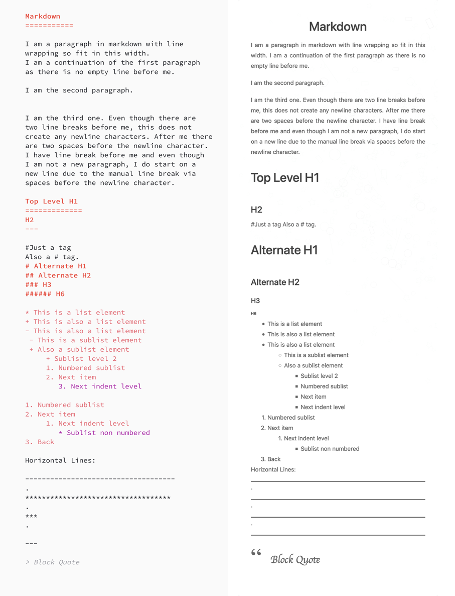

图3.2显示了相应页面中的使用条款部分，包括标题、列表和其他块元素。这些块已在图像中标记，并留作练习，供读者在网页中执行。隐私政策页面也应使用这些元素进行更新。您可以根据章节资源（ <https://github.com/hugoinaction/hugoinaction/tree/chapter-03-resources/01>).

图3.2。在Acme Corporation网站的使用条款页面中添加标题和列表等块级元素
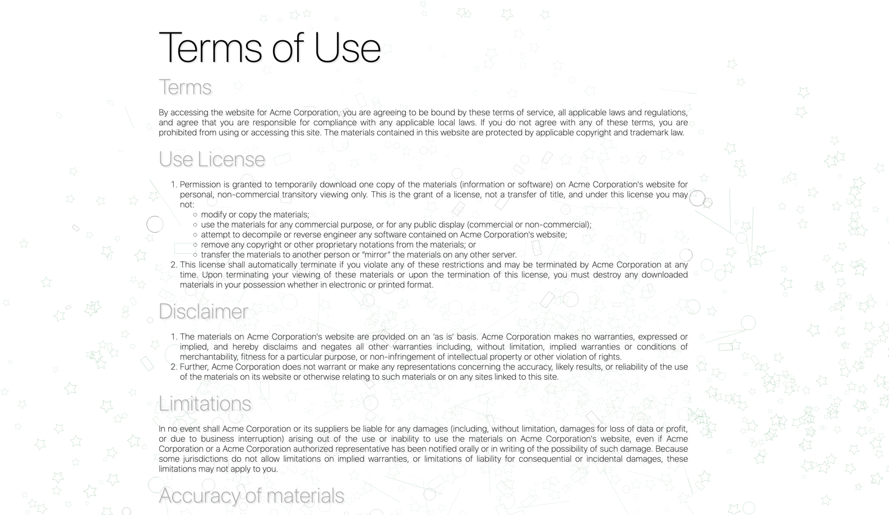

## 3.2.3格式、内联链接、代码和图像

虽然块元素赋予页面结构，但内联元素强调页面的重要部分。请注意，页面中的链接由Hugo自动格式化，并转换为HTML锚标记，可以单击并转到目标页面。这是Hugo的Markdown解析器提供的一个特性，我们不需要编写任何特殊的东西来启用这个特性。也可以使用`[Visible text](http://example.org/path/to/file)`.创建内联链接. 我们可以通过`[visible text](http://link "Title"）`，其中`Title`将通过工具提示提供。我们可以通过脚注链接在文本中共享目标链接，方法是将链接中的脚注位置编号指定为`[visible text][target 1]`，然后将底部的共享脚注指定为[target 1]：<https://example.org/path/to/target>.链接还可以直接指定位置，如[target 1]将自动链接到我们刚才指定的target 1。

Markdown使用基于文本的标记提供基本格式支持。我们可以用`_`（下划线）或`*`（星号）表示`em`斜体，`__`（双下划线）表示加粗`strong`。我们可以为粗体和斜体使用二个下划线`~~`（双波浪线）用于删除。

内联代码可以通过用反引号`内联代码`包围它来指定，它可以放在自由流动的内容中。它在HTML代码标记中使用等距宽度字体进行格式化。

Markdown支持`＜img＞`标记来显示内联图像。不支持指定块图像、图像尺寸和其他细节，这由主题来实现。图像可以使用类似于链接的语法内联，并用！（感叹号，通常称为bang）。我们也可以在图像标记中使用相对路径。我们可以写`！[Alt-Text]（/path/to/image "可选工具提示"）`以在文本中内联渲染图像。

```bash
清单3.4。Markdown中的内联格式
1    *Italics*
2 
3    _Italics_
4 
5    __Bold__
6 
7    ___Bold+Italics___
8 
9   this_is_not_emphasis
10
11   ~~Strike-through~~
12
13   Content with a -- (dash) and a --- (long dash).
14
15   [link](http://link/path/to/target)
16
17   [link](http://link/path/to/target "TITLE ON LINK")
18
19   [Shared Links with footnotes][target 1]
20
21   [Second shared link][target 1]
22
23   [target 1]
24
25   [target 1]: http://footnote.com
26
27   Sample inline code `a++` can be specified here.
28
29   
```

图3.3 标记第2部分中的元素-内联元素，如粗体、斜体、下划线、链接和图像
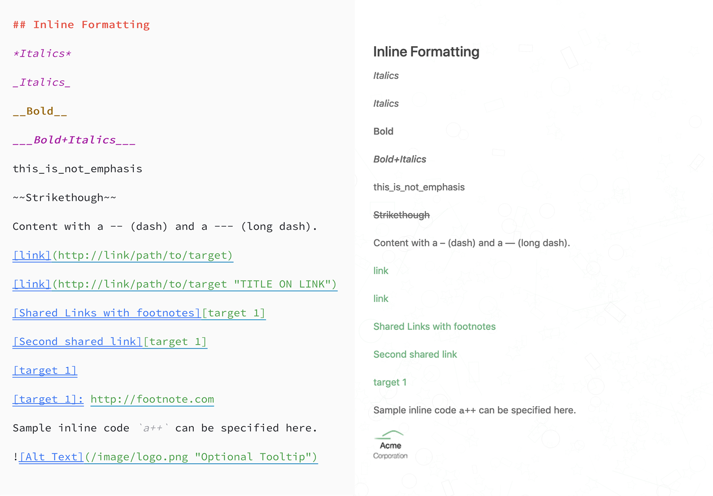

使用这些功能，我们可以正确标记Acme Corporation网站隐私政策的重要部分，并对其进行格式化。格式化后的隐私政策页面看起来更加完整和专业。图3.4显示了完整的隐私策略页面的一部分，其中标记了内联元素。更新隐私策略页面以匹配此设计的练习留给读者。完整的隐私策略页面在代码检查点2中以及章节资源（ <https://github.com/hugoinaction/hugoinaction/tree/chapter-03-02> ).

图3.4 Acme Corporation的隐私政策页面，使用块元素、内联链接和格式
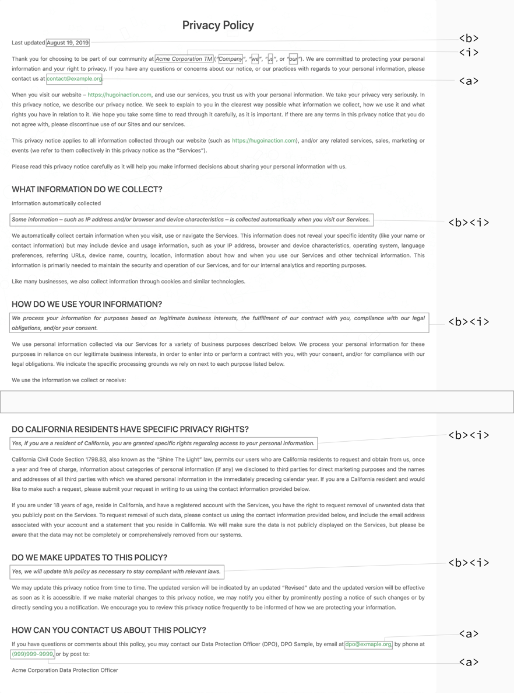

## 3.2.4 HTML

虽然我们可以在简单的Markdown中做很多工作，但纯HTML和CSS的功能要强大得多。无法在Markdown中表示HTML的许多特性。Markdown认识到了这个问题。如果Markdown文档中存在HTML标记，Markdown解析器会将HTML标记保留在输出中。我们可以在Markdown文档中放置任何HTML，它仍然会出现在生成的输出中。例如，带有`<em>`emphasis`</em>`的粗体将转换为带有`<em>`的`<strong>Bold with <em> emphasis </em></strong>`的粗体。因此，Markdown是HTML的超集。从技术上讲，任何有效的HTML都是有效的Markdown。您可以在Markdown中放置HTML标记，以便在内容中呈现这些标记。您还可以使用HTML和XML文档中使用的转义语法编写Unicode字符。这提供了对整个Unicode字符集的访问，包括本地化、表情符号等。

虽然我们可以在Markdown中添加任何HTML来提供额外的功能，但这并不是一个很好的做法。强烈建议尽量减少Markdown内容中嵌入HTML的使用。如果我们不信任内容的创建者，因为可以添加任意JavaScript和CSS，内联HTML可能会变成安全风险。由于主题创建者几乎无法控制嵌入的HTML，因此在更新主题时，允许嵌入HTML可能会成为一个大问题。用户可以自由地使用HTML进行创作，内容添加了布局、对齐方式、颜色和其他难以清理的样式信息。默认情况下，在Hugo中禁用内联HTML。您可以通过配置文件（在`markup/goldmark/renderer`部分）config.yaml中的不安全密钥启用它。请注意，Unicode字符未被禁用。我们将在第5章中介绍的带有快捷方式功能的内联HTML几乎没有必要。

```bash
# In config.yaml
markup:
  goldmark:
    renderer:
      unsafe: true
```

> 注意
> 当我们为Acme Corporation的网站创建配置文件时，我们将版权指令指定为`Copyright &#xA9`；。这里，我们将转义HTML用于基于Unicode的版权符号`&copy;`也会奏效。许多主题在params区域中使用Markdown，使我们能够为呈现的内容提供格式。Hugo提供了一个非常简单的实用方法来将Markdown转换为HTML，我们将在第6章中详细介绍。

我们确实在隐私政策中使用`TM`标记Acme Corporation商标。这将是用`&trade;`替换它的好时机；以获取HTML商标符号。

```bash
清单3.5。在Markdown中使用HTML
1    HTML Escaped characters:
2 
3    Copyright: &copy;
4 
5    Registered: &reg;
6 
7    Trademark: &trade;
8 
9    Less Than: &lt;
10
11   Greater Than: &gt;
12
13   Ampersand: &amp;
14
15   Smiley: &#x1F604;
16
17   Embedded HTML: x<sup>2</sup>
18
19
20   Floating image via HTML:  Follow up text after the image. This honors the floats 
22   and wraps around the image, automatically going into the next line.
```

图3.5 Markdown第3部分中的元素-HTML转义和内联HTML
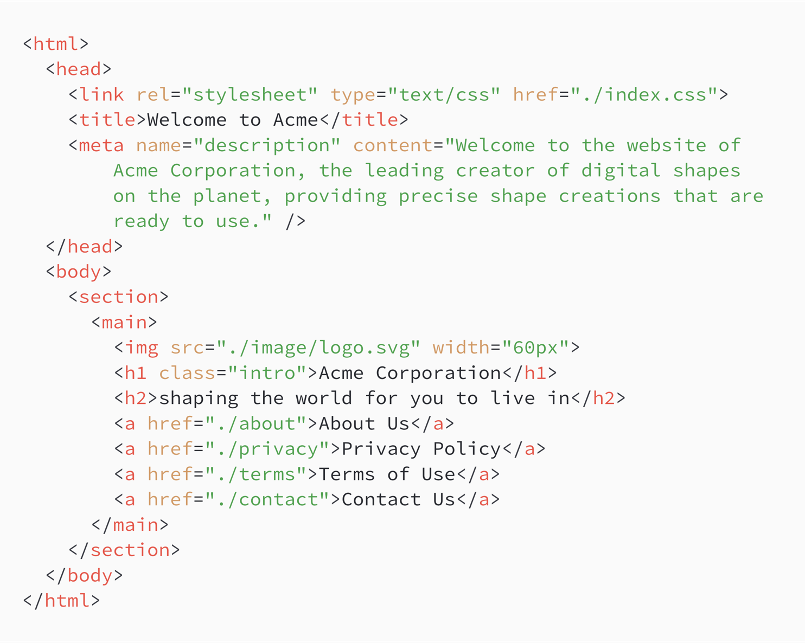

## 3.2.5表格 任务列表 代码块

Hugo支持GitHub在GitHub Flavored Markdown（GFM）中推广的Markdown扩展，包括表、任务列表和代码块。我们可以使用与Hugo相同的语法。

要创建表，我们可以每行写一行，每列用`|`（管道）字符分隔。我们可以写一行破折号（`-`）来突出显示表头行。Hugo还支持更短形式的Markdown表，其中可以忽略行边缘的管道字符。

任务列表遵循GitHub风格，我们在这里写一个破折号（`-`）和方括号（`[]`）来声明任务。选中任务的大括号之间可以有（`x`）字。Hugo中的任务列表呈现为禁用状态。没有自动启用，因为在没有服务器编辑文件的情况下，不可能在单击时更新内容。

Markdown支持在代码块的开头和结尾使用三个反勾号（\`\`\`）（通常称为代码围栏）的代码块。起始代码栏后面可以跟着语言的名称，以获得特定于语言的代码突出显示。默认情况下，Hugo不启用代码中的行号。我们可以使用以下设置启用它们：

```bash
markup:
  highlight:
    lineNos: true
```

Hugo通过向代码围栏传递附加选项，支持突出显示代码片段或覆盖代码段：

```javascript {linenos=true,hl_lines=[2,"4-6"],linenostart=199}
while (!success) {
  tryAgain();
  attempt++;
  if (Dead) {
    break;
  }
}
```

上面的代码段覆盖了行号配置并强制其为true，从199开始显示行号，并突出显示第2、4、5和6行。

```bash
清单3.6。表GitHub风格标记中的代码围栏和任务列表
Table:

   Name | Job
--------|------
   Alex | Web Developer
    Bob | Sys Admin
   Gabby| Technical Writer

Alternate Table:

|  Name | Mantra |
|  ---  |   ---  |
| Alex  | There must be a better way. |
| Bob   | Play it safe. |
| Gabby | Try everything, but do what you like. |

Acme Website task list
- [x] Get the home page up
- [x] Update Privacy Policy and Terms of Use
- [ ] Add the about page
- [ ] Start the blog
- [ ] Enable contact us

\```js
var x= 10;
x++;
console.log(x);
\```

```

图3.6。标记第4部分中的元素-表、代码块和任务列表
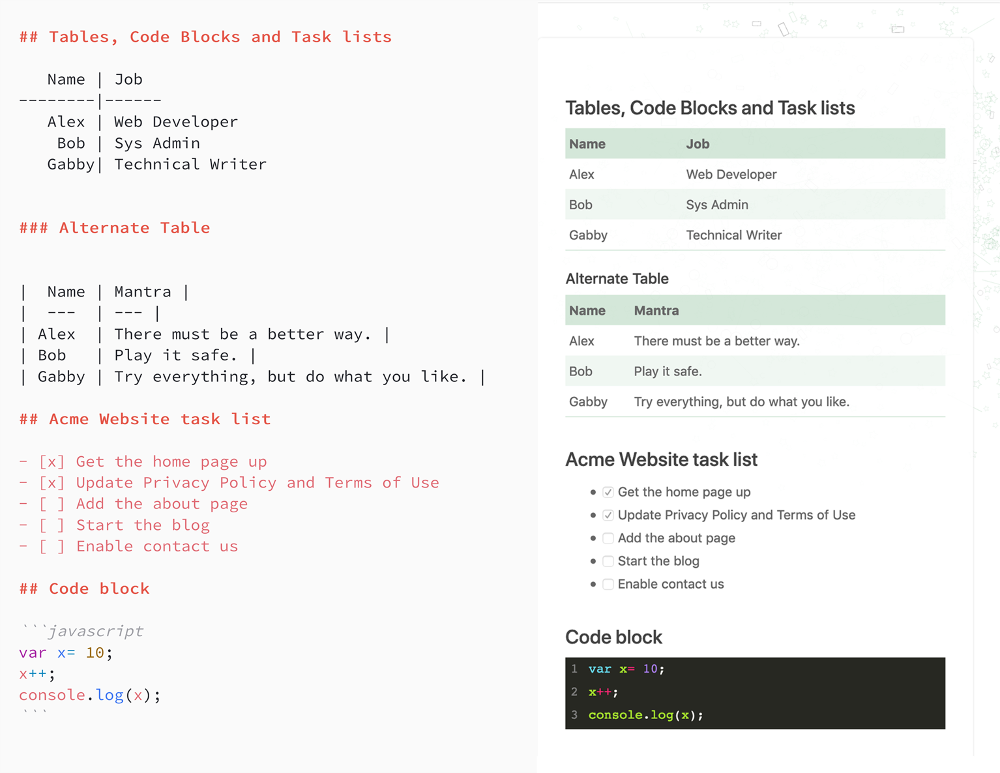

## 3.2.6表情符号、id和其他Hugo扩展

Hugo扩展了Markdown，增加了一些功能，使我们日常使用Markdown变得更加轻松和有趣。在config.yaml中，我们可以将`enableEmoji:true`设置为在源代码中使用与slack、GitHub、Basecamp、Trello、Gitter、Bitbucket等语法完全相同的直接表情符号。你可以使用表情符号备忘单<https://www.webfx.com/tools/emoji-cheat-sheet/>获取支持的表情符号列表。

Hugo自动将标头转换为ID，以便我们可以直接链接到它们。
它还支持HTML定义列表（除了相对较少使用的有序和无序列表之外，HTML中的其他类型的列表）。要声明定义列表，可以在一行中指定术语，后跟：（冒号），另一行中定义。

除此之外，Hugo还提供了对自定义快捷码的支持，通过添加自定义元素，我们可以扩展Markdown，从而将其呈现为HTML，我们将在第4章中讨论。

清单3.7。Hugo的表情、分数和定义列表

```bash
## Direct Emojis
Smile please :smile:

I :heart: Hugo

Wink :wink:

A link to [Emojis](#direct-emojis)


## Definition Lists

Alex
: Hippy Web Developer
: Technophile

Bob
: Classic SysAdmin
: Conservative

Gabby
: Cool Content Master
: Cautious
```

> 注意
> 并非所有主题都支持所有Markdown功能。如果您计划依赖第三方主题，一个好主意是检查您计划使用的所有Markdown功能的功能支持。您可以尝试的一个很好的示例页面作为markdown.md包含在本书的代码内容中。

图3.7 标记第5部分中的元素-表情符号分数和定义列表。
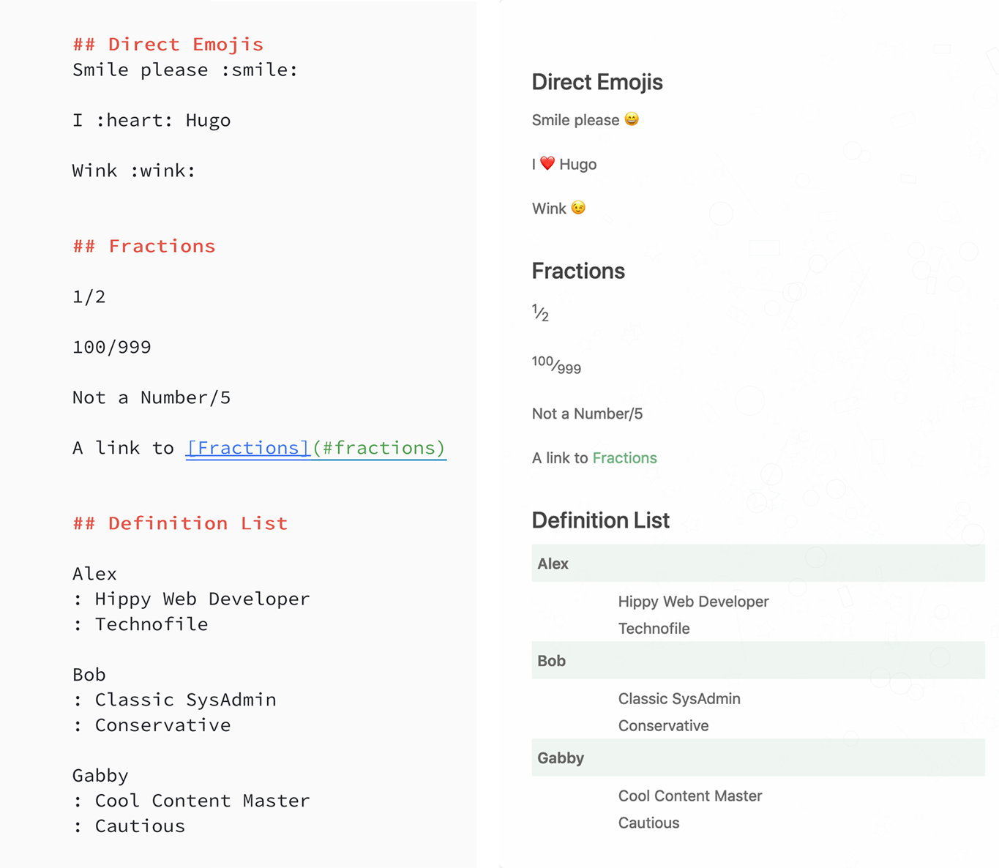

## 3.3 Markdown in Action

使用所有这些内容功能，我们将更新Acme Corporation网站的“关于我们”页面，并使其更形象。关于页面的基本元素已经出现在第2章的示例文本中。以下更改将使页面更易于呈现。

## 3.3.1 Block Elements

1. 添加顶级标题-`About us`
2. 制造(`Manufacturing`)、产品(`Products`)和团队(`Team`)二级标题。
3. 移动`We shape the world. You live in it.`到块引用
4. 制造(`Manufacturing`)部分内有一个编号列表，其中包含项目符号的子列表。

## 3.3.2 内联元件

1. 编号列表中的项目名称应为粗体。
2. 产品部分中的200个形状应为粗体和斜体。
3. 表中的文本应转换为链接。

## 3.3.3内联HTML和字符代码

1. 在该部分顶部的Acme Corporation后面添加商标标志。
2. 圆的字符代码为`&#8413`；对于三角形为&#9651；。雨果将两个破折号自动转换为一条直线。
3. 我们将在制造部分添加一个具有20px边距的右浮动图像，指向/image/draw.jpg。（您可以在本章的资源中找到draw.jpg，需要将其移动到static/image文件夹中。）这将通过嵌入式HTML完成。

## 3.3.4 Tables

1. 逗号分隔的列表需要转换为表。

## 3.3.5表情符号和定义列表
1.文本“smiles”应转换为：`smile`:表情符号。
2.团队部分应转换为HTML定义列表

在章节资源（ https://github.com/hugoinaction/hugoinaction/tree/ch03-resources/3）和作为代码检查点。

图3.8。Acme公司的“关于我们”页面使用高级Markdown功能-1个块元素，如标题和列表，2个内联元素，如粗体、斜体和链接，3个内联HTML和字符代码，4个表，5个分数，表情符号和定义列表。
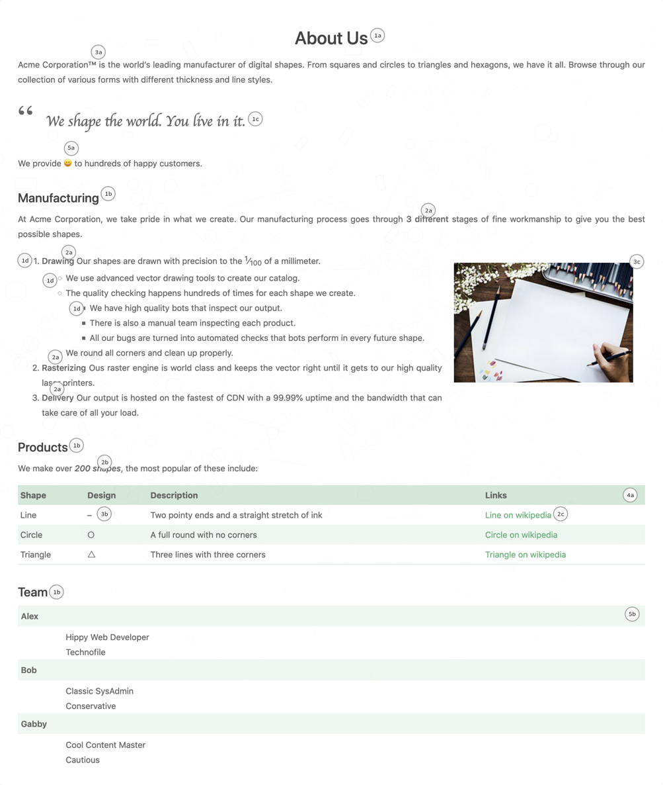

## 3.4其他标记语言
Hugo本机支持Markdown和HTML内容标记。这些语言的解析器是用Go编写的，并嵌入到Hugo中，得到了Hugo团队的关注，以确保出色的性能。Hugo还支持`AsciiDoc`、`pandoc`和`reStructuredText`来提供内容。这些语言在Hugo中本机不可用，而是通过外部助手支持。外部助手是Hugo通过命令行调用的软件程序，用于解析某些内容。因为他们在Hugo之外，Hugo无法保证他们的表现。表3.1比较了Hugo支持的不同标记语言。

## 表3.1 Hugo中的内容标记语言
|                           | Markdown                    | HTML                                     | AsciiDoc                        | pandoc’s Markdown           | reStructuredText             |
| ------------------------- | --------------------------- | ---------------------------------------- | ------------------------------- | --------------------------- | ---------------------------- |
| Hugo support              | Native(原生)                | Native（原生）                           | External（外部）                | External（外部）            | External（外部）             |
| Performance(性能)         | Fast(快速)                  | Fast(快速)                               | Slow(缓慢)                      | Slow(缓慢)                  | Slow(缓慢)                   |
| Human readability(可读性) | Good(好)                    | Bad（差）                                | Good（好）                      | Good（好）                  | Good（好）                   |
| Primary target(主要目标)  | Regular documents(常规文件) | Browser-readable content(浏览器可读内容) | Long-form documents(长格式文件) | Regular documents(常规文件) | Code documentation(代码文件) |

* 与功能相比，Markdown 简单易用。它是网站内容的完美语言，不超过几页。Hugo的Markdown解析器快速而强大。对于Hugo新手，建议从Markdown格式开始，除非他们已经知道不同的标记语言

* HTML（超文本标记语言）也是一种标记语言。因为这是web浏览器所理解的格式，所以当我们以这种语言提供内容时，不需要翻译。HTML以其原生形式比DOC或PDF格式更具可读性，并且它比大多数其他标记语言更强大。我们可以直接在Hugo中编写HTML，并且仍然可以利用Hugo的模板特性，我们将在接下来的章节中讨论这些特性。

* 不过，编写纯HTML确实有缺点。在编写基本HTML时，我们倾向于将页面布局和结构与内容混合起来。像Markdown这样的语言迫使我们专注于内容，但严格的纪律可以通过与Hugo一起使用纯HTML来获得更好的性能。

* AsciiDoc专注于具有数百页的文档，是书籍作者中最流行的标记语言。它提供了比Markdown更多的功能，尽管这是以不支持许多编程语言和框架为代价的。本书的源代码在AsciiDoc中。

* pandoc是一个支持Markdown超集的文件格式转换器，Hugo可以使用命令行将其转换为HTML。

* reStructuredText专注于生成文档项目。它是正式定义的，并且具有更严格的语言，以简化为代价提供更简单的解析。

请注意，Hugo不断添加对新格式的支持。在撰写这本书时，有积极的讨论支持Hugo中的AsciDoc。有了本机支持，AsciiDoc将获得性能提升，并且我们可以选择将该语言用于具有最小缺点的内容。

## 3.4 Metadata

通过用格式化元素和结构修饰原始文本数据，当使用Eclectic主题渲染时，各个页面看起来都是完整的，这形成了与Markdown数据相关的模板和代码。虽然网页上有足够的内容来组成一个网站，但我们需要提供信息来组织内容，并将其组织成列表、菜单等。Markdown并不是提供结构化数据的最佳语言。Hugo支持另一组我们称之为元数据语言的语言。我们可以使用这些语言来提供这些信息。其中之一是YAML(<https://yaml.org/>)，我们在本书中使用。它是软件配置的流行语言，也是元数据语言中最容易阅读的语言。

YAML代表YAML标准标记语言（YAML的Y代表YAML，递归首字母缩写）。它是一种用于结构化数据的语言，键和值由冒号（：）分隔。YAML的定义强调了一个事实，即YAML的核心用例是围绕结构化数据，而不是像我们在Markdown或HTML中那样标记数据。YAML对空格很敏感。我们使用YAML作为Acme Corporation网站的配置文件。YAML支持纯键值对作为其主要数据结构，并且还支持单个数据元素和列表。在本节中，我们将详细介绍YAML支持的语法和特性。

## 评论

我们在YAML中对注释使的（#）。注释是单行的，可以出现在YAML文档的任何位置。下面的列表显示了YAML注释的语法。

> 清单3.4添加YAML注释

```bash
# This is a comment.
```

## 3.4.2基本数据类型

为了便于阅读，YAML根据内容自动猜测数据类型。它支持字符串、数字和布尔数据类型。它还支持nil（也称为null）类型。如果键或值为真或假，YAML会自动将其强制为布尔数据类型。它将数字猜测为数字，其他一切都变成字符串。下面的列表提供了YAML数据类型的示例。

```bash
key: value             # YAML猜测类型为字符串
key2: 12.0             # Enter键后相同的缩进声明。这有一个浮点值
key3: 10               # YAML自动强制数字类型
key4: "10"             # 用引号括起来以声明字符串。
key5:
   "hello"             # 由于hello位于不同的缩进处，因此它被读取为value（而不是key）
key6:                  # nil value
key7: false            # 布尔假
```

## 3.4.3 多行字符串

YAML对缩进敏感，换行符定义新YAML键值对的开头。我们可以使用管道字符（|）来创建多行字符串，以显示新行，使用大于号（>）来创建对新行不敏感的多行字符串。下面的列表提供了这方面的示例。

```bash
# 带有换行符的多行字符串可以用|（管道）字符声明，而如果我们使用>（大于），则忽略换行符，并将字符串连接到单行中。
key1: |
This is a multiline string
where enter keys are valid

This is another para. The string ends with two
empty lines.

key2: >
This is a multiline string where new lines
will be merged back in.

Again we need two blank lines to close it.
```

## 3.4.4列表

我们可以使用破折号（-）或方括号（[]）在YAML中声明列表。下面的列表显示了如何添加列表。

```bash
key1:                  # 可以通过-（破折号）添加列表
  - a
  - b
  - c
key2: [d, e, f]        # 也可以通过方括号（[]）添加列表
```

## 3.4.5字典

字典，也称为映射或对象，是键值对。顶级YAML对象也是一个字典。我们可以在YAML中创建字典和子字典，它们可以包含所有类型。下一个列表显示如何使用YAML添加字典。

```bash
key1:                   # 字典/映射/键值对
   key11: value13       # 字典中元素的顺序无关紧要
   key12:               # YAML中的缩进项
     - List Item 1
     - List Item 2
   key13: 10
key14: {key14: value14}
```

## 练习3.3

YAML不支持以下哪种数据类型？

a. Date
b. Boolean
c. Map
d. List
e. Numbers

## 3.4.6 修改`config.yaml`

现在是重新访问config.yaml的好时机，我们在第2章和自那以来，一直在修改。它包含baseURL和title等元素的键值对。这些的顺序无关紧要。
`author`、`menu`和`params`元素是字典，而`footer`和`main`元素是列表。因为类型是自动推断的，`recentCount`是一个数字，`recents`是一个字符串，`true`自动转换为Bool值。清单3.9显示了配置文件中YAML元素的最新使用。

```bash
# config.yaml
baseURL: http://example.org/                  # Hosting location.
languageCode: en-us                           # Locale
title: Acme Corporation                       # Name of the website
theme: Eclectic                               # Name of the theme
author:                                       # Information about the website author
  facebook: "https://facebook.com/example"
  twitter: "https://twitter.com/example"
  email: "contact@example.org"
  name: "Acme Corporation"
  location: New York
  phone: (999) 999-9999
  hours: "**Mon-Fri:** 9:00AM - 6:00PM, ET"

menu:                                         # Menu placement
  main:                                       #    - Name of the menu
    - identifier: about                       #       - Identifier
      name: About                             #       - Display name (theme specific key)
      url: /about                             #       - Target URL
      weight: 1                               #       - Sorting order
    - identifier: contact
      name: Contact
      url: /contact
      weight: 2
params:                                       # Theme specific parameters
  color: "#71B180"
  copyright: "Copyright © 2020 Acme Corporation. All Rights Reserved."
  footer:
    - title: About
      content: Acme Corporation is the world's leading manufacturer of digital shapes. 
      From squares and circles to triangles and hexagons, we have it all. Browse through 
      our collection of various forms with different thickness and line styles. We shape 
      the world. You live in it.
    - title: Recent Blog Posts
      recents: blog
      recentCount: 7
    - title: Contact Us
      contact: true
  style: green
  logo: /image/logo.png
  logo_small: /image/logo.png
  about_us: Acme Corporation is the world's leading manufacturer of digital shapes. From 
  squares and circles to triangles and hexagons, we have it all. Browse through our collection 
  of various forms with different thickness and line styles. We shape the world. You live in it.
  recent_posts:
    enable: true

markup:
  goldmark:
    renderer:
      unsafe: true
  highlight:
    lineNos: true
enableEmoji: true
```

## 3.5其他 matedate 语言

YAML也有与Markdown相同的权衡：人类可读性优于严格的规范。这种权衡伴随着解析器的复杂性和奇怪的边缘情况可能不容易理解。我们在本书中选择了YAML作为配置文件，因为它的流行性和易读性。Hugo支持TOML和JSON作为除YAML之外的其他元数据语言。附录B涵盖TOML
表3.2提供了它们特性的快速比较。

表3.2元数据语言比较

| **Area**                                      |                                            |                                                |                                                |
| --------------------------------------------- | ----------------------------------------------- | ----------------------------------------------- | ----------------------------------------------- |
| **Name**                                      | YAML                                            | TOML                                            | JSON                                            |
| **Overall Popularity**(总体受欢迎程度)        | 中等                                            | 低                                              | 高                                              |
| **Usage in Hugo Community**(Hugo社区中的采法) | 低                                              | 高                                              | 低                                              |
| **Readability** （可读性)                     | 高                                              | 中等                                            | 中等                                            |
| **GitHub support with Markdown**              | 支持                                            | 不支持                                          | 不支持                                          |
| **Objective**                                 | 可读性                                          | 一种表达方式                                    | 信息交换                                        |
| **Data types supported** (支持的数据类型)     | number, string, boolean, null, list, dictionary | number, string, boolean, date, list, dictionary | number, string, boolean, null, list, dictionary |

* TOML 的目标是确保是写入特定数据项的一种标准方式。YAML的自动猜测数据类型的方式使其更容易读取，但可能导致YAML推断错误的类型。例如，纯文本是字符串，但如果纯文本的单词如果为true，则变为布尔值。TOML使用一个强定义的,我们必须用双引号将每个字符串括起来。

* JSON（JavaScript对象表示法）是一种用于交换信息的流行格式并且在生成和机器解析方面比YAML和TOML容易得多。JSON最显著的优势是高性能的可用性,大多数编程语言的解析器，熟悉这种格式开发人员。图形编辑器和CMS解决方案通常使用JSON for Hugo相互作用

> 注意
> 你会在TOML的Hugo社区找到很多资源,由于TOML的非限制性，它更易于复制和粘贴。如果您碰巧编写了一个解析器，那么TOML将更容易作语法分析,对于高级Hugo用户来说，TOML是一门很好的语言。

## 3.6 front matter

除了全局站点范围的配置，我们还需要特定于页面的元数据如创建日期、标签、URL、作者姓名等。Hugo需要这些信息-组织网站中的页面，并将有关此页面的信息提供给更广泛的互联网，如搜索引擎和社交网络。我们还可以展示页面侧边栏中的一些元数据。

为了提供特定于页面的元数据，Hugo提出了front matter的概念。front matter是一组键值对，用于定义正确提供的内容的元数据在内容之前。对于前面的内容，我们可以在同一文件上提供元数据主要内容。前面的内容也称为页面元数据部分（页面元数据-简言之，数据或元数据）以及页面配置。这些术语用在这本书中是可变的。

要将YAML内容放在页面的前面，我们需要用三个破折号（---）并将其放在页面顶部。以下列表显示了如何使用三段式格式将YAML标识为内容元数据语言。

```bash
--- # 三个破折号包装YAML分组块
# 请注意，文件扩展名为.md
<metadata section in YAML>
---
<data section in Markdown>
```

Hugo善于处理元数据，并提供了一组合理的默认值。这就是为什么到目前为止，我们能够相处得很好，只提供了很少的元数据，仍然能够渲染内容。默认情况下，Hugo从文件名,Git接收信息,版本控制系统（如果使用）和OS属性（如修改日期）。我们只有当我们需要做一些hugo做不到的事情时，我们才需要处理前面的问题猜测自己或需要重写它来执行特定任务。

> 内容之前的元数据
> 在元数据出现在内容之前,在计算机世界中是早就有的概念,自编程开始以来。Pascal表示字符串的长度通过该长度的原始二进制数据。许多二进制文件格式以签名开头是与文件关联的元数据。例如，如果您在文本中打开.pdf文件,编辑器中它以%PDF开头，.png文件以.png开头，.gif文件以gif开头。Jekyll第一个现代静态站点构建器，为所有人引入了元数据的概念, 后来的静态站点建设者，Hugo采用了这个概念。

## 3.6.1front matter常见的元数据元素
front matter包括与特定页面。就像网站有一个配置文件（config.yaml）一样，我们可以页面本身上编写特定于页面的YAML内容。我们可以在
front matter 表3.3列出了一些最常见的财产。

表3.3 hugo中常见的front matter。所示示例适用于Acme Corporation的网站中“关于我们”页面

| Name        | Default                                                      | Use                                                          | Example                                                      |
| ----------- | ------------------------------------------------------------ | ------------------------------------------------------------ | ------------------------------------------------------------ |
| title       | Name of the file(文件的名称)                                 | 用于摘要页面和RSS,提供给搜索引擎的提要.                      | About Us                                                     |
| description | <empty string>                                               | 提供给搜索引擎；可以在列表页面中使用。                       | World’s leading manufacturer of digital shapes. We shape the world. You live in it. |
| date        | 如果在config.yaml中enableGitInfo为true，是默认Git修改日期，否则的话是公元1年1月1日（January 1, 01）。 | 日期字段有助于排序页面。                                     | January 01, 2020                                             |
| keywords    | <empty list>                                                 | 元数据中使用的关键字（keywords）传递给搜索引擎爬虫           | Acme Corpora-tion, Acme Line Company, Circle,Line, Triangle  |
| type        | Name of the subfolder con taining the current file; default if this file is present directly in the content folder. | 主题的内容类型。每种类型的渲染方式都不同（我们在第6章介绍）。 | <absent>                                                     |
| slug        | <folder>/<br/><title or filename if not title>               | web浏览器中文件的URL,Hugo还提供此任务的url字段。slug是URL的最后一部分,尊重多语言的本地化-语言内容作为URL忽略它。如果我们使用slug和以后添加语言，页面可以获取语言前缀。 | <absent>                                                     |
| draft       | false                                                        | draft标记内容已提交但尚未完成。hugo不渲染草稿.               | <absent>                                                     |
| aliases     | []                                                           | 将在输出目录结构中创建的一个或多个别名（例如，重命名content的旧发布路径）的数组。有关详细信息，请参见别名。 | <absent>                                                     |
| layout      | <depends>                                                    | 此字段标记Hugo用于渲染页面。A.单个页面具有单个布局，而索引页包含页面具有列表布局。我们将进入第7章的布局。 | <absent>                                                     |
| cascade     | <absent>                                                     | 让我们先定个话题中所有子页上的属性文件夹。第7章讨论详细级联。 | <absent>                                                     |
| outputs     | <gets from config>                                           | 此页面需要的格式以HTML或JSON呈现，例如我们将使用输出第9章。  |                                                              |
| tags        | <absent>                                                     | 用于为标签提供默认Hugo配置。那里可以是可以或可能不包括标签。我们将讨论分类法和标记第4章。 |                                                              |
| <others>    | <absent>                                                     | 主题特定参数页面。                                           | <absent>                                                     |

要在Acme Corporation网站的About Us页面中更新这些，我们可以将清单3.11中的代码添加到页面顶部(https://github.com/
hugoinaction/hugoinaction/tree/chapter-03-resources/04）。我们应用front
matter以YAML格式将其封装在三个短划线（---）中。
Listing 3.11  Adding front matter to the About page (content/about.md)

```bash
--- # In file content/about.md
title: About Us
date: 2020-01-01T00:00:00Z
description: World's leading manufacturer of digital shapes. We shape the world. You live in it.
draft: false
---
<page content>
```

Eclectic主题将一级标题放在页面上，因此我们不需要添加它,除此之外，似乎没有重大变化。你应该看看更新的描述和文档标题也应显示在选项卡中当您查看生成的HTML时（参见图3.12）。

Figure 3.11 Address bar update with the front matter


code checkpoint <https://chapter-03-04.hugoinaction.com>, and source code:<https://github.com/hugoinaction/hugoinaction/tree/chapter-03-04>

> 注意:
> 本书的其余部分将讨论更多front matter和用例。本章缺少的一个关键特征是级联front matter条目见第7章。

## 练习3.4

我们可以使用Hugo中的___aliases___ front matter条目来定义自定义URL用于网页。

我们只能通过front matter启用一些功能，例如草稿。前面一旦我们在第4章开始研究分类法，这个问题就会变得更加重要。front matter和内容构成了内容创作者必须进行的更新。有了这两个领域的工作知识，我们可以设计尽可能多的我们希望在网站上看到的内容页面。GitHub支持渲染front matter内容和当我们在front matter使用YAML时，标记会被标记下来，这样就可以很容易地进行操作-图3.13显示了GitHub上的About Us页面。

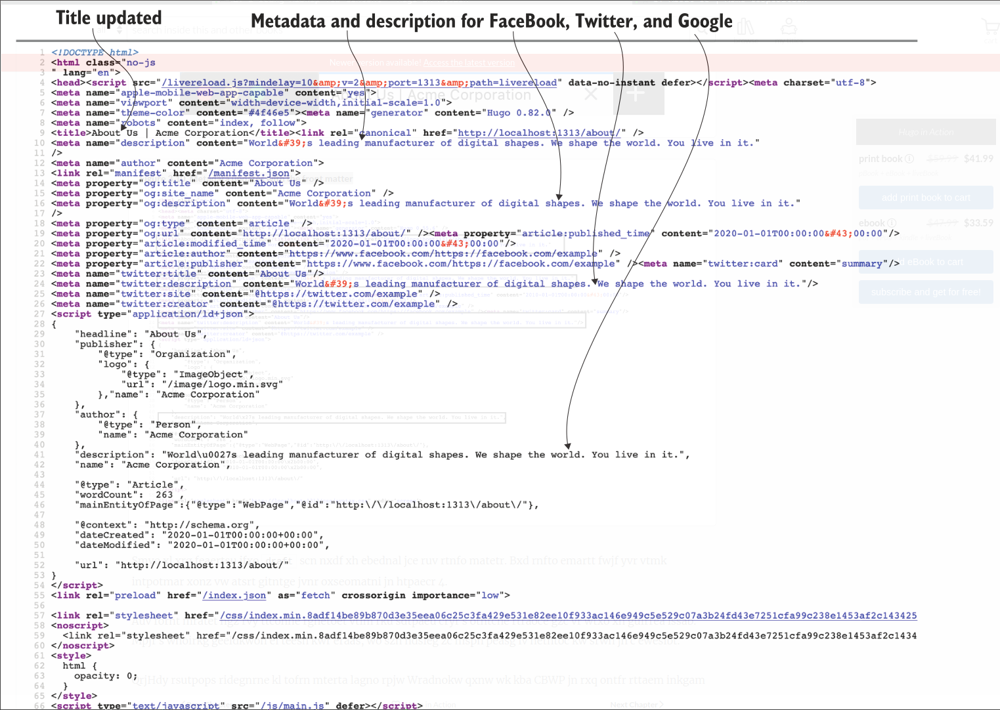

## Figure 3.12Metadata and description for FaceBook, Twitter, and Google Metadata updates with the front matter content

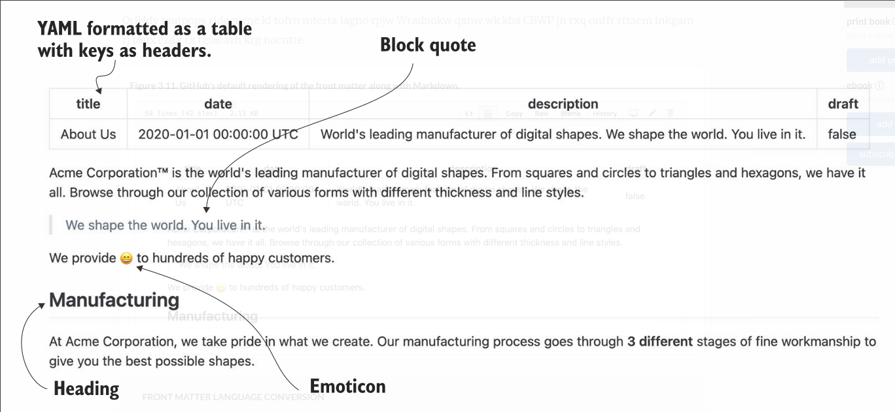

图3.13 GitHub与Markdown一起默认呈现front matter 内容

> Front matter 语言转换
> Hugo并行支持所有元数据语言。不同的文档可以使用其他元数据语言，Hugo正确解析这些语言。Hugo也可以在元数据语言之间转换.我们可以使用Hugo命令行来进行转换通过输入hugo convert to TOML＜content file＞将内容转换为TOML。我们可以模拟-通过使用toJSON和toYAML更新命令，立即转换为JSON/YAML，
> 没有真正的理由进行这种转换，因为hugo支持所有front matter格式。大多数用户坚持选择自已习惯的元数据语言，但如果您需要切换到另一个,那也可以做到.

## 3.6.2 使用 front matter 数据驱动的登录页

Front matter 不仅仅是元数据；我们可以使用它来指定页面的数据。这个主题作者可以自由使用前面提供的结构化数据任何页面。一些元素（文本转盘）受益于结构化数据。我们可以提供转盘的各个页面作为键值对。主题作者可以嵌入这些在模板中的正确位置比使用Markdown要容易得多.

例如，Eclectic主题支持照片和文本转盘，图标-基于列表、推荐、客户图标等，所有这些都由我们可以在页面的标题。您可以将提供的data-driven.md文件（<https://github.com/hugoinaction/hugoinaction/tree/chapter-03-resources/05>）-content文件夹以尝试此功能。您可以在<http://localhost:11313/data-driven以>获得类似于图3.14所示的页面。

> code checkpoint <https://chapter-03-05.hugoinaction.com>, and source code:<https://github.com/hugoinaction/hugoinaction/tree/chapter-03-05>

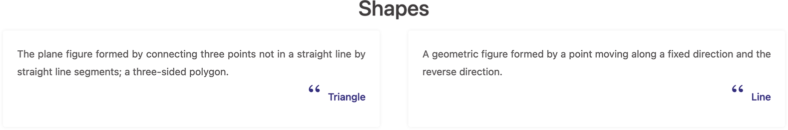
图3.14 Acme Corporation网站使用数据驱动方法和使用带有Eclectic主题的front matter。我们可以将data-driven.md放在content文件夹中来得到这个页面

一些主题（如Universal theme主题）也可以获取全局config.yaml范围内的信息,或从数据文件夹中读取。您应该阅读以下文档了解如何使用这些功能。

在front matter提供结构化元数据的方法，作为一个全局配置或数据文件夹中的文件都是有成本的。因为结构化数据是特定的对于主题，如果切换到其它主题，将不合适。对于许多用户来说，使用预先构建的主题和提供结构化数据是最适合他们的需求，因为他们可能会为这些功能选择该主题。它也是更容易以YAML格式而不是纯HTML格式维护数据。

主题提供了许多内置功能和复杂的逻辑，以实现兼容-在显示数据时，屏幕大小的灵活性。在第6章中,我们将创建基于结构化数据的网页。

> 练习3.5
> 正确或错误：理论上，我们可以构建基于front matter的网页，并且Markdown正文中没有任何内容。
> 答案：是正确的

## 3.7 使用标记和元数据语言的好处

在Jamstack中，我们在多个文件中使用标记和元数据语言来替换数据库在传统web堆栈中的作用。放弃的好处当我们移动到Jamstack时，数据库并不明显。数据库已优化,30多年来，提供了巨大的存储优化和查询功能。数据-base（SQL和NoSQL）需要对其存储的数据进行某种表结构化。数据库期望一些模式，即使每个文档中的模式都不同。然而它们不是很有用,如果根本没有模式/结构，例如格式化文本。

在大多数面向数据库的内容管理系统中,网页被装到数据库中单个列中或分配给单个键。然而使用带有文本内容作为文件存储在磁盘上，我们就可以用大量实用程序访问文本文件，从标准bash工具（如grep）到通用软件（如版本管理系统)（Git）。

3.7.1 内容版本控制

当我们使用版本控制系统编写和提交代码时,我们继承了为源代码构建的健壮版本控制方案，并可以将内容其用于版本控制。使用Markdown，格式更新更容易理解
的diff视图。我们完全支持fork、branch和pull内容请求。我们可以具有网站内容的适当软件生命周期，分支视图和版本化内容发布。如果我们愿意，我们可以编写脚本到vali-可以触发代码提交的日期内容、检查拼写或修复结构,就像我们在第2章中为GitHub部署创建的网站一样。

这种支持不仅存在于Hugo中，也存在于整个Jamstack中。Jamstack通过将内容从数据库移动到标记来实现这一点。我们可以在中看到差异视图在GitHub上的操作，导航到我们的Acme Corporation网站。示例差异视图如图3.15所示。
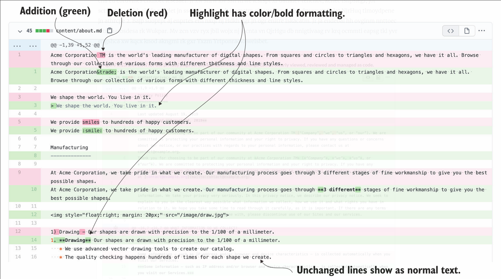
图3.15 GitHub上About页面的示例差异视图。我们可以查看、审阅和管理每个内容,并更改为代码。

图3.16 web表单上的内容语言：Acme Corporation的首席编辑Gabby网站，试图了解从web表单到内容输入文档的转变需要什么。

## 3.7.2 Theme independence  主题独立性

网站从Markdown到配置的许多移动都是标准化的。内容作者在Markdown中添加了文本颜色和HTML间距等内容。这些内容在多个主题中保持稳定。我们可以切换主题，并看到我们的页面呈现几乎正确。虽然Hugo为所有Markdown生成了正确的HTML，但仍需要主题作者了解所有Markdown功能。

如果您有兴趣检查代码跨主题的可移植性尝试跨主题的功能不是一个坏主意。Acme Corporation网站（图3.17）的“关于我们”页面在在Universal主题中看起来并没有问题

chde checkpoint <https://chapter-03-06.hugoinaction.com>, and source code:<https://github.com/hugoinaction/hugoinaction/tree/chapter-03-06>

图3.17Acme Corporation网站的“关于我们”页面使用Hugo的Universal theme主题渲染

## 3.7.3 Cleanliness 产生干净的html

所见即所得编辑器生成的HTML标记像WordPress这样的工具可能过于复杂和不可读。我们是还存在所见即所得（WYSIWYG）创建者将任意JavaScript粘贴到内容中的风险，这可能会变成安全问题。Markdown是一相比HTML,当我们读写时，产生额外标记和错误的可能性要低得多。类似地，使用Markdown，我们可以使用表单以传统方式输入元数据的内容管理系统。并且纯文本元数据语言提供了更多的灵活性和比任何一种形式都强大。

## 总结

* Markdown具有格式化常规网页和博客帖子所需的所有功能。
* Markdown支持块元素，如标题、各种类型的列表和子列表。
* 我们可以提供内联图像、链接、基本格式和代码块
* Hugo支持GitHub Flavored Markdown（GFM），它添加了任务列表和Markdown的表格。
* Hugo的渲染引擎还支持表情符号、自动压缩,选项和定义列表等功能。
* Hugo支持多种语言的内容，包括AsciiDoc-表单内容，pandoc用于扩展Markdown，reStructuredText用于文档使用基于文本的构造标记基于文本的内容。
* 除了数据，网页还需要使用Hugo提供的元数据YAML、TOML和JSON。
* YAML 是一种易读的并且由Hugo提供了数据驱动的机制
* 虽然Hugo有合理的默认值，我们可以不用编写单个元数据项，Hugo提供了覆盖大多数元数据的能力,如标题、描述、日期和主题特定参数等项。
* 大多数Markdown功能都是Hugo独有的，可以在所有应用中使用主题
* 通过将内容管理为文件而不是数据库的方法,Markdown的可读性使我们获得了合理的差异视图和版本控制支持,使用Git等代码版本控制软件。
